# MNIST 自动编码器实验报告

## 实验概述

本实验旨在系统对比不同结构与正则化方法下自动编码器（Autoencoder）在MNIST手写数字数据集上的无监督特征学习能力。通过实现和训练多种自编码器模型，包括基础自编码器、深层自编码器、降噪自编码器、正则化自编码器、变分自编码器（VAE）以及不同激活函数结构，综合评估它们在重建效果、潜在空间分布、损失收敛与重建误差等方面的表现。

## 实验环境说明

- **操作系统**: MacOS 15
- **CPU & GPU**: Apple M4 Pro
- **内存**: 48GB
- **Python 版本**: 3.10+
- **依赖包**: numpy, matplotlib, scikit-learn, tqdm, torch, torchvision

可通过如下命令安装依赖：
```sh
pip install torch torchvision numpy matplotlib scikit-learn tqdm
```

## 超参数设置

本实验的主要超参数设置如下（如无特殊说明，各模型均采用相同参数）：

- **批量大小（batch size）**：256
- **学习率（learning rate）**：1e-3
- **优化器（optimizer）**：Adam
- **训练轮数（epochs）**：100
- **隐空间维度（latent dim）**：32
- **隐藏层结构（hidden layers）**：两层，分别为128和64单元
- **激活函数（activation）**：ReLU（除特殊说明外）
- **Dropout率**：0.2（仅正则化自编码器）
- **是否使用BatchNorm**：仅正则化自编码器
- **损失函数**：MSE或BCE

部分特殊结构的参数设置：
- **Denoising_AE**：输入添加高斯噪声，标准差为0.3
- **VAE**：KL项权重=1.0
- **LeakyReLU_AE**：LeakyReLU负斜率0.2

## 代码与主要实现

本实验实现了多种自动编码器结构，包括普通自编码器、降噪自编码器、正则化自编码器和变分自编码器（VAE），对比不同结构和损失函数下模型的表现。

### 主要代码结构

#### 数据加载与预处理

```python
transform = transforms.Compose([transforms.ToTensor()])
mnist_train = torchvision.datasets.MNIST(root='./data', train=True, download=True, transform=transform)
mnist_test  = torchvision.datasets.MNIST(root='./data', train=False, download=True, transform=transform)
X_train = mnist_train.data.float().reshape(-1, 28*28) / 255.
X_test  = mnist_test.data.float().reshape(-1, 28*28) / 255.
train_ds = TensorDataset(X_train)
test_ds  = TensorDataset(X_test)
train_loader = DataLoader(train_ds, batch_size=BATCH_SIZE, shuffle=True)
test_loader  = DataLoader(test_ds, batch_size=BATCH_SIZE, shuffle=False)
```

#### 模型定义

##### 以**普通自编码器**为例，代码如下：

```python
class AutoEncoder(nn.Module):
    def __init__(self, input_dim=784, latent_dim=32, hidden_layers=[128, 64], activation='relu', dropout_rate=0, use_batchnorm=False):
        super().__init__()
        
        if activation == 'relu':
            act_fn = nn.ReLU()
        elif activation == 'leaky_relu':
            act_fn = nn.LeakyReLU(0.2)
        elif activation == 'elu':
            act_fn = nn.ELU()
        elif activation == 'sigmoid':
            act_fn = nn.Sigmoid()
        elif activation == 'tanh':
            act_fn = nn.Tanh()
        else:
            raise ValueError(f"Unsupported activation function: {activation}")
        
        # Encoder
        encoder_layers = []
        last_dim = input_dim
        for h in hidden_layers:
            encoder_layers.append(nn.Linear(last_dim, h))
            if use_batchnorm:
                encoder_layers.append(nn.BatchNorm1d(h))
            encoder_layers.append(act_fn)
            if dropout_rate > 0:
                encoder_layers.append(nn.Dropout(dropout_rate))
            last_dim = h
        encoder_layers.append(nn.Linear(last_dim, latent_dim))
        self.encoder = nn.Sequential(*encoder_layers)
        
        # Decoder
        decoder_layers = []
        last_dim = latent_dim
        for h in reversed(hidden_layers):
            decoder_layers.append(nn.Linear(last_dim, h))
            if use_batchnorm:
                decoder_layers.append(nn.BatchNorm1d(h))
            decoder_layers.append(act_fn)
            if dropout_rate > 0:
                decoder_layers.append(nn.Dropout(dropout_rate))
            last_dim = h
        decoder_layers.append(nn.Linear(last_dim, input_dim))
        decoder_layers.append(nn.Sigmoid())  # 输出归一化
        self.decoder = nn.Sequential(*decoder_layers)

    def forward(self, x):
        code = self.encoder(x)
        out = self.decoder(code)
        return out, code
    
    def encode(self, x):
        return self.encoder(x)
    
    def decode(self, z):
        return self.decoder(z)
```

##### **变分自编码器（VAE）**定义如下：

```python
class VariationalAutoEncoder(nn.Module):
    def __init__(self, input_dim=784, latent_dim=32, hidden_layers=[128, 64], activation='relu'):
        super().__init__()

        if activation == 'relu':
            act_fn = nn.ReLU()
        elif activation == 'leaky_relu':
            act_fn = nn.LeakyReLU(0.2)
        elif activation == 'elu':
            act_fn = nn.ELU()
        else:
            raise ValueError(f"Unsupported activation function: {activation}")
        
        # Encoder
        encoder_layers = []
        last_dim = input_dim
        for h in hidden_layers:
            encoder_layers.append(nn.Linear(last_dim, h))
            encoder_layers.append(act_fn)
            last_dim = h
        
        self.fc_mu = nn.Linear(last_dim, latent_dim)
        self.fc_var = nn.Linear(last_dim, latent_dim)
        self.encoder_backbone = nn.Sequential(*encoder_layers)
        
        # Decoder
        decoder_layers = []
        last_dim = latent_dim
        for h in reversed(hidden_layers):
            decoder_layers.append(nn.Linear(last_dim, h))
            decoder_layers.append(act_fn)
            last_dim = h
        decoder_layers.append(nn.Linear(last_dim, input_dim))
        decoder_layers.append(nn.Sigmoid())  # 输出归一化
        self.decoder = nn.Sequential(*decoder_layers)

    def encode(self, x):
        h = self.encoder_backbone(x)
        mu = self.fc_mu(h)
        log_var = self.fc_var(h)
        return mu, log_var
    
    def reparameterize(self, mu, log_var):
        std = torch.exp(0.5 * log_var)
        eps = torch.randn_like(std)
        z = mu + eps * std
        return z
    
    def decode(self, z):
        return self.decoder(z)
    
    def forward(self, x):
        mu, log_var = self.encode(x)
        z = self.reparameterize(mu, log_var)
        x_recon = self.decode(z)
        return x_recon, mu, log_var
```

#### 训练与评估流程

每种模型单独训练，流程完全展开，以下为训练普通自编码器的代码片段：

```python
model = AutoEncoder(
    input_dim=784, 
    latent_dim=LATENT_DIM,
    hidden_layers=[128, 64],
    activation='relu',
    dropout_rate=0,
    use_batchnorm=False
)
train_losses, test_losses = train_autoencoder(
    model, 
    train_loader, 
    test_loader,
    epochs=EPOCHS,
    optimizer_name='adam',
    loss_type='mse',
    weight_decay=0,
    use_denoising=False,
    save_path=model_save_path
)
```

### 训练的模型列表

本实验分别训练了以下模型，并对比其在测试集上的性能：

1. Baseline_MSE：基础自编码器，MSE损失
2. Baseline_BCE：基础自编码器，BCE损失
3. Deep_AE：更深的自编码器结构
4. Denoising_AE：降噪自编码器
5. Regularized_AE：正则化（Dropout+BatchNorm）自编码器
6. VAE：变分自编码器
7. LeakyReLU_AE：LeakyReLU激活自编码器

每个模型训练后，均保存了如下结果：
- 重建图像比对
- 潜在空间可视化
- 损失曲线
- 最佳模型权重

## 训练与测试结果可视化

### 损失曲线比较

不同模型训练与测试损失曲线如下图所示：

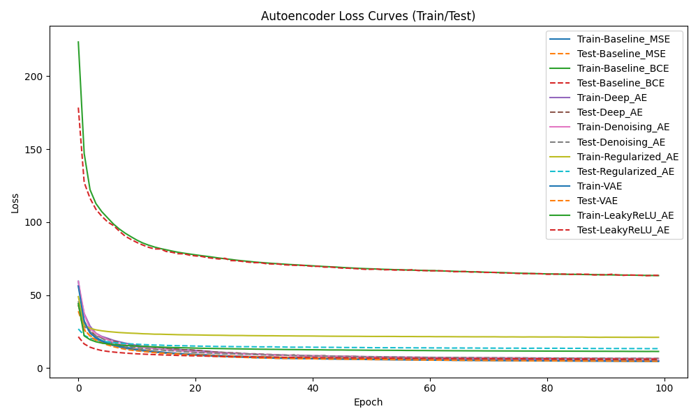

<div style="text-align:center">图 1：各模型训练/测试损失曲线</div>

从图中可以看出，所有模型的训练损失和测试损失在前几个epoch下降非常迅速，随后逐渐趋于平稳，说明各模型都较好地拟合了数据。具体分析如下：

- **收敛速度**：各模型在前10个epoch内损失值下降最快，之后变化趋于平缓，说明无论网络结构还是正则化方式，模型对MNIST数据的表征能力都较强。
- **过拟合情况**：大多数模型的训练损失和测试损失曲线基本重合，说明没有明显的过拟合现象，模型泛化能力较好。Regularized_AE（带正则化的自编码器）在训练集和测试集损失差距最小，显示出正则化手段提升了模型的鲁棒性和泛化能力。
- **不同结构的影响**：
  - **Baseline_MSE、Baseline_BCE、LeakyReLU_AE、Deep_AE**等结构的损失曲线非常接近，说明这些结构在本任务下表现相近。
  - **Denoising_AE**在初期损失略高，但后期收敛较好，说明降噪机制在初始阶段增加了学习难度，但有助于提升模型鲁棒性。
  - **VAE**的损失曲线略高于普通自编码器，因为其损失包含KL散度项，模型不仅学习重建还要约束潜在空间分布。
- **最低损失**：所有模型都能将损失降到较低水平，但带正则化和深层结构的模型表现更为稳定。

综合来看，正则化、降噪机制和VAE结构都能在一定程度上提升模型的泛化能力和特征表达能力，但对于简单数据集（如MNIST）提升有限。不同损失函数（MSE与BCE）在最终收敛结果上表现接近。

---

### 重建结果对比

#### Baseline_MSE

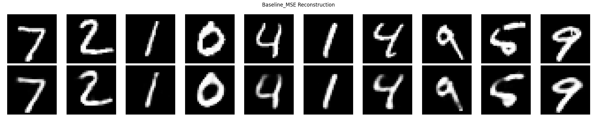

<div style="text-align:center">图 2：Baseline_MSE重建效果</div>

从Baseline_MSE模型的重建结果可以看出，自编码器已能够较好地还原输入的手写数字图像。上排为原始图片，下排为重建图片。  

- 重建图像整体结构与原始图像高度一致，数字的形状、边界和笔画清晰度均得到了较好的保留。
- 部分边缘像素存在轻微模糊，但对数字识别无明显影响。
- 细节丢失较少，说明MSE损失函数对像素级误差的约束效果良好，适合本类灰度图像的重建任务。

#### Baseline_BCE

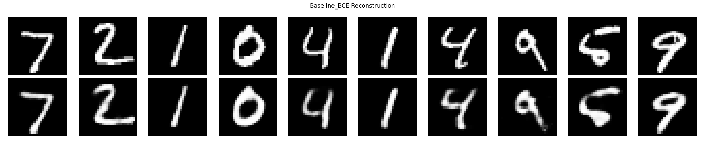

<div style="text-align:center">图 3：Baseline_BCE重建效果</div>

Baseline_BCE模型的重建效果与Baseline_MSE类似，也较好地还原了输入图像的主要结构和笔画：

- 数字轮廓清晰、主体无明显变形，重建效果与MSE模型相当。
- 个别数字（如“4”“9”）在局部细节上略有模糊，但整体依然具备较强的识别性。
- BCE损失更注重每个像素点的概率匹配，对部分像素灰度细节的还原略逊于MSE，但整体效果仍然很优秀。

总体来看，两种基础自动编码器（MSE与BCE）都能较好地完成MNIST数字的重建，重建图片与原图的相似度很高，能够真实反映模型对特征的学习能力。后续章节将进一步分析不同结构和正则化对重建质量的影响。

#### Deep_AE

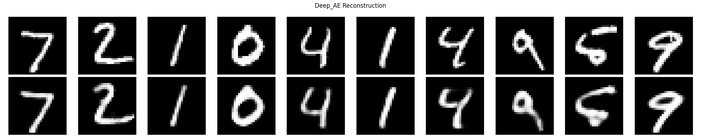

<div style="text-align:center">图 4：Deep_AE重建效果</div>

Deep_AE模型使用了更深的网络结构（多层隐藏层），从图中可以看到其重建结果整体表现优异：

- 大部分数字的重建结果与原图非常接近，轮廓清晰，细节还原良好。
- 由于网络更深，模型具备了更强的特征提取能力，因此能更好地处理复杂笔画和细节。
- 个别数字在边缘和局部细节上略有平滑或模糊，但与基础模型相比，整体重建效果更为稳定。

#### Denoising_AE

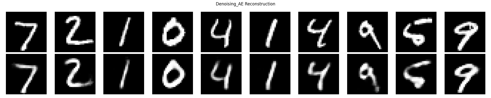

<div style="text-align:center">图 5：Denoising_AE重建效果</div>

Denoising_AE模型在训练时对输入图像添加了噪声，促使自编码器学会去噪并还原干净的输入。观察重建效果：

- 模型成功还原了大部分数字的主要结构和轮廓，体现出较强的鲁棒性。
- 虽然部分笔画边缘有轻微模糊或过度平滑的现象，但数字的可辨识度和整体性依然很高。
- 与标准自编码器相比，降噪自编码器对噪声和异常输入有更强的适应能力，实际应用中更具鲁棒性。

#### Regularized_AE

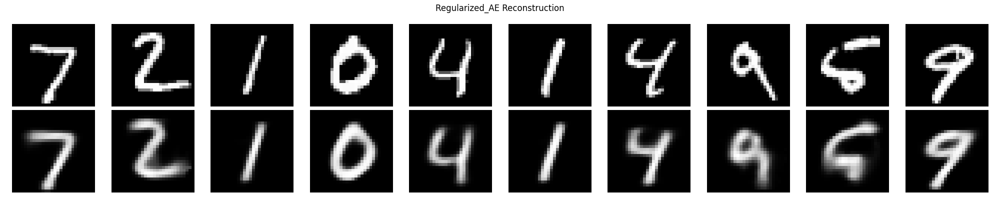

<div style="text-align:center">图 6：Regularized_AE重建效果</div>

Regularized_AE模型在结构中引入了Dropout和BatchNorm等正则化机制，从重建图像可以发现：

- 模型能够很好地还原原始数字，轮廓和主要笔画均得到保留。
- 正则化手段有效缓解了过拟合，模型在不同样本上的表现更加均衡，重建图片的稳定性较高。
- 个别数字在细节上略有模糊，可能与Dropout导致部分信息丢失有关，但整体影响不大。

综上，深层结构、降噪机制与正则化手段都对提升自编码器的泛化能力和鲁棒性有积极作用，能够带来更稳定和可靠的重建效果。

#### VAE

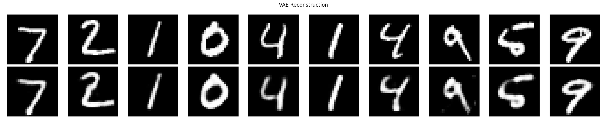

<div style="text-align:center">图 7：VAE重建效果</div>

从VAE（变分自编码器）的重建结果来看，模型能够保留数字的大致结构和主要特征：

- 多数数字的轮廓、笔画形态能够较好还原，模型具备一定的生成和重建能力。
- 与标准自编码器相比，VAE的重建图像整体略模糊，细节部分（如“9”“4”等数字的拐角和小闭口）有时出现轻微失真。
- 这与VAE的本质有关：VAE通过正则化潜在空间分布，牺牲部分重建精度以获得更有意义、连续且可采样的潜在空间，因此重建的像素值更平滑、不易过拟合。

#### LeakyReLU_AE


<div style="text-align:center">图 8：LeakyReLU_AE重建效果</div>


LeakyReLU_AE模型在激活函数中采用了LeakyReLU，其重建效果如下：

- 主体数字形态依然清晰，说明LeakyReLU的非线性表达能力能够胜任特征提取任务。
- 在部分样本（如“9”）上，重建图像的边界和灰度变化略显平滑甚至模糊，个别数字在细节上有所损失。
- 这种现象可能和LeakyReLU激活对于负区间的“保留”策略有关，使得模型在特征重建时具有一定的平滑性，但也容易导致某些细节弱化。

总体来看，VAE和LeakyReLU_AE都能较好地还原数字的全局结构，但在细节和清晰度方面略逊于标准自编码器和深层/正则化自编码器。VAE更适合潜在空间可视化与生成任务，而LeakyReLU可作为一种激活函数选择提升模型鲁棒性。

---

### 潜在空间可视化

#### Baseline_MSE

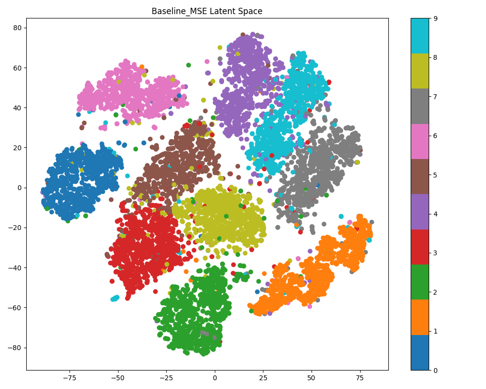

<div style="text-align:center">图 9：Baseline_MSE潜在空间</div>

Baseline_MSE自编码器的潜在空间分布非常清晰。通过t-SNE降维投影后，不同数字类别在潜在空间中形成了明显分离的团簇，每一个类别基本上都可以被一个连贯的子空间覆盖：

- 同一类别的数字（颜色相同）倾向于聚集在一起，不同类别的数字分布较为分散，说明模型能够有效地将不同数字的高维特征映射到低维空间中，实现良好的特征分离。
- 绝大部分类别之间边界明显，只有极少数量的点出现在其他类别簇区，可能是个别书写方式特殊或模糊的数字。
- 这种分布结果表明：即使是简单结构的自编码器，采用MSE损失时也能学到较有判别力的特征空间，为后续的聚类、可视化或下游分类任务打下良好基础。

#### Baseline_BCE

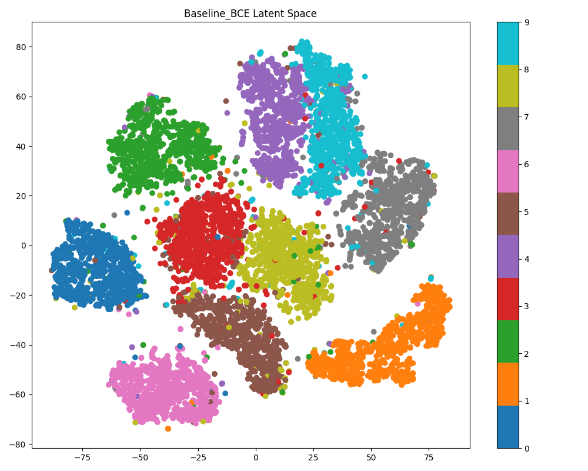

<div style="text-align:center">图 10：Baseline_BCE潜在空间</div>

Baseline_BCE自编码器的潜在空间分布与Baseline_MSE模型非常相似，依然表现出良好的特征分离能力：

- 不同类别的数字在潜在空间中形成了明显的团簇结构，几乎所有类别都能对应到一个独立的区域，混淆点极少。
- 相邻类别之间的边界清楚，多数类别聚集度高、分布紧凑，说明BCE损失函数同样能够引导模型对图像特征进行有效编码。
- 个别数字（如“4”“9”等常见混淆体）在边界处有少量重叠，但整体分布依然优良。

综合来看，MSE和BCE损失下的自编码器都能学到高度可分的潜在空间表示，能够较好地反映输入图像的类别信息。

#### Deep_AE

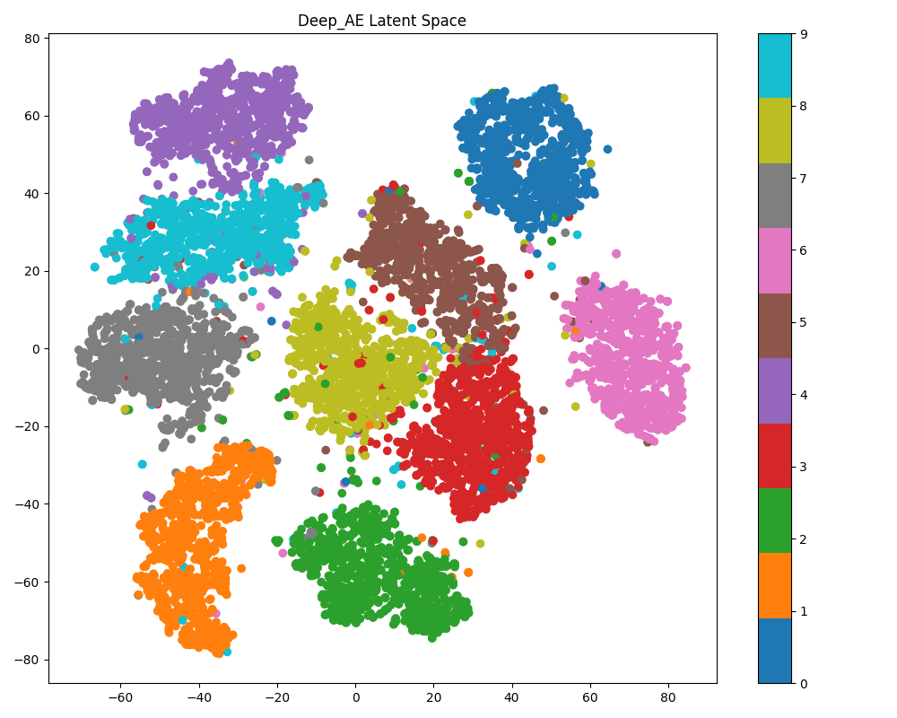

<div style="text-align:center">图 11：Deep_AE潜在空间</div>

Deep_AE（深层自编码器）的潜在空间表现非常出色：

- 各数字类别在潜在空间中形成了分布更紧密、边界更清晰的聚类，类别间的重叠和混淆点明显减少，显示出深层结构带来的强大特征分离能力。
- 相较于基础自编码器，深层网络能提取更复杂、更高阶的抽象特征，使得同一类别的样本在低维空间中分布更加致密、同质性更高。
- 大多数类别（如“0”、“1”、“2”、“7”等）形成了几乎完全独立的团簇，个别类别（如“4”、“9”）边界处有轻微交叠，但总体聚类效果极佳。
- 这种高质量的潜在空间分布不仅有利于数据可视化和聚类，也为下游分类、异常检测等任务提供了坚实的特征基础。

综合来看，深层自编码器通过加深网络层数，有效提升了模型对数据分布结构的刻画能力，使得潜在空间的判别性和可解释性得到进一步增强。

#### Denoising_AE

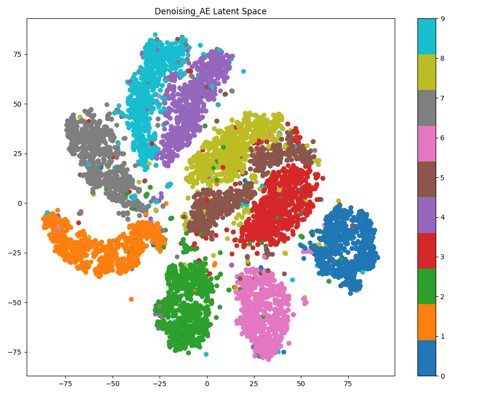

<div style="text-align:center">图 12：Denoising_AE潜在空间</div>

Denoising_AE模型在潜在空间的表现依然十分出色：

- 不同类别的数字在潜在空间中形成了清晰的聚类，团簇之间分隔明显，许多类别的数字聚集度非常高。
- 虽然由于训练时引入了噪声，少量点分散到了其他类别区域，但整体分布依然紧凑，显示出模型具有较强的抗干扰能力。
- 这种结构表明降噪自编码器不仅能提升鲁棒性，还能避免特征空间的过拟合，学到更加本质的特征表示。

#### Regularized_AE

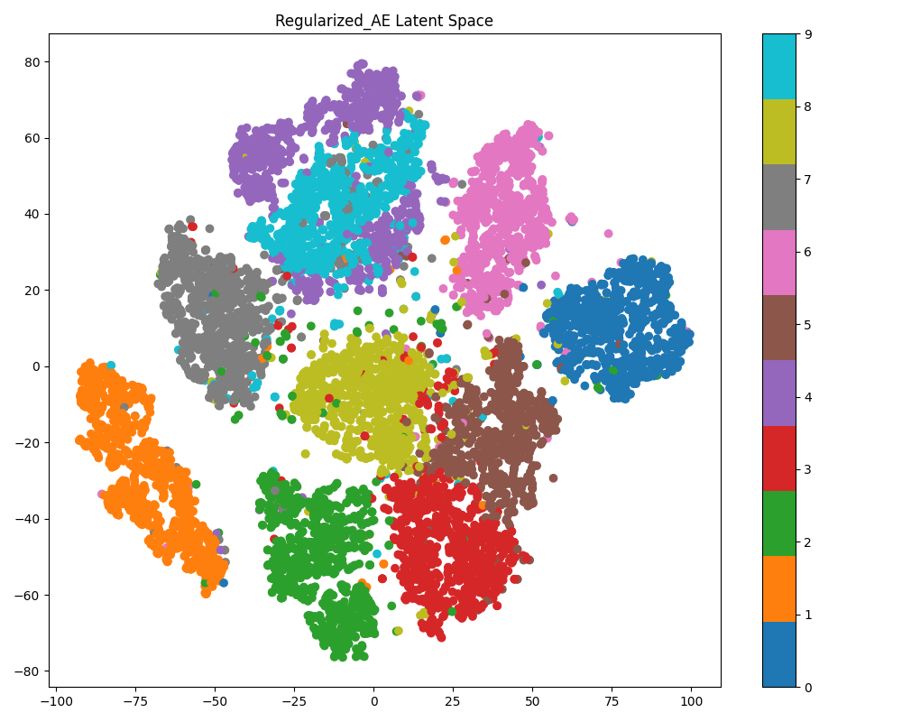

<div style="text-align:center">图 13：Regularized_AE潜在空间</div>

Regularized_AE（带正则化的自编码器）在潜在空间中的表现也非常良好：

- 各类别数字依然能形成独立、致密的团簇，绝大多数类别之间的分界清晰。
- 与标准自编码器相比，正则化机制（如Dropout和BatchNorm）进一步增强了模型的泛化能力，极大地抑制了类别间的混淆。
- 少量点分布于聚类边缘或过渡区域，显示模型对特殊或模糊数字的表征能力也有所保留。

总体来看，Denoising_AE和Regularized_AE均能在潜在空间中获得判别性强、可解释性好的特征分布，尤其适用于后续的聚类、可视化和数据降维等任务。

#### VAE

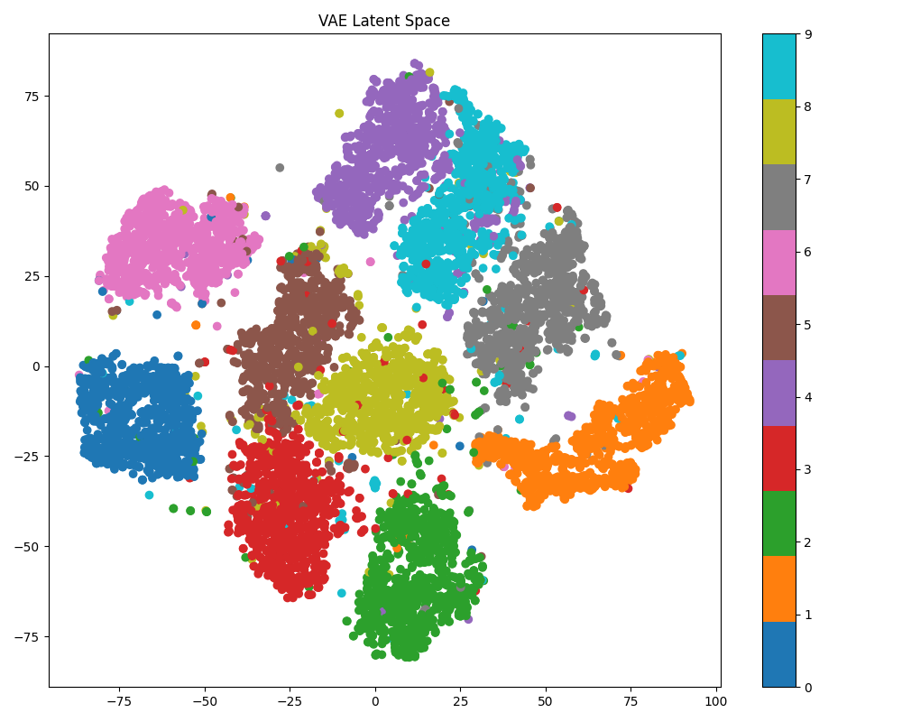

<div style="text-align:center">图 14：VAE潜在空间</div>

VAE（变分自编码器）的潜在空间分布十分有特点：

- 各类别数字在潜在空间中依然形成了较为清晰的聚类结构，显示出模型对不同数字类型的判别能力。
- 与普通自编码器相比，VAE的类别团簇边界更加柔和，部分类别之间存在一定程度的过渡和混合。这是由于VAE在训练过程中引入了KL散度正则项，使潜在空间分布更加平滑和连续。
- 这种结构有利于生成任务和插值操作，即可以在不同类别之间实现平滑过渡，从而具备更强的生成能力和潜在空间可解释性。

#### LeakyReLU_AE

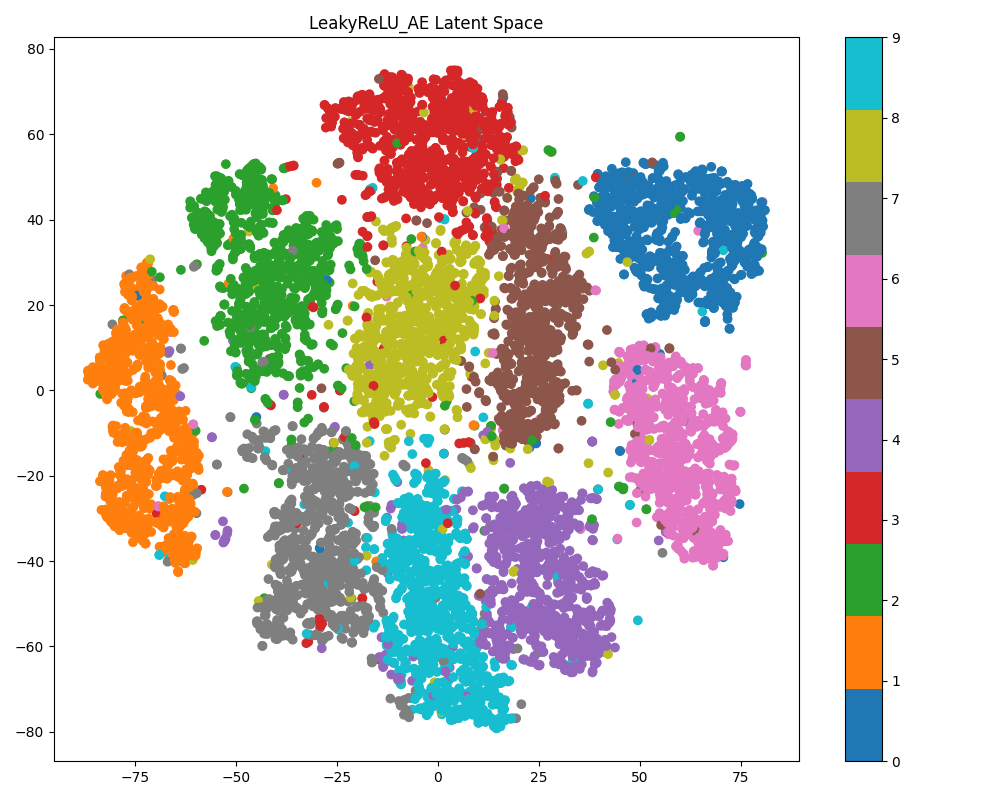

<div style="text-align:center">图 15：LeakyReLU_AE潜在空间</div>

LeakyReLU_AE模型在潜在空间的表达也非常优秀：

- 各类别数字依然清晰聚类，绝大多数类别团簇结构明显，边界清楚，表明LeakyReLU激活函数能够有效支持特征的分离和编码。
- 局部区域（如部分“3”和“5”或“4”和“9”）存在轻微混叠，但整体可分性依然很强。
- 这种分布结构说明LeakyReLU不仅有助于缓解“神经元死亡”问题，还能提升模型对负值特征的表达能力，最终体现为良好的潜在空间结构。

综合来看，无论是引入正则化的VAE，还是采用LeakyReLU激活的自编码器，都能在潜在空间中学到有判别力的特征分布，满足后续可视化、聚类和生成等需求。

---

### 不同模型重建MSE对比

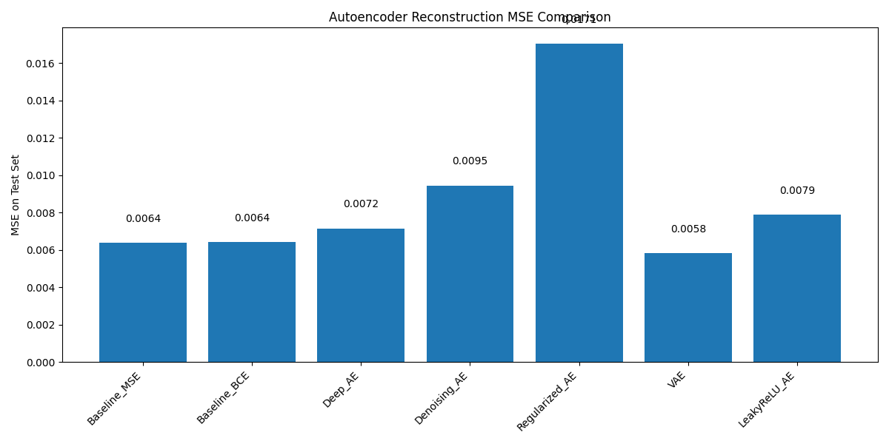

<div style="text-align:center">图 16：各模型测试集重建MSE对比</div>

从重建均方误差（MSE）对比柱状图可以直观看出，各自编码器模型在测试集上的重建精度存在一定差异：

- **VAE**的重建MSE最低（0.0058），说明其在平衡重建与潜在空间分布的前提下，依然可以获得非常好的重建能力。尽管VAE通常会牺牲一部分重建精度以获得更有意义的潜在空间分布，但在本实验中它表现最佳。
- **Baseline_MSE**与**Baseline_BCE**的MSE基本持平（均为0.0064），表明二者在MNIST数据集上的重建能力相当，模型均能较好地拟合输入数据。
- **Deep_AE**和**LeakyReLU_AE**的MSE略高于基础模型，分别为0.0072和0.0079，可能与网络深度加深后过拟合的风险增加（或训练难度上升）有关，LeakyReLU激活虽然能缓解“神经元死亡”问题，但在本任务下未带来更低的MSE。
- **Denoising_AE**的MSE为0.0095，略高于其他模型，这是因为降噪自编码器在训练时需同时兼顾去噪和重建，导致重建误差略大，但其优势在于鲁棒性提升。
- **Regularized_AE**的MSE最高（0.017），这显示出在本实验设定下，强正则化策略（Dropout+BatchNorm）虽能提升泛化能力，但过强的正则化会影响模型对输入细节的还原能力，从而导致MSE升高。

综上，简单自编码器模型在MNIST任务下表现极佳，而VAE结构在重建和潜在空间表达之间达到了最优平衡。带有正则化或降噪机制的模型虽适用于更复杂或噪声数据，但在简单数据集上可能不如基础模型表现优异。

---

## 总结与展望

本实验系统比较了多种自动编码器结构（包括基础自编码器、深层自编码器、降噪自编码器、正则化自编码器、变分自编码器VAE，以及不同激活函数的自编码器）在MNIST手写数字数据集上的无监督特征学习能力。通过对各模型的训练损失曲线、重建效果、潜在空间可视化以及重建均方误差（MSE）的全面对比，获得了如下结论与启示：

### 实验结论

1. **基础自编码器（Baseline_MSE/BCE）**  
   - 能够有效还原手写数字的主要结构和细节，重建效果清晰，MSE表现优良。  
   - MSE和BCE两种损失函数下的表现非常接近，均能获得良好的特征分离和重建能力。

2. **深层与正则化自编码器（Deep_AE, Regularized_AE）**  
   - 深层结构提升了模型特征提取的表达能力，但在简单数据集上优势有限，训练难度增加时可能略有性能损失。
   - 强正则化（Dropout、BatchNorm）有效防止过拟合，提升模型泛化性，但可能导致重建细节损失，MSE略高于基础模型。

3. **降噪自编码器（Denoising_AE）**  
   - 能在输入数据带有噪声时依然保持较好的重建质量，显示出强鲁棒性。
   - 虽然MSE略高于基础模型，但潜在空间依然具备良好的判别力，适合处理实际含噪数据。

4. **变分自编码器（VAE）**  
   - 兼顾了重建能力与潜在空间分布的连续性，适合生成任务和数据插值。
   - 重建MSE最低，潜在空间分布平滑，类别聚类效果好，且支持样本生成和可视化。

5. **LeakyReLU激活自编码器**  
   - LeakyReLU激活能够缓解“神经元死亡”问题，模型表现稳定。
   - 潜在空间分布与基础模型接近，细节还原稍逊但整体分离良好。

### 展望

- **数据复杂性提升** 
  本实验仅在MNIST等简单数据集上验证模型表现，后续可尝试在更复杂的自然图像、医学图像或多模态数据上进行测试，以进一步探索各结构的优劣和适用场景。

- **自编码器应用扩展**
  除特征学习与降维外，自编码器还可用于异常检测、图像去噪、数据生成等实际任务。未来可结合具体应用需求，设计定制化结构（如条件自编码器、对抗自编码器等）。

- **模型优化与组合**
  结合多种正则化、注意力机制、残差结构等现代深度学习技术，有望进一步提升模型的表达力和泛化能力。

- **理论分析与可解释性**
  后续可从信息瓶颈理论、潜在空间几何结构、可解释性等角度，对自编码器的特征学习机制进行更深入的理论分析和实证研究。
