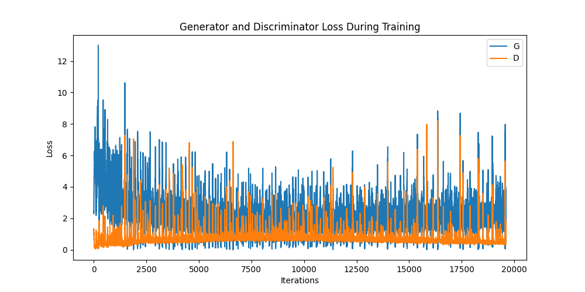
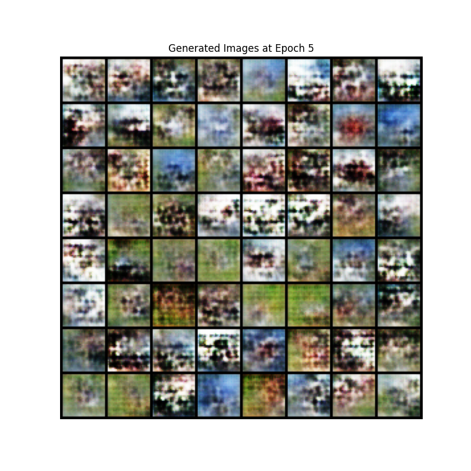
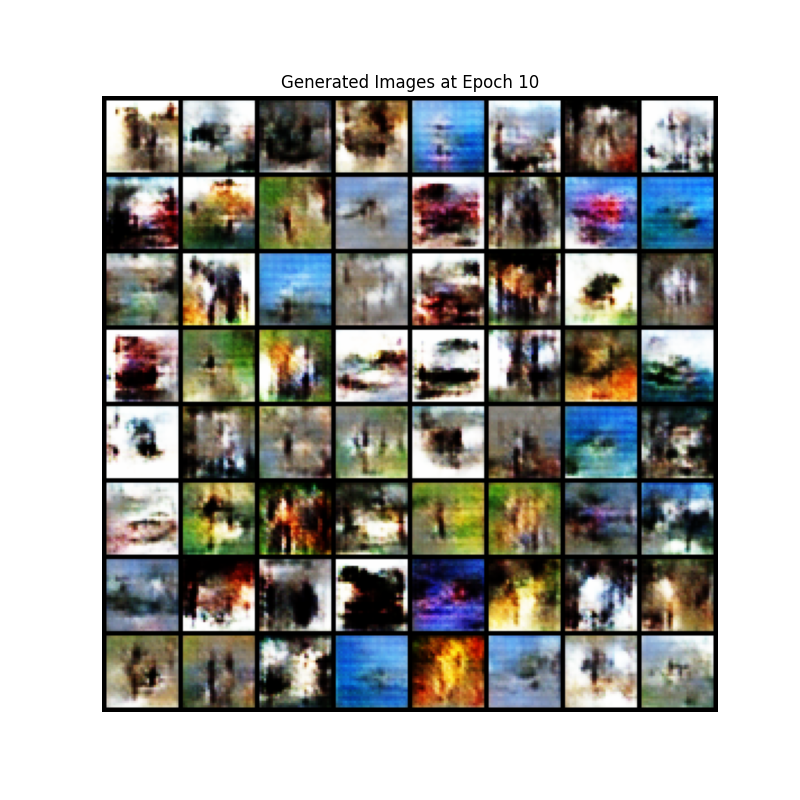
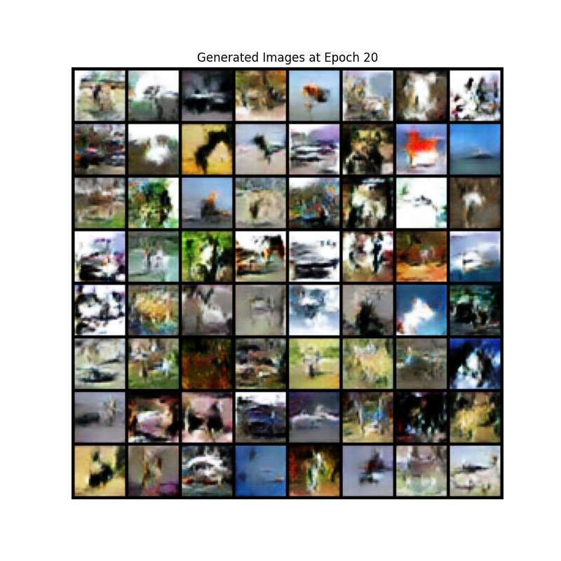
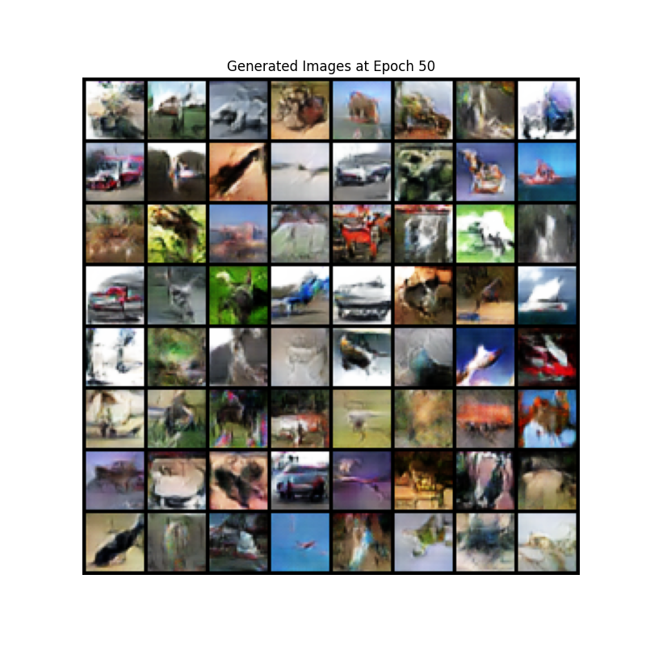
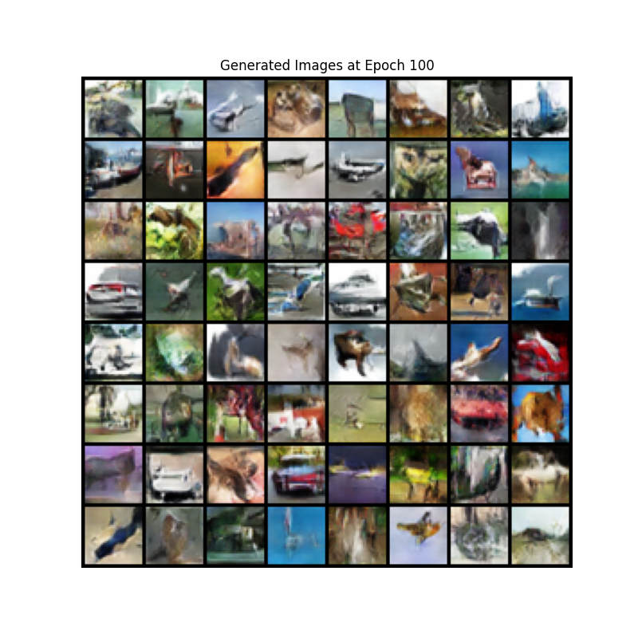
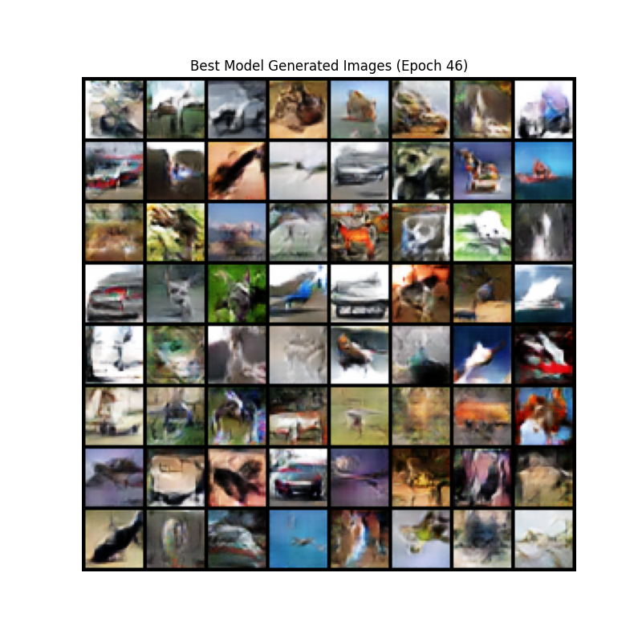
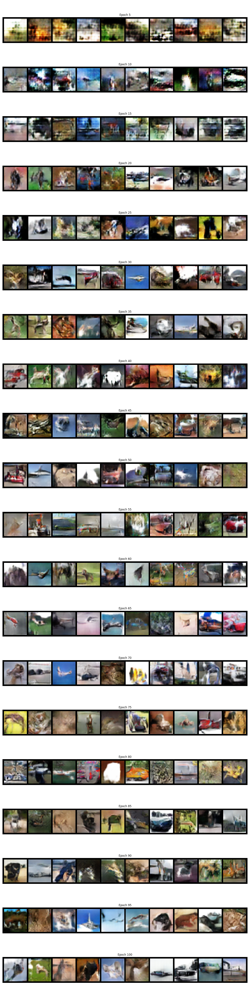

# GAN（生成对抗网络）在 CIFAR-10 数据集上的

# 实现与实验报告

## 实验目的与背景

生成对抗网络（Generative Adversarial Networks, GAN）是一类极具影响力的生成模型，由 Ian Goodfellow 等人在 2014 年提出。GAN 通过“生成器-判别器”对抗博弈的方式进行训练，能够学习复杂的数据分布，实现高质量的图像、音频等数据的生成。

本实验旨在基于 CIFAR-10 数据集，系统实现并训练 GAN，评估其在自然图像生成领域的表现。实验将详尽阐释 GAN 的原理、关键实现细节、训练流程，并通过可视化方式分析模型的生成能力。

## 模型原理详解

### GAN 的基本结构

GAN 包含两个核心模块：

- **生成器（Generator, G）**：输入为低维随机噪声向量 $z$，输出为尽量“逼真”的伪造数据（如图片）。目标是“欺骗”判别器，使其将伪造样本判为真实。
- **判别器（Discriminator, D）**：输入为数据样本（可能来自真实数据分布，也可能是生成器伪造的），输出为一个概率，表示输入为真实样本的可能性。目标是区分真实与伪造。

### 对抗训练的数学原理

GAN 的训练可理解为一个极小极大的博弈过程。设：

- $p_{\text{data}}(x)$：真实数据分布
- $p_z(z)$：噪声分布（如正态分布或均匀分布）
- $G(z)$：生成器，将噪声 $z$ 映射为伪造样本
- $D(x)$：判别器，输出输入 $x$ 为真实的概率

GAN 的最初目标函数为：

$$
\min_G \max_D V(D, G) = \mathbb{E}_{x \sim p_{\text{data}}(x)}[\log D(x)] + \mathbb{E}_{z \sim p_z(z)}[\log(1 - D(G(z)))]
$$

- **判别器 $D$ 的目标**：最大化 $V(D, G)$，即区分真实与伪造样本
  - 使得 $D(x)$ 对真实样本趋近于 1，对生成样本趋近于 0
- **生成器 $G$ 的目标**：最小化 $V(D, G)$，即“欺骗”判别器
  - 使得 $D(G(z))$ 趋近于 1

更具体地，训练过程分为两个步骤：

1. **训练判别器 $D$**：最大化

   $$
   \mathbb{E}_{x \sim p_{\text{data}}(x)}[\log D(x)] + \mathbb{E}_{z \sim p_z(z)}[\log(1 - D(G(z)))]
   $$

   这等价于最大化判别器对真实样本的识别概率并最小化对伪造样本的识别概率。

2. **训练生成器 $G$**：最小化
   $$
   \mathbb{E}_{z \sim p_z(z)}[\log(1 - D(G(z)))]
   $$
   实际训练中，为了避免梯度消失，常采用如下目标，使生成器直接最大化判别器对伪造样本为真的概率：
   $$
   \max_G \mathbb{E}_{z \sim p_z(z)}[\log D(G(z))]
   $$

### 理论最优

在理想情况下，若 $G$ 和 $D$ 有足够的容量，最终 $G$ 能学到与真实数据分布 $p_{\text{data}}(x)$ 完全一致的分布 $p_g(x)$，此时判别器无法区分真假样本，输出恒为 $0.5$，即

$$
D^*(x) = \frac{p_{\text{data}}(x)}{p_{\text{data}}(x) + p_g(x)}
$$

### 训练流程总结

1. 固定 $G$，优化 $D$（判别器多步）
2. 固定 $D$，优化 $G$（生成器一步）
3. 重复以上步骤，直到收敛或达到设定 epoch

> GAN 训练常面临不稳定、梯度消失、模式崩溃等问题，需要合理设置网络结构与超参数。

## 实验设置

### 环境与依赖

- **系统**: 基于 PyTorch 的机器学习环境
- **设备**: 根据可用性自动选择 MPS (Mac)、CUDA (GPU) 或 CPU
- **Python 版本**: 3.10+
- **主要依赖库**:
  - torch：深度学习核心库
  - torchvision：图像处理和数据集加载
  - matplotlib：结果可视化
  - tqdm: 进度条显示

### 超参数说明

关键超参数如下：

```python
batch_size = 256     # 每批样本数
image_size = 32      # 图片尺寸（CIFAR-10: 32x32）
nc = 3               # 色彩通道数（RGB）
nz = 100             # 噪声向量维度
ngf = 64             # 生成器特征图规模
ndf = 64             # 判别器特征图规模
num_epochs = 100     # 训练轮数
lr = 0.0002          # 学习率
beta1 = 0.5          # Adam 优化器 beta1
```

### 数据加载与预处理

采用均值、标准差均为 $0.5$ 的归一化，使像素值落在 $[-1,1]$ 区间：

```python
transform = transforms.Compose([
    transforms.ToTensor(),
    transforms.Normalize((0.5, 0.5, 0.5), (0.5, 0.5, 0.5)),
])
train_dataset = torchvision.datasets.CIFAR10(root='./data', train=True, download=True, transform=transform)
train_loader = DataLoader(dataset=train_dataset, batch_size=batch_size, shuffle=True, num_workers=2)
```

### 权重初始化

采用 DCGAN 推荐的初始化方式，有助于稳定 GAN 训练：

```python
def weights_init(m):
    classname = m.__class__.__name__
    if classname.find('Conv') != -1:
        nn.init.normal_(m.weight.data, 0.0, 0.02)
    elif classname.find('BatchNorm') != -1:
        nn.init.normal_(m.weight.data, 1.0, 0.02)
        nn.init.constant_(m.bias.data, 0)
```

## 模型结构

### 生成器（Generator）

将随机噪声通过多层转置卷积（反卷积）逐步上采样为 32x32x3 彩色图片。

```python
class Generator(nn.Module):
    def __init__(self):
        super(Generator, self).__init__()
        self.main = nn.Sequential(
            nn.ConvTranspose2d(nz, ngf * 4, 4, 1, 0, bias=False),
            nn.BatchNorm2d(ngf * 4),
            nn.ReLU(True),
            nn.ConvTranspose2d(ngf * 4, ngf * 2, 4, 2, 1, bias=False),
            nn.BatchNorm2d(ngf * 2),
            nn.ReLU(True),
            nn.ConvTranspose2d(ngf * 2, ngf, 4, 2, 1, bias=False),
            nn.BatchNorm2d(ngf),
            nn.ReLU(True),
            nn.ConvTranspose2d(ngf, nc, 4, 2, 1, bias=False),
            nn.Tanh()
        )

    def forward(self, input):
        return self.main(input)
```

### 判别器（Discriminator）

通过多层卷积逐步下采样，输出真假概率：

```python
class Discriminator(nn.Module):
    def __init__(self):
        super(Discriminator, self).__init__()
        self.main = nn.Sequential(
            nn.Conv2d(nc, ndf, 4, 2, 1, bias=False),
            nn.LeakyReLU(0.2, inplace=True),
            nn.Conv2d(ndf, ndf * 2, 4, 2, 1, bias=False),
            nn.BatchNorm2d(ndf * 2),
            nn.LeakyReLU(0.2, inplace=True),
            nn.Conv2d(ndf * 2, ndf * 4, 4, 2, 1, bias=False),
            nn.BatchNorm2d(ndf * 4),
            nn.LeakyReLU(0.2, inplace=True),
            nn.Conv2d(ndf * 4, 1, 4, 1, 0, bias=False),
            nn.Sigmoid()
        )

    def forward(self, input):
        return self.main(input)
```

### 损失函数与优化器

- 损失函数：二元交叉熵（BCE）
- 优化器：Adam，分别用于 G 和 D

```python
criterion = nn.BCELoss()
optimizerD = optim.Adam(netD.parameters(), lr=lr, betas=(beta1, 0.999))
optimizerG = optim.Adam(netG.parameters(), lr=lr, betas=(beta1, 0.999))
```

## 训练过程

GAN 训练过程交替优化判别器和生成器，同时记录损失值和生成样本，便于后续可视化分析。

**训练主循环核心代码如下：**

```python
for epoch in range(num_epochs):
    for i, data in enumerate(train_loader):
        # 1. 训练判别器 D
        netD.zero_grad()
        real_cpu = data[0].to(device)
        batch_size = real_cpu.size(0)
        label = torch.full((batch_size,), 1, dtype=torch.float, device=device)
        output = netD(real_cpu).view(-1)
        errD_real = criterion(output, label)
        errD_real.backward()

        noise = torch.randn(batch_size, nz, 1, 1, device=device)
        fake = netG(noise)
        label.fill_(0)
        output = netD(fake.detach()).view(-1)
        errD_fake = criterion(output, label)
        errD_fake.backward()
        errD = errD_real + errD_fake
        optimizerD.step()

        # 2. 训练生成器 G
        netG.zero_grad()
        label.fill_(1)
        output = netD(fake).view(-1)
        errG = criterion(output, label)
        errG.backward()
        optimizerG.step()

        # 3. 记录损失与样本
        # ...
```

每 5 个 epoch 保存模型权重、损失曲线和生成图片，始终保存当前生成器最优权重（以 G loss 为准）。

## 实验结果与分析

### 损失曲线

训练过程中记录生成器与判别器损失，并可视化其变化趋势。



从损失曲线可以看出，训练初期生成器（G）和判别器（D）的损失都较高，且波动较大。随着训练的进行，判别器损失（D loss）整体呈下降趋势，并逐渐趋于平稳，说明判别器逐步学会区分真实与生成样本。生成器损失（G loss）则在初期有明显下降，随后在一定范围内波动，反映出生成器在不断尝试“欺骗”判别器的过程中，损失会随着判别器能力的提升而有所起伏。

整体来看，损失曲线未出现明显的梯度消失或模式崩溃现象，G 和 D 的损失均保持在合理区间，表明模型训练较为稳定。损失的周期性波动是 GAN 对抗训练的常见现象，反映了生成器和判别器之间的动态博弈关系。最终，损失曲线趋于平稳，说明模型已达到一定的平衡状态。

### 生成图片可视化

#### 不同 epoch 的生成样本

每 5 个 epoch 保存一次生成图片，便于观察生成器能力的提升，示例：











从生成图片的演变可以明显看出，随着训练 epoch 的增加，生成器生成的样本质量逐步提升：

- **第 5 个 epoch**：生成图片整体较为模糊，结构混乱，难以分辨具体物体，仅有部分色块和大致轮廓，缺乏清晰的细节和类别特征。
- **第 10 个 epoch**：部分图片开始出现简单的轮廓和色彩分布，但大多数样本依然模糊，物体边界不清晰，类别特征尚不明显。
- **第 20 个 epoch**：生成图片的结构感增强，部分样本已能初步分辨出如动物、车辆等类别的轮廓，但仍存在较多噪声和失真。
- **第 50 个 epoch**：大部分图片的内容更加清晰，物体形态和背景分离明显，色彩搭配更自然，部分样本已具备较好的可辨识度，但细节和真实感仍有提升空间。
- **第 100 个 epoch**：生成图片整体质量显著提升，许多样本已能较为清楚地分辨出 CIFAR-10 的典型类别（如飞机、汽车、动物等），图像细节丰富，结构自然，模式多样性也有所体现，但仍存在部分样本模糊或失真现象。

总体来看，生成器在训练过程中逐步学会了数据分布的主要特征，生成图片的清晰度和多样性不断提升，验证了 GAN 在自然图像生成任务中的有效性。

#### 最优模型生成样本

采用生成器损失最低 epoch 的模型生成图片：



从上图可以看出，最优模型生成的图片整体质量较高，能够较好地复现 CIFAR-10 数据集中的多种类别特征。生成图片在色彩分布、结构轮廓上与真实样本较为接近，部分样本能够分辨出如动物（鸟、狗、青蛙）、交通工具（汽车、飞机、船只）等典型类别。多数图片具备一定的形状和纹理细节，背景与主体有一定区分，色彩搭配自然。

不过，仍有部分生成图片存在模糊、结构不完整或类别不易辨识的情况，细节表现与真实图片相比尚有差距，个别样本出现了混合或失真的现象。这反映了 GAN 在复杂自然图像生成任务中仍面临一定的挑战，如模式崩溃和细节还原不足等问题。

总体而言，最优模型生成样本在清晰度、多样性和类别特征方面均有较好表现，能够反映出 GAN 对 CIFAR-10 数据分布的有效学习能力，但提升生成图片的真实感和细节仍有改进空间。

### 不同 epoch 生成器的横向对比

对比多个 epoch 保存下来的模型的生成样本：



从上图可以直观地观察到，随着训练 epoch 的增加，生成器生成图片的质量和多样性逐步提升：

- **早期（Epoch 5-15）**：生成图片普遍较为模糊，结构混乱，难以分辨具体物体，仅有色块和大致轮廓，缺乏清晰的细节和类别特征。
- **中期（Epoch 20-50）**：图片开始出现明显的结构感，部分样本能够初步分辨出如动物、车辆等类别的轮廓，色彩分布更自然，噪声和失真逐渐减少，但仍有不少样本模糊或结构不完整。
- **后期（Epoch 55-100）**：生成图片的清晰度和可辨识度显著提升，许多样本已能较为清楚地表现出 CIFAR-10 的典型类别（如飞机、汽车、动物等），细节和纹理更加丰富，背景与主体区分明显，模式多样性也有所体现。

整体来看，生成器在训练过程中不断学习和捕捉数据分布的主要特征，生成图片的质量和多样性随 epoch 增加而持续提升。尽管后期仍有部分样本存在模糊或失真的现象，但大多数图片已具备较好的真实感和类别特征，验证了 GAN 在自然图像生成任务中的有效性和进步过程。

## 实验结论

本实验实现了基于 DCGAN 架构的 GAN，在 CIFAR-10 数据集上能够生成较为清晰且多样的彩色图片。通过损失曲线、样本可视化及模型进展对比，展示了 GAN 训练过程的动态与难点。

后续可进一步探索的方向包括：

- 针对模式崩溃的改进方法（如 WGAN、谱归一化等）
- 更复杂的数据集与更深的生成器结构
- 评价指标如 FID、IS 等量化生成图片质量
