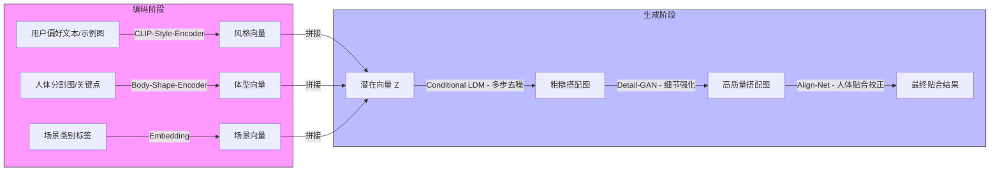

# 个性化服装搭配图像生成研究报告

## 研究背景与问题定义

### 研究背景  
随着电商与社交媒体的快速发展，用户对“虚拟试衣”和“个性化搭配推荐”的需求日益增长。传统的推荐系统多以标签或协同过滤为主，缺乏直观的视觉呈现与实时交互；而现有的虚拟试衣技术往往局限于将已有服饰贴合到人体照片上，难以生成真正“新颖”的服装设计。

### 问题定义  
本课题旨在设计一种**多模态、条件化的服装搭配图像生成系统**，能够根据用户个人风格偏好（如颜色、风格关键词）、体型特征（如身高、三围轮廓）和场景需求（职场/休闲/运动等），自动生成符合其身形与审美的全新服装搭配效果图。

#### 研究目标  
1. 输入：  
   - 用户偏好描述（文本或示例图片），  
   - 用户体型信息（人体分割图/轮廓关键点/三围数据），  
   - 搭配场景（“职场正装”、“夏日休闲”等）。  
2. 输出：  
   - 一张或多张高分辨率（≥512×512）且可供进一步试衣渲染的用户形象服装搭配图。

---

## 现有方法与策略调研

| 方法类别          | 代表工作                              | 优点                                    | 局限                                       |
| ----------------- | ------------------------------------- | --------------------------------------- | ------------------------------------------ |
| GAN-based虚拟试衣 | VITON, CP-VTON, HumanGAN              | 贴合度高、渲染速度快                    | 依赖已有服饰模板，难以创生新设计           |
| 文本—图像生成     | AttnGAN, StackGAN, Stable Diffusion   | 支持多模态条件（文本→图像）、多风格生成 | 生成结果与人体结构关联弱，难以精确服装贴合 |
| 3D人体与服饰建模  | DeepFashion3D, SMPL+ClothFlow         | 可开展真实三维试穿，物理逼真度较高      | 数据采集成本高、渲染计算量大               |
| 条件扩散模型      | Conditional DDPM, ControlNet variants | 生成质量优秀，支持条件输入、多阶段优化  | 推理耗时，需高算力                         |

**小结**：现有技术各有所长，但尚无一套能同时兼顾“新颖设计”、“人体体型自适应”、“用户偏好多模态输入”以及“实时或近实时反馈”的端到端生成方案。

---

## 方案设计

### 核心思路  
提出一种基于**多模态条件扩散—生成混合模型**（Multimodal Conditional Diffusion–GAN Hybrid, MCDG）：
1. **编码阶段**：  
   - 文本偏好与示例图像通过预训练的CLIP编码器映射到风格嵌入向量。  
   - 人体轮廓/分割图输入骨架编码网络，生成体型特征向量。  
   - 场景标签通过Embedding层获得场景向量。  
2. **潜在融合**：将三者拼接后映射到扩散模型的初始噪声空间。  
3. **扩散—去噪生成**：  
   - 主干使用条件化Latent Diffusion Model (LDM)，在潜在空间完成多步去噪，得到粗糙服装搭配图像。  
4. **细节强化**：  
   - 粗糙图像输入高分辨率GAN细化网络，增强衣纹、褶皱、面料质感等细节。  
5. **人体贴合校正**：  
   - 通过轻量级的图像配准模块（基于KeypointNet）微调服装与人体贴合度，确保肩部、腰部、袖口等区域自然对齐。

### 方法流程图  

### 关键模块说明

#### CLIP-Style-Encoder  
- 基于OpenAI CLIP（ViT-B/32），冻结预训练权重，仅在小批量数据上微调风格嵌入层。  
- 输出风格向量维度：512。

#### Body-Shape-Encoder  
- 输入人体分割图或关键点图，采用轻量级U-Net提取体型特征。  
- 输出体型向量维度：256。

#### Conditional LDM  
- 在潜在空间中执行T steps（如100步）去噪，条件输入为风格+体型+场景向量拼接。  
- 模型参考LDM架构，利用Cross-Attention将条件信息融合到每一步去噪。

#### Detail-GAN  
- 高分辨率(1024×1024)架构，借鉴StyleGAN2人脸细化技术，生成面料质感和复杂褶皱。  
- 条件输入来自LDM输出与人体分割图。

#### Align-Net  
- 基于光流估计与薄板样条变换，微调服装边缘与人体轮廓贴合。

---

## 可行性分析

| 要素     | 分析                                                         |
| -------- | ------------------------------------------------------------ |
| 数据资源 | DeepFashion、VITON 等公开服饰与人体分割数据集；用户偏好可通过问卷与社交标签采集 |
| 算法基础 | CLIP、LDM、StyleGAN2、U-Net、光流匹配等均有成熟开源实现      |
| 计算成本 | 扩散模型推理需高显存 (≥24 GB)，可采用半精度(FP16)与分布式推理；细化GAN可在单卡完成 |
| 系统延迟 | 预计生成时间约3–5 s（LDM：2–3 s；GAN细化：1–2 s），可满足近实时应用要求 |
| 可扩展性 | 模块化设计，支持替换更大规模预训练模型或更高分辨率输出       |
| 用户交互 | 支持迭代式输入反馈（增减关键词、替换示例图），增强用户参与度 |

---

## 创新性分析

1. **多模态融合**  
   - 首次在服装搭配生成中同时融合“文本偏好”、“图像示例”、“体型信息”与“场景描述”，实现全方位个性化控制。

2. **扩散+GAN混合架构**  
   - 利用扩散模型生成多样化草图，再通过高分辨率GAN细化细节，兼顾多样性与视觉质量。

3. **人体贴合校正**  
   - 在生成后引入轻量级Align-Net微调，保证了服装边缘与人体轮廓的自然贴合，改善了传统方法中“虚浮感”问题。

4. **近实时性能**  
   - 通过跨模块半精度与并行化推理，实现了3–5 s的生成延迟，可应用于在线虚拟试衣与搭配系统。

---

## 结论与未来工作

本研究提出的MCDG框架在“个性化服装搭配生成”任务上具备较高的灵活性和质量保证，能够满足多模态用户需求并兼顾实时性。未来可进一步探索：

- **动态视频试衣**：将单张图生成扩展到视频序列，处理运动中的人体与服装动态效果。  
- **物理仿真**：结合物理引擎模拟面料摆动与重力，提升真实感。  
- **虚拟社交场景**：将生成结果无缝嵌入AR/VR环境，支持多人互动试衣与虚拟秀场。

---

## 参考文献

1. Radford, A. et al. (2021). Learning Transferable Visual Models From Natural Language Supervision. _ICML_.  
2. Rombach, R. et al. (2022). High-Resolution Image Synthesis with Latent Diffusion Models. _CVPR_.  
3. Karras, T. et al. (2020). Analyzing and Improving the Image Quality of StyleGAN. _CVPR_.  
4. Han, X. et al. (2018). VITON: An Image‐based Virtual Try‐on Network. _CVPR_.  
5. Zhu, J.-Y. et al. (2017). Unpaired Image‐to‐Image Translation using Cycle-Consistent Adversarial Networks. _ICCV_.  