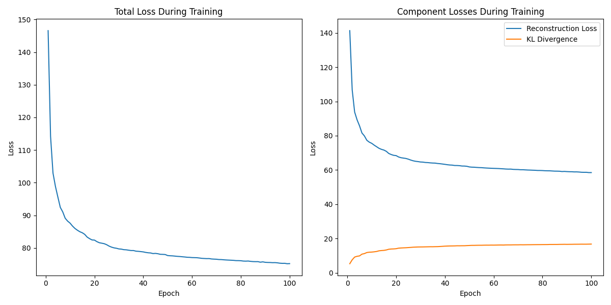
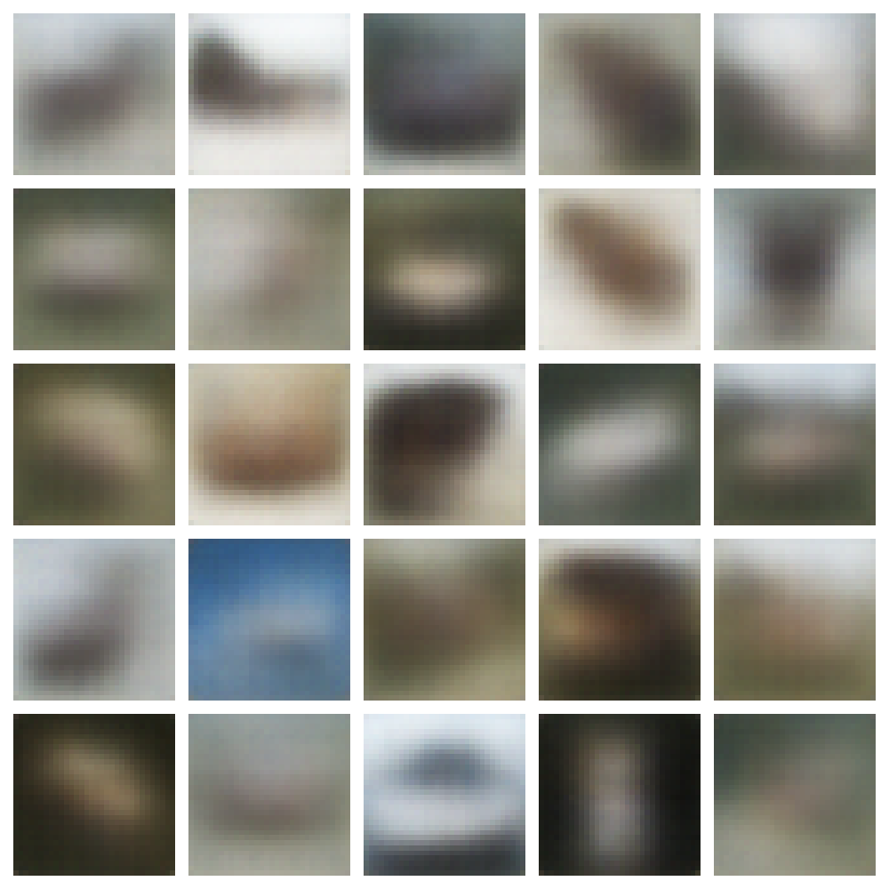
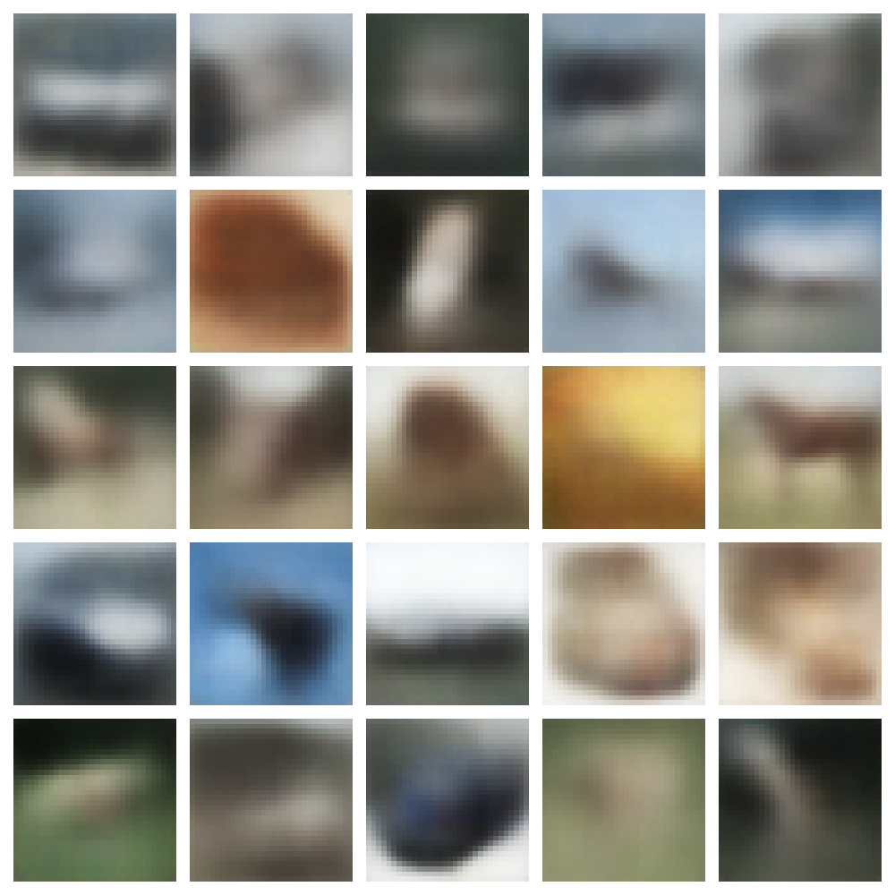
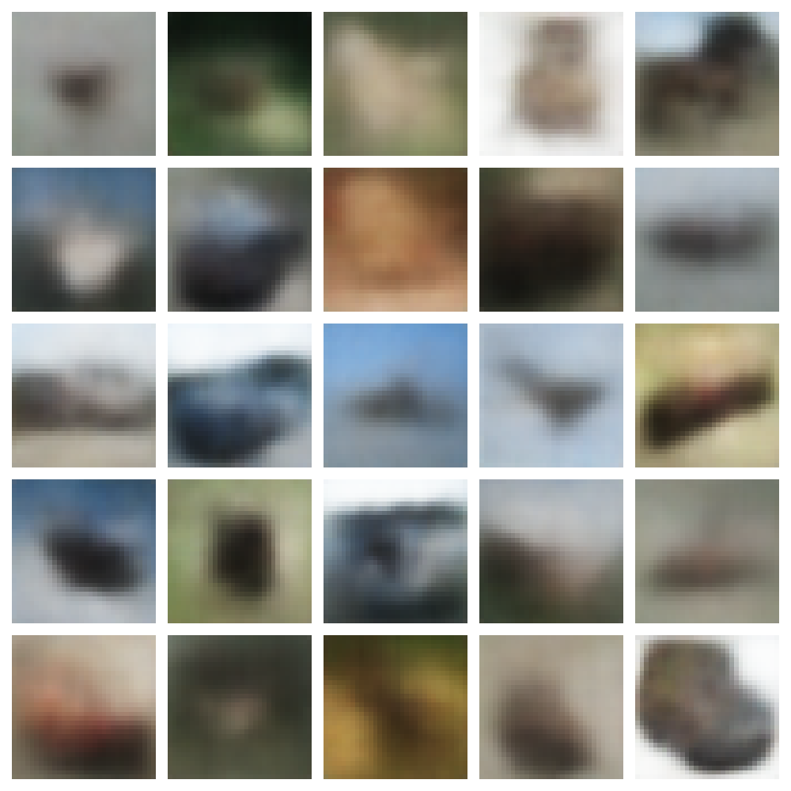
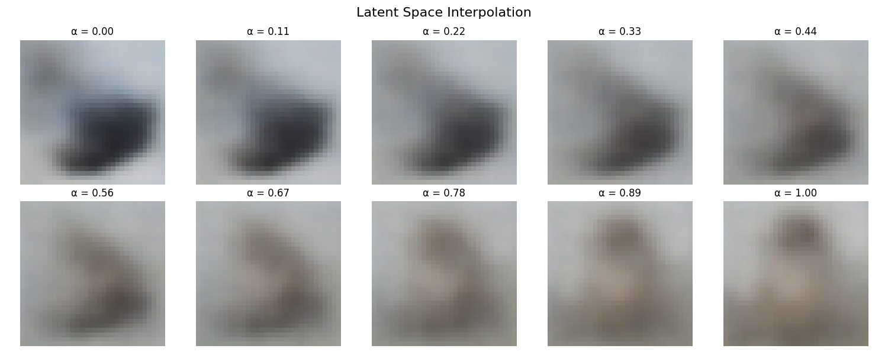

# 变分自编码器（VAE）在 CIFAR-10 数据集上的

# 实现与实验报告

## 实验背景与目标

变分自编码器（Variational Autoencoder, VAE）是一种具有概率生成模型特性的神经网络架构，由 Kingma 和 Welling 于 2013 年首次提出。本实验基于 CIFAR-10 数据集，实现并训练深度卷积 VAE 模型，旨在探索其图像重建与生成能力，以及潜在空间的表示性质。

主要目标包括：

- 理解并实现 VAE 的基本原理和数学框架
- 设计适用于 CIFAR-10 彩色图像的卷积 VAE 架构
- 评估模型的重建质量及生成能力
- 分析训练过程中损失函数各组成部分的变化规律

## 模型原理详解

### VAE 基本框架

变分自编码器结合了深度学习与变分推断，是一种同时具备生成能力与表示学习能力的概率模型。其核心思想是学习数据的潜在概率分布，而非传统自编码器学习的确定性映射。

VAE 由两个主要组件构成：

- **编码器**：将输入数据 $x$ 映射为潜在空间中的分布参数 $\mu$ 和 $\log\sigma^2$
- **解码器**：将从潜在分布中采样的向量 $z$ 重建为原始数据空间中的样本

### 数学原理

设 $x$ 为观测数据，$z$ 为潜在变量。VAE 的目标是最大化数据的边际似然 $p(x)$。由于直接计算 $p(x)$ 通常难以处理，VAE 转而最大化证据下界（Evidence Lower Bound, ELBO）：

$$
\mathcal{L}(\theta, \phi; x) = \mathbb{E}_{z \sim q_{\phi}(z|x)} \left[ \log p_{\theta}(x|z) \right] - D_{KL} \left( q_{\phi}(z|x) \| p(z) \right)
$$

其中：

- $p_{\theta}(x|z)$：由参数 $\theta$ 确定的解码器，表示给定潜在变量 $z$ 时，观测数据 $x$ 的条件概率
- $q_{\phi}(z|x)$：由参数 $\phi$ 确定的编码器，作为真实后验分布 $p(z|x)$ 的近似
- $p(z)$：潜在变量的先验分布，通常设为标准正态分布 $\mathcal{N}(0, I)$
- $D_{KL}$：KL 散度，衡量两个概率分布的差异

ELBO 可以分解为两个部分：

1. **重建项**：$\mathbb{E}_{z \sim q_{\phi}(z|x)} \left[ \log p_{\theta}(x|z) \right]$，鼓励解码器准确重建输入数据
2. **正则化项**：$D_{KL} \left( q_{\phi}(z|x) \| p(z) \right)$，使编码器输出的分布接近先验分布

### 重参数化技巧

为使整个网络可微，VAE 采用重参数化技巧。具体来说，编码器不直接输出采样值，而是输出分布参数 $\mu$ 和 $\log\sigma^2$，然后通过以下方式进行采样：

$$
z = \mu + \sigma \odot \varepsilon, \quad \varepsilon \sim \mathcal{N}(0, I)
$$

其中 $\odot$ 表示元素级乘法。这种采样方式使得梯度可以通过采样操作向后传播。

### KL 散度的解析解

假设编码器输出的分布为 $q_{\phi}(z|x) = \mathcal{N}(\mu, \text{diag}(\sigma^2))$，先验分布为 $p(z) = \mathcal{N}(0, I)$，则 KL 散度有解析解：

$$
D_{KL} \left( q_{\phi}(z|x) \| p(z) \right) = \frac{1}{2} \sum_{j=1}^{J} \left( \mu_j^2 + \sigma_j^2 - \log\sigma_j^2 - 1 \right)
$$

其中 $J$ 是潜在空间的维度。

## 实验设置

### 环境与依赖

- **系统**: 基于 PyTorch 的机器学习环境
- **设备**: 根据可用性自动选择 MPS (Mac)、CUDA (GPU) 或 CPU
- **Python 版本**: 3.10+
- **主要依赖库**:
  - torch：深度学习核心库
  - torchvision：图像处理和数据集加载
  - matplotlib：结果可视化
  - tqdm: 进度条显示

### 超参数设置

模型训练和架构的主要超参数如下：

```python
batch_size = 256      # 每批样本数
image_size = 32       # 图像尺寸 (CIFAR-10: 32×32)
nc = 3                # 图像通道数 (彩色RGB)
latent_dim = 128      # 潜在向量维度
hidden_dim = 256      # 隐藏层维度
num_epochs = 100      # 训练轮数
learning_rate = 1e-3  # 学习率
```

### 数据集与预处理

实验使用 CIFAR-10 数据集，包含 6 万张 32×32 彩色图像，分为 10 个类别。数据预处理仅将图像转换为张量并归一化到 [0,1] 范围：

```python
transform = transforms.Compose([
    transforms.ToTensor(),  # 将图像转换为[0,1]范围的张量
])

train_dataset = torchvision.datasets.CIFAR10(root='./data', train=True,
                                            download=True, transform=transform)
train_loader = DataLoader(dataset=train_dataset, batch_size=batch_size,
                         shuffle=True, num_workers=2)
```

## 模型设计

### 整体架构

实现的 VAE 模型采用深度卷积神经网络结构，包含以下关键组件：

1. **编码器**：多层卷积网络，将输入图像映射为潜在分布参数
2. **重参数化层**：实现随机采样的同时支持梯度传播
3. **解码器**：多层转置卷积网络，将潜在向量重建为原始图像
4. **残差连接**：提升梯度流动，增强深层网络训练效果

模型初始化代码：

```python
class VAE(nn.Module):
    def __init__(self):
        super(VAE, self).__init__()

        # 编码器
        self.encoder = nn.Sequential(
            # 3x32x32 -> 32x16x16
            nn.Conv2d(nc, 32, kernel_size=4, stride=2, padding=1),
            nn.BatchNorm2d(32),
            nn.LeakyReLU(0.2, inplace=True),

            # 32x16x16 -> 64x8x8
            nn.Conv2d(32, 64, kernel_size=4, stride=2, padding=1),
            nn.BatchNorm2d(64),
            nn.LeakyReLU(0.2, inplace=True),

            # 64x8x8 -> 128x4x4
            nn.Conv2d(64, 128, kernel_size=4, stride=2, padding=1),
            nn.BatchNorm2d(128),
            nn.LeakyReLU(0.2, inplace=True),

            # 128x4x4 -> 256x2x2
            nn.Conv2d(128, 256, kernel_size=3, stride=2, padding=1),
            nn.BatchNorm2d(256),
            nn.LeakyReLU(0.2, inplace=True),
        )

        # 展平和全连接层
        self.flatten_size = 256 * 2 * 2
        self.enc_fc1 = nn.Linear(self.flatten_size, hidden_dim * 2)
        self.enc_fc2 = nn.Linear(hidden_dim * 2, hidden_dim)

        # 潜在分布参数
        self.fc_mu = nn.Linear(hidden_dim, latent_dim)
        self.fc_log_var = nn.Linear(hidden_dim, latent_dim)

        # 解码器初始全连接层
        self.dec_fc1 = nn.Linear(latent_dim, hidden_dim)
        self.dec_fc2 = nn.Linear(hidden_dim, hidden_dim * 2)
        self.dec_fc3 = nn.Linear(hidden_dim * 2, self.flatten_size)

        # 解码器转置卷积层
        self.decoder = nn.Sequential(
            # 256x2x2 -> 128x4x4
            nn.ConvTranspose2d(256, 128, kernel_size=3, stride=2, padding=1, output_padding=1),
            nn.BatchNorm2d(128),
            nn.ReLU(inplace=True),

            # 128x4x4 -> 64x8x8
            nn.ConvTranspose2d(128, 64, kernel_size=4, stride=2, padding=1),
            nn.BatchNorm2d(64),
            nn.ReLU(inplace=True),

            # 64x8x8 -> 32x16x16
            nn.ConvTranspose2d(64, 32, kernel_size=4, stride=2, padding=1),
            nn.BatchNorm2d(32),
            nn.ReLU(inplace=True),

            # 32x16x16 -> 3x32x32
            nn.ConvTranspose2d(32, nc, kernel_size=4, stride=2, padding=1),
            nn.Sigmoid()  # 保持输出在[0,1]范围
        )

        # 残差连接
        self.enc_res1 = nn.Sequential(
            nn.Conv2d(32, 32, kernel_size=3, stride=1, padding=1),
            nn.BatchNorm2d(32),
            nn.LeakyReLU(0.2, inplace=True)
        )

        self.dec_res1 = nn.Sequential(
            nn.ConvTranspose2d(32, 32, kernel_size=3, stride=1, padding=1),
            nn.BatchNorm2d(32),
            nn.ReLU(inplace=True)
        )
```

### 重参数化实现

重参数化函数实现了从分布参数到采样值的可微转换：

```python
def reparameterize(self, mu, log_var):
    """重参数化技巧，实现采样时可反向传播。

    Args:
        mu (Tensor): 潜在高斯分布的均值
        log_var (Tensor): 潜在高斯分布的对数方差

    Returns:
        Tensor: 采样得到的潜在向量z
    """
    std = torch.exp(0.5 * log_var)
    eps = torch.randn_like(std)
    return mu + eps * std
```

### 损失函数设计

根据 VAE 理论，实现的损失函数包括重建损失（均方误差）和 KL 散度两部分：

```python
def loss_function(recon_x, x, mu, log_var):
    """计算VAE的损失函数，包括重建损失和KL散度。"""
    # 重建损失：均方误差
    recon_loss = F.mse_loss(recon_x, x, reduction='sum')

    # KL散度：-0.5 * sum(1 + log(sigma^2) - mu^2 - sigma^2)
    kl_div = -0.5 * torch.sum(1 + log_var - mu.pow(2) - log_var.exp())

    total_loss = recon_loss + kl_div
    return total_loss, recon_loss, kl_div
```

## 训练过程

### 训练循环

训练过程采用 Adam 优化器，并使用进度条实时显示各项损失：

```python
def train(epoch):
    """训练模型"""
    model.train()
    train_loss = 0
    recon_loss_total = 0
    kl_loss_total = 0

    # 创建进度条
    pbar = tqdm(enumerate(train_loader), total=len(train_loader),
                desc=f"Epoch {epoch}/{num_epochs}")

    for batch_idx, (data, _) in pbar:
        data = data.to(device)

        # Forward pass
        optimizer.zero_grad()
        recon_batch, mu, log_var = model(data)
        loss, recon_loss, kl_loss = loss_function(recon_batch, data, mu, log_var)

        # Propagation and optimization
        loss.backward()
        optimizer.step()

        # 累加损失
        train_loss += loss.item()
        recon_loss_total += recon_loss.item()
        kl_loss_total += kl_loss.item()

        # 更新进度条显示
        batch_size = data.size(0)
        pbar.set_postfix({
            'Loss': f'{loss.item() / batch_size:.6f}',
            'Recon': f'{recon_loss.item() / batch_size:.6f}',
            'KL': f'{kl_loss.item() / batch_size:.6f}'
        })

    # 计算平均损失
    avg_loss = train_loss / len(train_loader.dataset)
    avg_recon_loss = recon_loss_total / len(train_loader.dataset)
    avg_kl_loss = kl_loss_total / len(train_loader.dataset)

    print(f'====> Epoch: {epoch} Average loss: {avg_loss:.6f} '
          f'Average Reconstruction Loss: {avg_recon_loss:.6f} '
          f'Average KL Loss: {avg_kl_loss:.6f}')

    return avg_loss, avg_recon_loss, avg_kl_loss
```

### 模型保存与评估

训练过程中，每 10 个 epoch 保存一次模型，并生成样本用于可视化评估：

```python
for epoch in range(1, num_epochs + 1):
    epoch_loss, epoch_recon_loss, epoch_kl_loss = train(epoch)
    losses.append(epoch_loss)
    recon_losses.append(epoch_recon_loss)
    kl_losses.append(epoch_kl_loss)

    # 定期保存模型并生成样本
    if epoch % 10 == 0:
        model_path = f'{MODEL_SAVE_PATH}/vae_epoch_{epoch}.pth'
        torch.save(model.state_dict(), model_path)

        # 生成并显示样本
        with torch.no_grad():
            sample = torch.randn(25, latent_dim).to(device)
            sample = model.decode(sample).cpu()

            fig, axes = plt.subplots(5, 5, figsize=(10, 10))
            axes = axes.flatten()

            for i, ax in enumerate(axes):
                ax.imshow(sample[i].permute(1, 2, 0).numpy())
                ax.axis('off')

            plt.tight_layout()
            plt.savefig(f'{RESULT_SAVE_PATH}/vae_samples_epoch_{epoch}.png')
            plt.close()

    # 保存最优模型
    if epoch_loss < best_loss:
        best_loss = epoch_loss
        best_epoch = epoch
        torch.save(model.state_dict(), f'{MODEL_SAVE_PATH}/vae_best.pth')
```

## 实验结果与分析

### 损失函数变化趋势

训练过程中，总损失、重建损失和 KL 散度的变化如下图所示：



- **总损失** 在最初几个 epoch 内快速下降，从约 145 降至 90 左右，此后逐步收敛，到第 100 个 epoch 时稳定在约 75。说明模型在早期迅速学习到主要重建能力，随后进入细节微调阶段。
- **重建损失** 初始值极高（≈140），与总损失曲线基本重合，随后大幅下降至约 60，并在后期缓慢降低，平均每个 epoch 仅能带来极小的改进，表明图像重建质量趋于稳定。
- **KL 散度** 开始时约为 5，很快攀升至 15 左右，随后逐渐趋平，第 100 个 epoch 时约为 16.5。该趋势表明编码器分布正则化在早期增强迅速，后期趋于平衡，有助于潜在空间的稳定约束。

### 不同训练阶段的生成样本

模型在训练过程中每 10 个 epoch 生成一组样本，可以观察生成质量的变化：







- **Epoch 10**
  生成图像整体较为模糊，仅能勾勒基本轮廓和主色调。细节几乎不可辨识，边缘有明显抖动，类别特征尚未成形。
- **Epoch 50**
  清晰度和色彩还原明显提升，对象轮廓开始收敛，部分样本的纹理和背景细节可见，类别特征（如动物形态、车辆轮廓）逐渐显现，多样性有所增强。
- **Epoch 100**
  样本在形状和纹理上表现稳定，色彩对比度平衡，对象边缘锐利，细节丰富，背景与主体分离更清楚，生成质量达到较高水平。

### 最优模型生成结果

基于验证损失最低的模型，生成了更多样本用于评估：


- **最优模型样本**
  从生成图可以看出，图像轮廓清晰、细节丰富。动物、车辆和飞机等不同类别的特征表现准确，色彩与纹理还原自然，背景与主体分离明显；噪点进一步减少，物体边缘更为锐利，整体视觉质量达到最佳水平，充分展示了模型对潜在空间结构的良好学习。

### 重建质量评估

比较原始输入图像与重建图像，评估模型的重建能力：


- **结构保留**
  模型能够较好地重建出原图的整体轮廓，比如鸟类、车辆和飞机的形状边界清晰可辨。
- **细节模糊**
  重建结果普遍偏向平滑，纹理和高频细节被弱化，特别是在复杂背景和小目标区域。
- **颜色还原**
  重建图像的主色调与原图一致，但对比度和饱和度略低，高光和阴影细节有所损失。
- **背景表现**
  背景多被重建为均匀色块，远景细节丢失明显，模型更关注主体对象的重建。
- **类别差异**
  对于轮廓简单、色彩对比强烈的类别（如卡车、飞机），重建效果最稳定；对于纹理复杂的动物或自然场景，重建质量相对较差。

### 潜在空间特性

通过潜在空间的插值实验，观察生成图像的平滑过渡：



从 α=0.00 到 α=1.00，图像在颜色、纹理和形状上都表现出连续且语义清晰的变化：

- 连续性
  图像的过渡非常平滑，每个插值步长之间没有突兀的跳变，说明潜在空间中相邻向量对应的生成结果差异很小，模型学到的潜在分布是连贯的。
- 语义变化
  - 当 α≈0.00–0.33 时，主体以棕褐色为主，保留了原图的基本轮廓；
  - α≈0.44–0.67 时，颜色逐渐由暖色系向冷色系过渡，背景元素开始从陆地向水面演化，主体轮廓也出现船体特征；
  - α≈0.78–1.00 时，细节进一步丰富，纹理从模糊变得清晰，最终完整呈现目标图像的蓝色水面和船只形态。
- 语义一致性
  整个插值过程不仅颜色平滑转换，物体结构也在潜在空间中沿着一条“语义曲线”逐步变形，体现出潜在表示对不同图像属性（颜色、纹理、形状）的良好解耦与重组能力。

该实验表明，VAE 学到的潜在空间在类别转换和属性插值上都具有很好的连续性和可解释性，为后续基于向量运算的图像编辑、属性控制提供了坚实基础。

## 结论与展望

### 主要发现

1. 实现的卷积 VAE 模型能够在 CIFAR-10 数据集上学习有意义的潜在表示，并生成合理的图像样本
2. 残差连接的引入有效提升了深层网络的训练效果
3. 随着训练进行，生成图像的清晰度和多样性逐渐提高
4. KL 散度和重建损失之间达到了一定的平衡，但仍存在优化空间

### 局限性

1. 生成的图像相比原始数据集仍有一定模糊感
2. 某些类别的生成效果明显优于其他类别

### 未来改进方向

1. **模型架构改进**：
   - 实现 β-VAE 增强解耦表示能力
   - 引入注意力机制捕捉更复杂的空间依赖关系
   - 尝试层次化 VAE 捕获不同尺度的特征
2. **损失函数优化**：

   - 引入感知损失提升视觉质量
   - 调整 KL 散度项权重以平衡重建与正则化
   - 实现条件 VAE（CVAE）控制生成过程

3. **评估方法完善**：
   - 引入 FID、IS 等客观评价指标
   - 进行用户研究评估生成图像的主观质量
   - 系统分析潜在空间的语义结构
