# 条件变分自编码器（Conditional VAE）在 CIFAR-10 数据集上的实现与评估

## 引言

变分自编码器（Variational Autoencoder, VAE）作为一种强大的生成模型，通过学习数据的潜在表示并从中生成新样本，在图像生成领域展现出显著潜力。然而，标准 VAE 缺乏对生成过程的精确控制，难以生成具有特定属性的样本。条件变分自编码器（Conditional VAE, CVAE）通过引入条件信息，有效解决了这一限制，实现了对生成内容的条件控制。

本实验基于 CIFAR-10 数据集，实现并评估了一个条件变分自编码器，重点关注如何通过类别标签控制图像生成过程。通过一系列实验与可视化分析，我们展示了 CVAE 在类条件图像生成任务中的性能表现，并探讨了潜在空间结构与条件机制的交互作用。

## 模型原理

### 条件变分自编码器基本概念

条件变分自编码器是 VAE 的扩展，由 Kihyuk Sohn 等人在 2015 年提出。相比于标准 VAE，CVAE 将条件信息（如类别标签）整合到编码和解码过程中，赋予模型根据指定条件生成样本的能力。

在标准 VAE 中，模型学习的是整个数据分布 $p(x)$；而在 CVAE 中，模型学习条件分布 $p(x|y)$，其中 $y$ 表示条件信息。这种条件控制机制使 CVAE 成为一个更灵活、可控的生成模型。

### 数学表达与推导

#### 变分推断框架

设 $x$ 为输入数据（如图像），$y$ 为条件信息（如类别标签），$z$ 为潜在变量。CVAE 的目标是最大化条件对数似然 $\log p(x|y)$。由于直接计算这一似然通常难以处理，我们采用变分推断方法引入近似后验分布 $q_{\phi}(z|x,y)$，得到证据下界（ELBO）：

$$
\begin{align}
\log p(x|y) &= \log \int p(x,z|y) dz\\
&= \log \int p(x,z|y) \frac{q_{\phi}(z|x,y)}{q_{\phi}(z|x,y)} dz\\
&= \log \mathbb{E}_{z \sim q_{\phi}(z|x,y)} \left[ \frac{p(x,z|y)}{q_{\phi}(z|x,y)} \right]
\end{align}
$$

根据 Jensen 不等式，我们得到：

$$
\begin{align}
\log p(x|y) &\geq \mathbb{E}_{z \sim q_{\phi}(z|x,y)} \left[ \log \frac{p(x,z|y)}{q_{\phi}(z|x,y)} \right]\\
&= \mathbb{E}_{z \sim q_{\phi}(z|x,y)} \left[ \log \frac{p(x|z,y)p(z|y)}{q_{\phi}(z|x,y)} \right]\\
&= \mathbb{E}_{z \sim q_{\phi}(z|x,y)} \left[ \log p(x|z,y) \right] - D_{KL} \left( q_{\phi}(z|x,y) \| p(z|y) \right)
\end{align}
$$

这就是 CVAE 的条件证据下界（Conditional Evidence Lower Bound, ELBO）。

#### 组成部分解析

CVAE 的 ELBO 由两部分组成：

1. **条件重建项**：$\mathbb{E}_{z \sim q_{\phi}(z|x,y)} \left[ \log p(x|z,y) \right]$

   - 表示从潜在变量 $z$ 和条件 $y$ 重建输入 $x$ 的期望对数似然
   - 衡量模型在给定条件下的重建能力
   - 通常使用均方误差（MSE）或交叉熵损失实现

2. **条件 KL 散度项**：$D_{KL} \left( q_{\phi}(z|x,y) \| p(z|y) \right)$
   - 衡量近似后验分布 $q_{\phi}(z|x,y)$ 与条件先验分布 $p(z|y)$ 之间的差异
   - 作为正则项，促使潜在表示接近预定义的先验分布
   - 有助于生成过程的稳定性和样本多样性

#### 简化与实现

在实际实现中，我们通常做以下简化：

1. **条件先验假设**：假设条件先验 $p(z|y)$ 等同于无条件先验 $p(z) = \mathcal{N}(0, I)$，即潜在变量的先验分布不依赖于条件
2. **高斯假设**：近似后验 $q_{\phi}(z|x,y) = \mathcal{N}(\mu_{\phi}(x,y), \text{diag}(\sigma^2_{\phi}(x,y)))$

在这些假设下，KL 散度项有解析解：

$$
D_{KL} \left( q_{\phi}(z|x,y) \| p(z) \right) = \frac{1}{2} \sum_{j=1}^{J} \left( \mu_j^2 + \sigma_j^2 - \log \sigma_j^2 - 1 \right)
$$

其中 $J$ 是潜在空间的维度。

### 重参数化技巧

为了使整个网络可以通过反向传播训练，CVAE 采用了重参数化技巧。不直接从分布 $q_{\phi}(z|x,y)$ 中采样，而是通过以下方式进行等价变换：

$$
z = \mu_{\phi}(x,y) + \sigma_{\phi}(x,y) \odot \varepsilon, \quad \varepsilon \sim \mathcal{N}(0, I)
$$

其中 $\odot$ 表示元素级乘法。这使得采样操作对参数 $\phi$ 可微分，从而能够通过标准反向传播进行优化。

### 条件信息的融合方式

条件信息可以通过多种方式融入 CVAE 架构：

1. **连接（Concatenation）**：

   - 在编码器中，将条件向量与输入数据连接
   - 在解码器中，将条件向量与潜在向量连接
   - 优点：简单直接，容易实现

2. **条件层（Conditional Layers）**：

   - 使用条件批归一化（Conditional Batch Normalization）
   - 或 FiLM（Feature-wise Linear Modulation）
   - 优点：可能提供更细粒度的特征调制

3. **条件后验与先验**：
   - 学习条件相关的后验分布
   - 设计条件相关的先验分布
   - 优点：更贴合理论模型，但实现复杂

在本实验中，我们采用了连接（Concatenation）方式，将类别信息转换为 one-hot 向量后与特征或潜在向量连接，实现简单而有效的条件控制。

## 实验设置

### 环境与依赖

- **系统**: 基于 PyTorch 的机器学习环境
- **设备**: 根据可用性自动选择 MPS (Mac)、CUDA (GPU) 或 CPU
- **Python 版本**: 3.10+
- **主要依赖库**:
  - torch：深度学习核心库
  - torchvision：图像处理和数据集加载
  - matplotlib：结果可视化
  - tqdm: 进度条显示

### 数据集

实验使用 CIFAR-10 数据集，包含 60,000 张 32×32 彩色图像，分为 10 个类别（飞机、汽车、鸟类、猫、鹿、狗、青蛙、马、船和卡车），每类 6,000 张图像。数据预处理将图像转换为张量并归一化：

```python
# 数据预处理：转换为张量
transform = transforms.Compose([
    transforms.ToTensor(),  # 将图像从[0,255]转换为[0,1]范围的张量
])

# 加载CIFAR-10数据集
train_dataset = torchvision.datasets.CIFAR10(root='./data', train=True, download=True, transform=transform)
train_loader = DataLoader(dataset=train_dataset, batch_size=batch_size, shuffle=True, num_workers=2)
```

### 超参数设置

模型训练涉及以下关键超参数：

```python
batch_size = 256      # 每批样本数量
image_size = 32       # 图像尺寸（CIFAR-10为32×32像素）
nc = 3                # 图像通道数（RGB彩色图像）
latent_dim = 128      # 潜在向量的维度
hidden_dim = 256      # 隐藏层维度
num_classes = 10      # CIFAR-10类别数量
num_epochs = 100      # 训练轮数
learning_rate = 1e-3  # 优化器学习率
```

这些超参数的选择考虑了模型的表达能力、训练效率和生成质量之间的平衡。特别是`latent_dim`决定了潜在空间的维度，影响模型的表达能力和生成多样性；而`hidden_dim`控制网络容量，影响特征提取和重建能力。

### KL 退火策略

为平衡重建质量和 KL 散度正则化，实验采用 KL 退火（KL annealing）策略，随训练进程逐渐增加 KL 损失项的权重：

```python
def kl_annealing_weight(epoch, start_weight=0.0, end_weight=1.0, annealing_epochs=10):
    """计算KL退火权重"""
    if epoch >= annealing_epochs:
        return end_weight
    return start_weight + (end_weight - start_weight) * epoch / annealing_epochs
```

这种策略使模型在训练初期优先学习良好的重建能力，然后随着训练进行，逐渐增强对潜在空间的正则化，防止 KL 散度项"消失"，同时确保潜在空间具有良好的结构和采样性能。

## 模型设计

### CVAE 整体架构

CVAE 模型由三个主要组件组成：编码器、重参数化模块和解码器。完整的网络架构如下：

```python
class CVAE(nn.Module):
    def __init__(self, latent_dim=128, num_classes=10):
        super(CVAE, self).__init__()

        self.latent_dim = latent_dim
        self.num_classes = num_classes

        # 编码器卷积层
        self.enc_conv1 = nn.Conv2d(nc, 32, kernel_size=4, stride=2, padding=1)  # 32x16x16
        self.enc_conv2 = nn.Conv2d(32, 64, kernel_size=4, stride=2, padding=1)  # 64x8x8
        self.enc_conv3 = nn.Conv2d(64, 128, kernel_size=4, stride=2, padding=1)  # 128x4x4

        # 计算展平后的特征大小
        self.flatten_size = 128 * 4 * 4

        # 处理展平图像特征和类别标签的全连接层
        self.enc_fc1 = nn.Linear(self.flatten_size + num_classes, hidden_dim)

        # 潜在分布的均值和方差参数
        self.fc_mu = nn.Linear(hidden_dim, latent_dim)
        self.fc_log_var = nn.Linear(hidden_dim, latent_dim)

        # 解码器的初始全连接层
        self.dec_fc1 = nn.Linear(latent_dim + num_classes, hidden_dim)
        self.dec_fc2 = nn.Linear(hidden_dim, self.flatten_size)

        # 解码器反卷积层
        self.dec_conv1 = nn.ConvTranspose2d(128, 64, kernel_size=4, stride=2, padding=1)  # 64x8x8
        self.dec_conv2 = nn.ConvTranspose2d(64, 32, kernel_size=4, stride=2, padding=1)  # 32x16x16
        self.dec_conv3 = nn.ConvTranspose2d(32, nc, kernel_size=4, stride=2, padding=1)  # 3x32x32

        # 批归一化层
        self.enc_bn1 = nn.BatchNorm2d(32)
        self.enc_bn2 = nn.BatchNorm2d(64)
        self.enc_bn3 = nn.BatchNorm2d(128)

        self.dec_bn1 = nn.BatchNorm2d(64)
        self.dec_bn2 = nn.BatchNorm2d(32)
```

### 编码器设计

编码器负责将输入图像和类别标签映射到潜在空间分布参数（均值和方差）：

```python
def encode(self, x, c):
    """
    将输入图像和类别标签编码为潜在分布参数
    """
    # 通过卷积层处理图像
    x = F.relu(self.enc_bn1(self.enc_conv1(x)))
    x = F.relu(self.enc_bn2(self.enc_conv2(x)))
    x = F.relu(self.enc_bn3(self.enc_conv3(x)))

    # 展平卷积输出
    x = x.view(-1, self.flatten_size)

    # 与one-hot类别标签连接
    x = torch.cat([x, c], dim=1)

    # 通过全连接层处理
    x = F.relu(self.enc_fc1(x))

    # 获取潜在分布参数
    mu = self.fc_mu(x)
    log_var = self.fc_log_var(x)

    return mu, log_var
```

编码器的关键设计包括：

1. **卷积特征提取**：使用三层卷积网络逐步降低分辨率，提取图像特征
2. **批归一化**：每层卷积后应用批归一化，稳定训练过程
3. **条件融合**：将类别的 one-hot 编码与展平的特征向量连接
4. **双头输出**：分别预测潜在分布的均值和对数方差

### 重参数化模块

实现采样过程的同时支持反向传播：

```python
def reparameterize(self, mu, log_var):
    """重参数化技巧，使采样过程可微"""
    std = torch.exp(0.5 * log_var)
    eps = torch.randn_like(std)
    z = mu + eps * std
    return z
```

这个简洁但关键的模块实现了 VAE 的核心创新，即通过随机噪声的确定性变换实现可微分的随机采样。

### 解码器设计

解码器将潜在向量和类别标签映射回图像空间：

```python
def decode(self, z, c):
    """从潜在向量和类别标签解码生成图像"""
    # 将潜在向量与one-hot类别标签连接
    z = torch.cat([z, c], dim=1)

    # 通过全连接层处理
    x = F.relu(self.dec_fc1(z))
    x = F.relu(self.dec_fc2(x))

    # 重塑为适合反卷积层的形状
    x = x.view(-1, 128, 4, 4)

    # 通过反卷积层处理
    x = F.relu(self.dec_bn1(self.dec_conv1(x)))
    x = F.relu(self.dec_bn2(self.dec_conv2(x)))
    x = torch.sigmoid(self.dec_conv3(x))  # 使用sigmoid确保输出在[0,1]范围内

    return x
```

解码器的关键设计包括：

1. **条件融合**：将类别的 one-hot 编码与潜在向量连接
2. **特征重建**：通过全连接层恢复空间维度
3. **上采样**：使用转置卷积层逐步提高分辨率
4. **激活函数**：内部使用 ReLU 激活，输出层使用 Sigmoid 将值约束在[0,1]范围

### 前向传播

CVAE 的完整前向传播流程：

```python
def forward(self, x, c):
    """CVAE的前向传播"""
    # 将类别索引转换为one-hot向量
    c_one_hot = F.one_hot(c, num_classes=self.num_classes).float()

    # 编码、采样和解码
    mu, log_var = self.encode(x, c_one_hot)
    z = self.reparameterize(mu, log_var)
    x_reconstructed = self.decode(z, c_one_hot)

    return x_reconstructed, mu, log_var
```

前向传播整合了完整的 CVAE 流程：类别条件处理、编码、潜在空间采样和条件解码，体现了条件生成模型的完整流程。

## 训练过程

### 损失函数

CVAE 的损失函数结合了重建损失和 KL 散度，并应用 KL 退火策略：

```python
def loss_function(recon_x, x, mu, log_var, kld_weight=1.0):
    """计算CVAE的损失函数：重建损失 + KL散度"""
    # 重建损失：均方误差
    recon_loss = F.mse_loss(recon_x, x, reduction='sum')

    # KL散度：-0.5 * sum(1 + log(sigma^2) - mu^2 - sigma^2)
    kl_div = -0.5 * torch.sum(1 + log_var - mu.pow(2) - log_var.exp())

    # 总损失（应用权重）
    total_loss = recon_loss + kld_weight * kl_div

    return total_loss, recon_loss, kl_div
```

这个损失函数直接对应 CVAE 的 ELBO 目标，其中重建损失实现了条件似然项，KL 散度实现了后验与先验之间的正则项。

### 训练循环

训练过程的核心实现如下：

```python
def train(epoch, kld_weight):
    """训练模型一个epoch"""
    model.train()
    train_loss = 0
    recon_loss_total = 0
    kl_loss_total = 0

    # 创建进度条
    pbar = tqdm(enumerate(train_loader), total=len(train_loader),
                desc=f"Epoch {epoch}/{num_epochs}")

    for batch_idx, (data, target) in pbar:
        data, target = data.to(device), target.to(device)

        # 前向传播
        optimizer.zero_grad()
        recon_batch, mu, log_var = model(data, target)
        loss, recon_loss, kl_loss = loss_function(recon_batch, data, mu, log_var, kld_weight)

        # 反向传播
        loss.backward()
        optimizer.step()

        # 累积指标
        train_loss += loss.item()
        recon_loss_total += recon_loss.item()
        kl_loss_total += kl_loss.item()

        # 更新进度条
        batch_size = data.size(0)
        pbar.set_postfix({
            'Loss': f'{loss.item() / batch_size:.6f}',
            'Recon': f'{recon_loss.item() / batch_size:.6f}',
            'KL': f'{kl_loss.item() / batch_size:.6f}',
            'KLD Weight': f'{kld_weight:.4f}'
        })

    # 返回平均损失
    avg_loss = train_loss / len(train_loader.dataset)
    avg_recon_loss = recon_loss_total / len(train_loader.dataset)
    avg_kl_loss = kl_loss_total / len(train_loader.dataset)

    print(f'====> Epoch: {epoch} Average loss: {avg_loss:.6f} '
          f'Average Reconstruction Loss: {avg_recon_loss:.6f} '
          f'Average KL Loss: {avg_kl_loss:.6f} '
          f'KLD Weight: {kld_weight:.4f}')

    return avg_loss, avg_recon_loss, avg_kl_loss
```

训练过程的关键步骤包括：

1. **批次迭代**：从数据加载器获取图像和类别标签
2. **前向传播**：通过模型生成重建图像
3. **损失计算**：计算重建损失和 KL 散度，应用 KL 退火权重
4. **反向传播**：计算梯度并更新模型参数
5. **进度监控**：显示实时损失和训练状态

### KL 退火应用

在训练主循环中，KL 退火策略逐步增加 KL 散度的权重：

```python
# 获取当前epoch的KL权重（逐步退火）
kld_weight = kl_annealing_weight(epoch - 1, start_weight=0.0, end_weight=1.0, annealing_epochs=15)
```

这里设置了 15 个 epoch 的退火周期，KL 权重从 0 逐渐增加到 1，帮助模型在训练初期专注于学习良好的重建能力，然后逐步引入潜在空间的约束。

### 定期评估与可视化

训练过程中，每 10 个 epoch 进行一次评估，生成条件样本和重建对比：

```python
if epoch % 10 == 0:
    model_path = f'{MODEL_SAVE_PATH}/cvae_epoch_{epoch}.pth'
    torch.save(model.state_dict(), model_path)
    print(f"Model saved to {model_path}")

    # 生成并显示条件样本
    samples, labels = generate_conditional_samples(model)
    save_path = f'{RESULT_SAVE_PATH}/cvae_samples_epoch_{epoch}.png'
    display_samples(samples, labels, save_path=save_path)
    print(f"Samples saved to {save_path}")

    # 显示原始图像与重建图像对比
    with torch.no_grad():
        test_data, test_labels = next(iter(train_loader))
        test_data, test_labels = test_data[:10].to(device), test_labels[:10].to(device)
        recon, _, _ = model(test_data, test_labels)

        # 绘制原始vs重建对比图
        comparison = torch.cat([test_data[:10], recon[:10]])
        comparison_path = f'{RESULT_SAVE_PATH}/cvae_reconstruction_epoch_{epoch}.png'
        # ... 图像保存代码
```

这种定期评估有助于可视化观察模型学习进展、生成能力的提升以及不同类别的条件控制效果。

## 实验结果与分析

### 训练损失分析

训练过程中，总损失、重建损失和 KL 散度的变化趋势如下图所示：

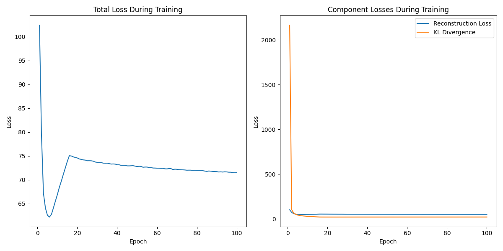

从上图可以看出：

- **总损失**：在训练初期，总损失迅速下降，随后出现短暂的回升，之后逐步趋于平稳并缓慢下降，表明模型在初期快速学习到基本的重建能力，随后在 KL 散度逐步加权的影响下，损失曲线出现调整，最终整体收敛。
- **重建损失**：重建损失在前几个 epoch 内迅速降低，随后保持在较低且稳定的水平，说明模型能够较好地重建输入图像，重建能力随训练提升明显。
- **KL 散度**：KL 散度在训练初期较高，随后迅速下降并趋于稳定，反映出 KL 退火策略的有效性。随着 KL 权重的逐步增加，模型逐渐加强对潜在空间分布的正则化，避免了 KL 项消失的问题。

整体来看，损失曲线表现出良好的收敛性，KL 退火策略有效平衡了重建质量与潜在空间正则化，有助于模型获得更有结构的潜在空间和更稳定的生成能力。

### 生成样本质量演变

通过每 10 个 epoch 的生成样本可视化，我们可以观察生成图像质量的进展：

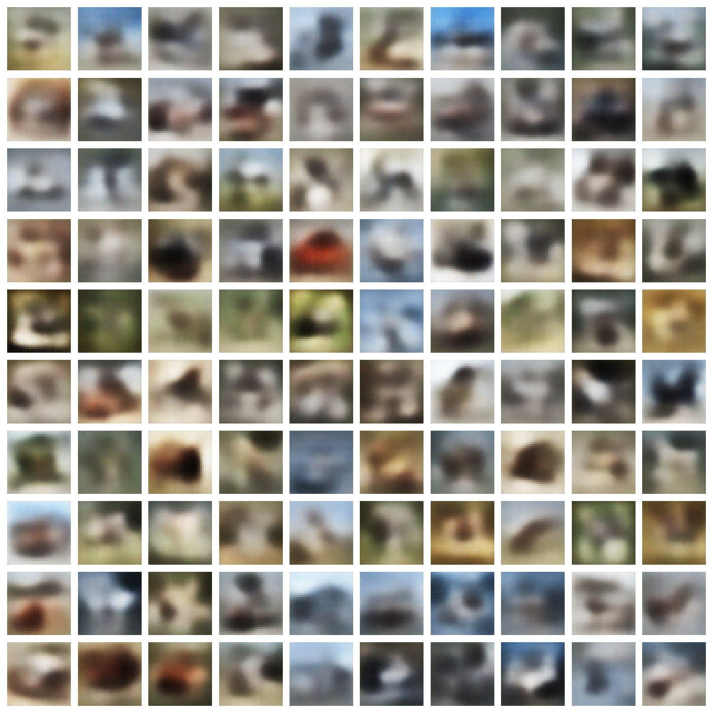
<div style="text-align: center;">cvae_samples_epoch_10</div>

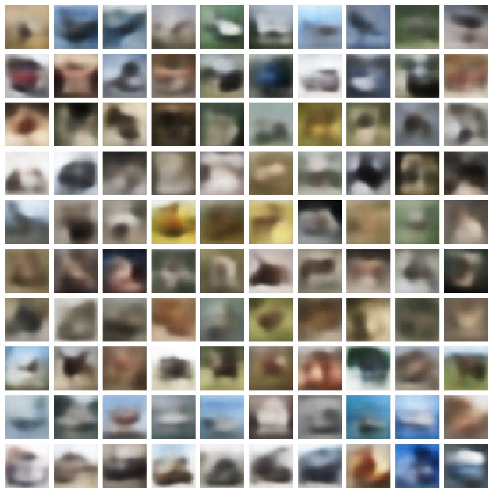
<div style="text-align: center;">cvae_samples_epoch_50</div>

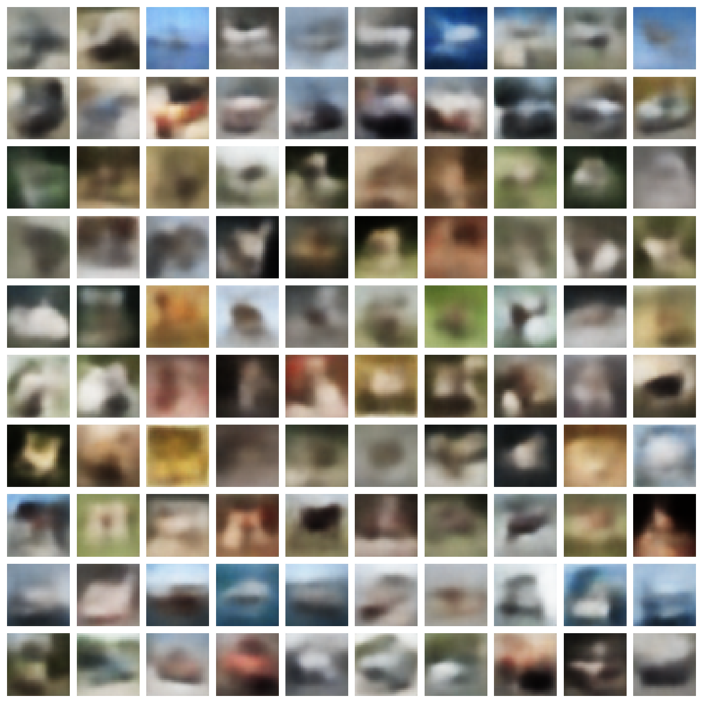
<div style="text-align: center;">cvae_samples_epoch_100</div>

从上面三组不同训练阶段的生成样本可以看出：

- **Epoch 10**：生成的图像整体较为模糊，类别特征尚不明显，大部分样本只能分辨出大致的轮廓和色块，细节缺失较多，类别间区分度较低。
- **Epoch 50**：生成样本的清晰度有所提升，部分类别（如船、飞机等）开始展现出较为明显的结构特征，颜色分布更加合理，背景与主体的分离逐渐清晰，但仍存在一定的模糊和混叠现象。
- **Epoch 100**：生成图像的质量进一步提升，类别特征更加突出，部分样本已经能够较好地反映目标类别的典型形态。整体图像的色彩、结构和细节表现均有改善，类别间的区分度增强，但与真实图像相比仍有一定差距，部分细节和边缘仍显模糊。

总体来看，随着训练的进行，CVAE 生成样本的清晰度、特征捕捉能力和类别表现均逐步提升，验证了模型在条件生成任务中的有效学习能力。

### 重建质量评估

比较原始图像与模型重建图像，以评估模型的信息保留能力：

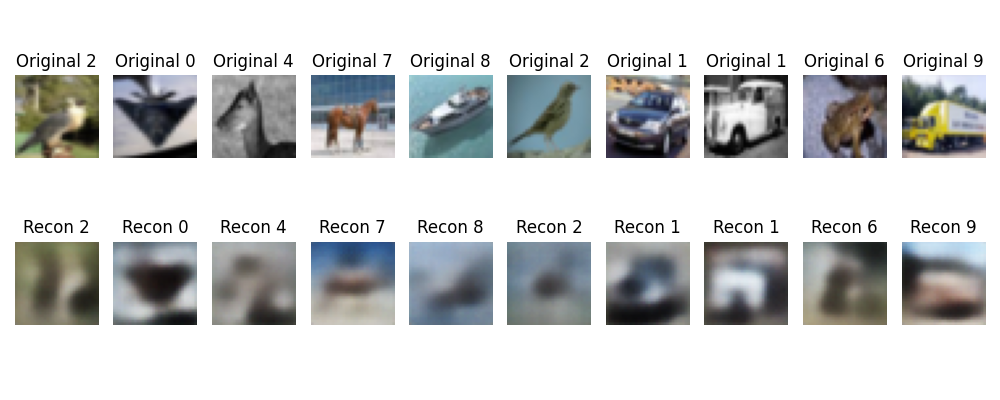
<div style="text-align: center;">cvae_reconstruction_epoch_10</div>

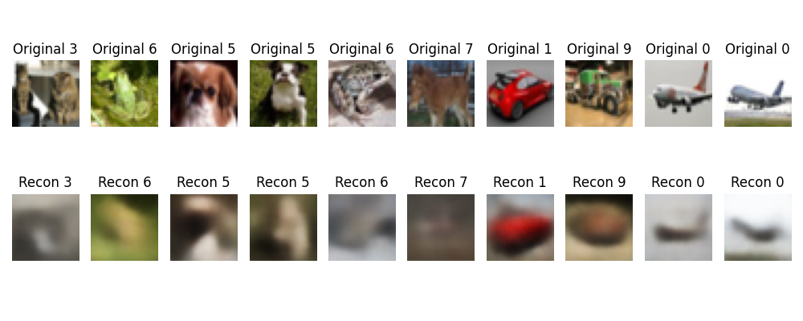
<div style="text-align: center;">cvae_reconstruction_epoch_50</div>

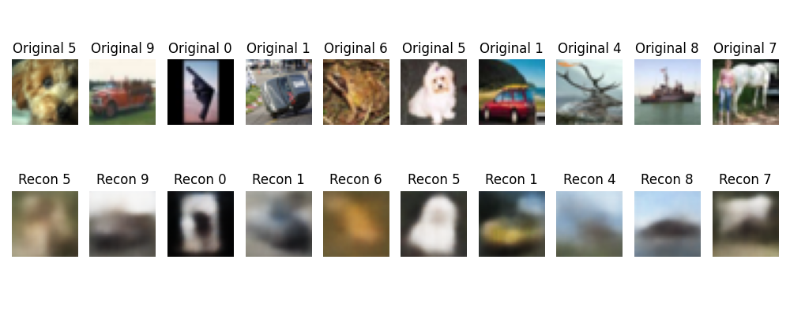
<div style="text-align: center;">cvae_reconstruction_epoch_100</div>

从上面三组原始图像与重建图像的对比可以看出：

- **Epoch 10**：模型重建的图像整体较为模糊，细节和颜色还原有限，仅能大致还原物体的轮廓和主色调，类别特征不明显。
- **Epoch 50**：重建图像的清晰度有所提升，部分样本的结构和颜色与原图更加接近，能够分辨出大致的类别和物体形态，但细节仍有缺失。
- **Epoch 100**：重建质量进一步提升，模型能够较好地还原原始图像的主要结构和颜色分布，类别特征更加明显。尽管与原图相比仍有一定模糊，但整体结构、色彩和类别信息的保留能力显著增强。

总体来看，随着训练的进行，CVAE 的重建能力逐步提升，能够较好地捕捉输入图像的全局结构和主要特征，但在细节和高频信息还原方面仍有提升空间。

### 类别条件生成效果

为评估条件控制的有效性，生成每个类别的样本并展示：

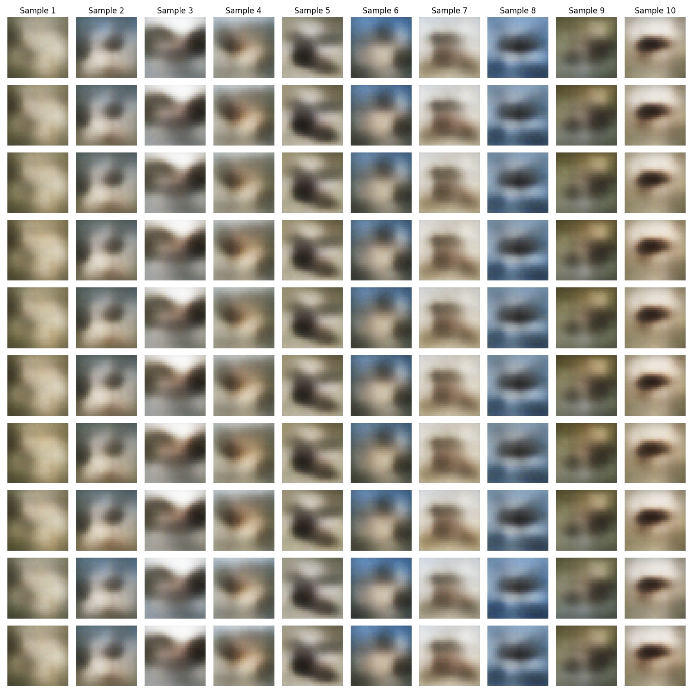
<div style="text-align: center;">cvae_class_controlled_samples</div>

从上图可以看出：

- 各类别的生成样本整体上都能体现出一定的类别特征，但图像分辨率较低，细节表现有限，部分类别之间的差异不够明显。
- 不同类别的生成结果在色彩和结构上存在一定差异，但由于生成图像较为模糊，部分类别（如猫、狗、马等）之间容易混淆，类别特征不够突出。
- 同一类别下的不同样本具有一定的多样性，说明模型能够在类别条件下生成不同风格的图像。
- 整体来看，CVAE 能够根据类别标签生成对应类别的图像，具备基本的条件控制能力，但生成质量和类别区分度仍有提升空间。

这表明模型已经学习到类别条件与生成内容之间的关联，但在高分辨率和细粒度特征表达方面仍有改进空间。

### 潜在空间与条件交互

使用相同的潜在向量但不同的类别标签进行生成，观察条件信息的影响：

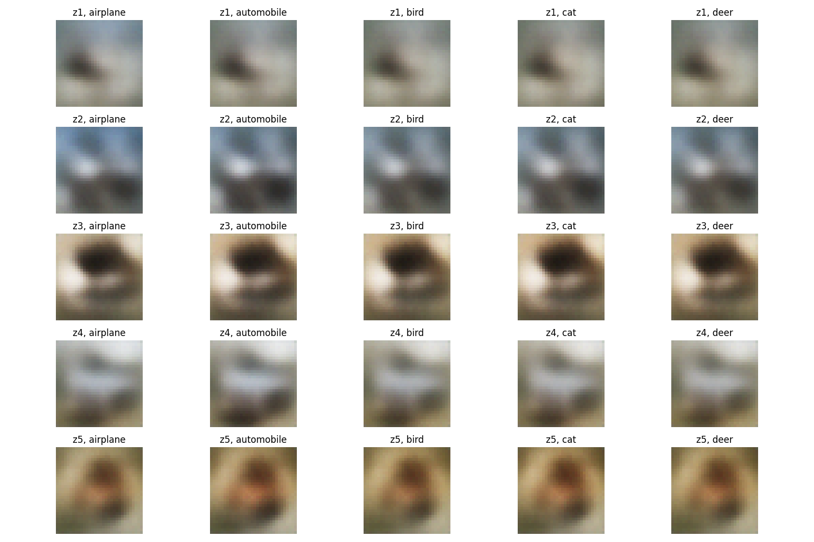
<div style="text-align: center;">cvae_comparison</div>

从上图可以看出：

- 每一行对应一个固定的潜在向量（z1~z5），每一列对应不同的类别标签（如 airplane、automobile、bird、cat、deer）。
- 在同一个潜在向量下，随着类别标签的变化，生成的图像整体结构和色彩分布会发生明显变化，表现出类别条件对生成结果的主导作用。
- 不同类别下，生成的图像呈现出与目标类别相关的特征（如飞机偏蓝、汽车偏灰、鸟类和鹿偏棕），但由于分辨率和模型能力限制，细节仍较为模糊，部分类别之间的差异不够显著。
- 同一潜在向量在不同类别下生成的图像在背景、姿态等方面存在一定的连贯性，说明潜在空间主要编码了类别无关的全局属性，而类别标签则主导了主要语义内容的变化。

综上，CVAE 能够实现潜在空间与条件标签的有效解耦：潜在向量控制图像的风格和部分底层特征，类别标签则决定了生成图像的主要类别属性。这验证了模型具备条件生成和潜在空间结构化的能力，但在细粒度语义表达和类别区分度上仍有提升空间。

## 讨论与分析

### 条件控制有效性

实验结果表明，CVAE 成功学习了条件控制能力，可以根据提供的类别标签生成相应类别的图像。从类别条件生成结果可以观察到：

1. **类别一致性**：生成的图像大多表现出与目标类别一致的视觉特征
2. **类内多样性**：同一类别下的不同样本保持了适度的多样性
3. **类别区分度**：不同类别的生成结果具有明显的视觉差异

### 潜在空间结构

通过潜在空间与条件交互实验，我们可以推断 CVAE 的潜在空间结构：

1. **属性分离**：潜在空间似乎编码了与类别无关的属性（如姿态、背景、颜色变化）
2. **类别独立性**：同一潜在向量在不同类别条件下生成的图像保持某种视觉连贯性
3. **语义连续性**：潜在空间中相近的点生成语义上相似的图像

### 与传统 VAE 对比

相比于标准 VAE，CVAE 表现出以下优势：

1. **目标导向生成**：能够生成特定类别的图像，而不只是随机样本
2. **潜在空间效率**：潜在空间可以更专注于表示类别无关的特征，提高表示效率
3. **生成多样性**：在保持类别一致性的同时，能够生成多样化的样本

#### 生成效果平行对比

下图展示了标准 VAE 与条件 VAE（CVAE）在 CIFAR-10 数据集上的生成样本对比（左：VAE，右：CVAE，类别标签一致）：

<div align="center">
  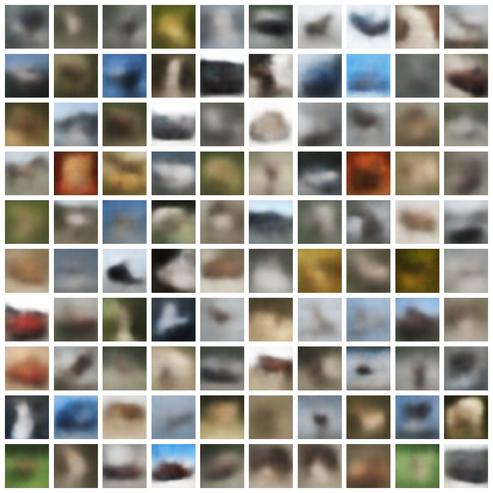
  
</div>

可以看出：

- **VAE（左）**：生成的样本缺乏明确的类别特征，整体较为模糊，类别不可控，样本分布随机。
- **CVAE（右）**：生成的样本能够体现出指定类别的主要特征，类别一致性明显提升，且同一类别下样本具有多样性。

#### 重建效果平行对比

进一步比较两者的重建能力（左：VAE，右：CVAE）：

<div align="center">
  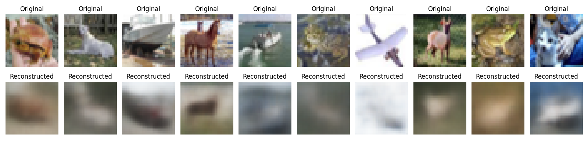
  
</div>

- **VAE 重建**：重建图像整体模糊，类别特征不明显，部分样本出现失真。
- **CVAE 重建**：重建图像在结构和颜色上更接近原图，类别特征更突出，细节还原能力更强。

#### 总结

通过上述平行对比可以直观地看到，CVAE 在类别可控性、生成样本多样性和重建质量等方面均优于传统 VAE。CVAE 能够根据类别标签生成目标类别的图像，并在潜在空间中实现类别与其他属性的有效解耦，提升了生成模型的实用性和表达能力。

### 局限性与挑战

实验过程中也观察到一些局限性：

1. **图像质量**：生成的图像分辨率有限，细节表现不够理想
2. **类别模糊**：某些类别（如猫与狗）的区分不够明确
3. **重建-多样性权衡**：KL 散度的权重影响重建质量与生成多样性的平衡

## 结论与未来工作

### 主要结论

本实验成功实现并评估了条件变分自编码器在 CIFAR-10 数据集上的类别条件图像生成能力。主要结论包括：

1. **条件控制有效性**：CVAE 能够根据提供的类别标签生成相应类别的图像，实现了对生成过程的有效控制。

2. **潜在空间结构**：CVAE 的潜在空间编码了与类别无关的属性，使得相同潜在向量在不同类别条件下生成的图像保持一定的视觉连贯性。

3. **KL 退火效果**：KL 退火策略有助于平衡重建质量和潜在空间正则化，避免 KL 散度项"消失"问题。

4. **生成质量**：随着训练进行，模型能够生成越来越清晰、符合类别特征的图像，同时保持适度的多样性。

### 未来工作方向

基于本实验的结果，提出以下未来研究方向：

1. **架构改进**：

   - 尝试更深的网络结构和注意力机制增强特征捕捉能力
   - 实现层次化潜在空间，捕捉不同尺度的特征
   - 探索扩散模型（Diffusion Models）与 CVAE 结合

2. **条件控制增强**：

   - 扩展到多条件控制（如类别+风格+属性）
   - 实现连续条件（如年龄、姿态角度等）的控制
   - 尝试更复杂的条件嵌入方式，如 FiLM 或条件归一化

3. **应用探索**：
   - 开发基于 CVAE 的风格迁移或属性编辑应用
   - 将 CVAE 用于数据增强，改善下游任务性能
   - 探索 CVAE 在异常检测中的应用潜力

条件变分自编码器作为一种结合了概率建模和条件控制的生成模型，为可控图像生成提供了强大框架，期待未来在更复杂场景中的应用与发展。
