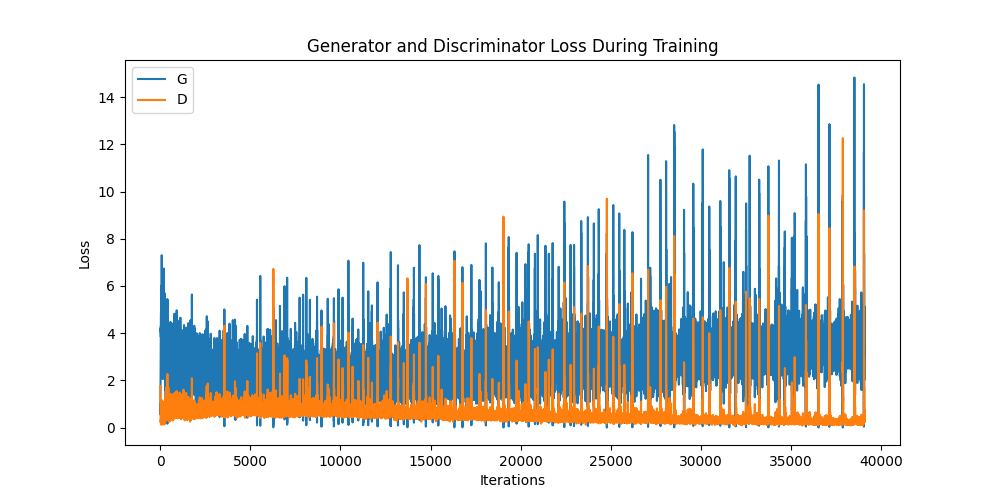
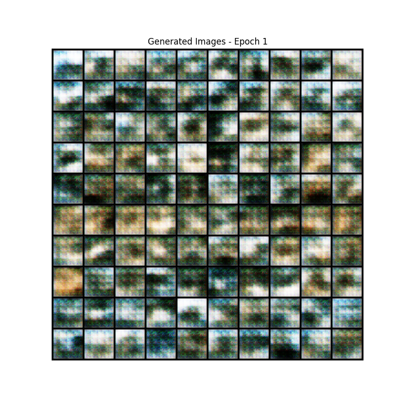
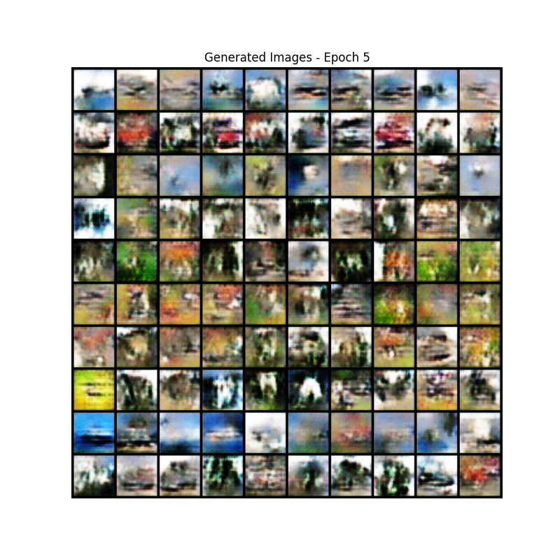
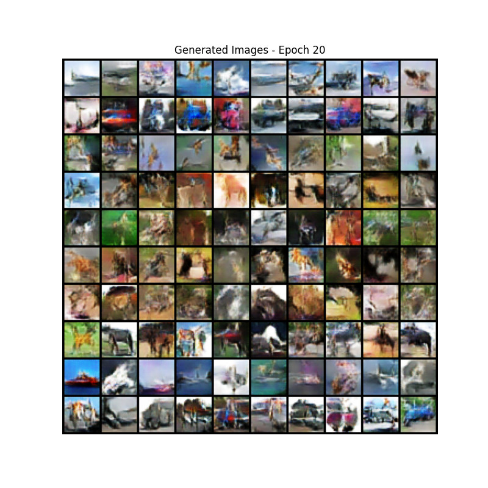
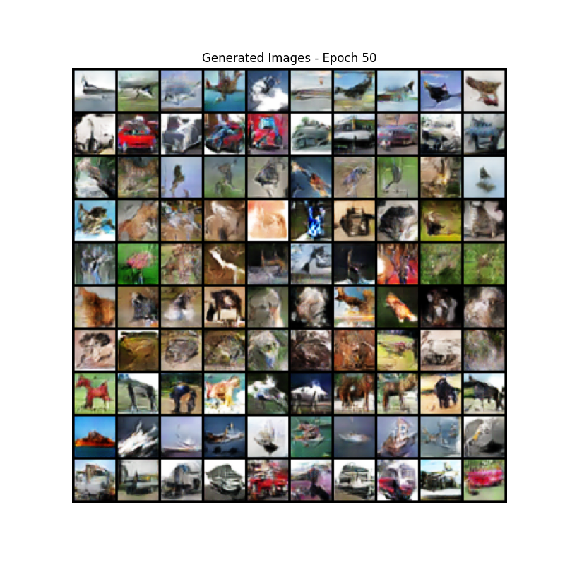
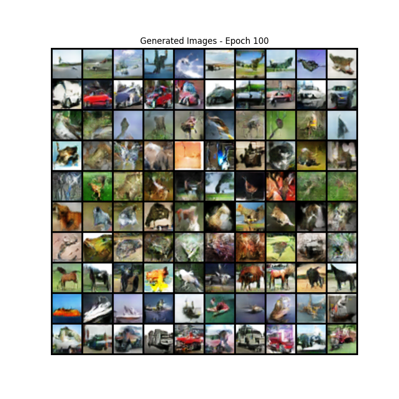
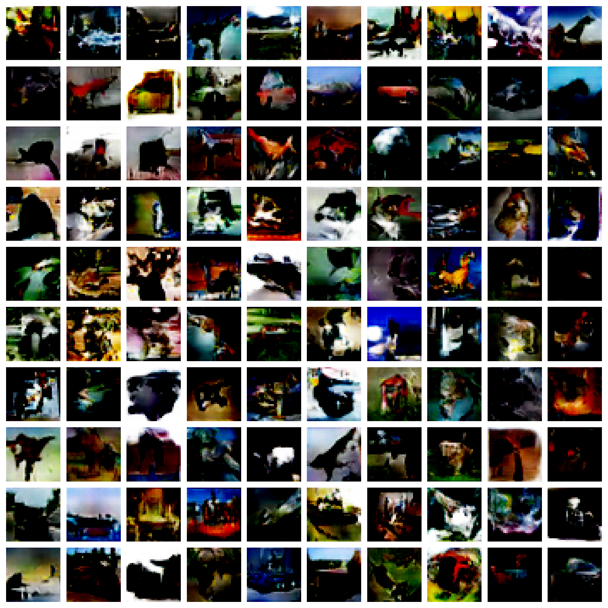
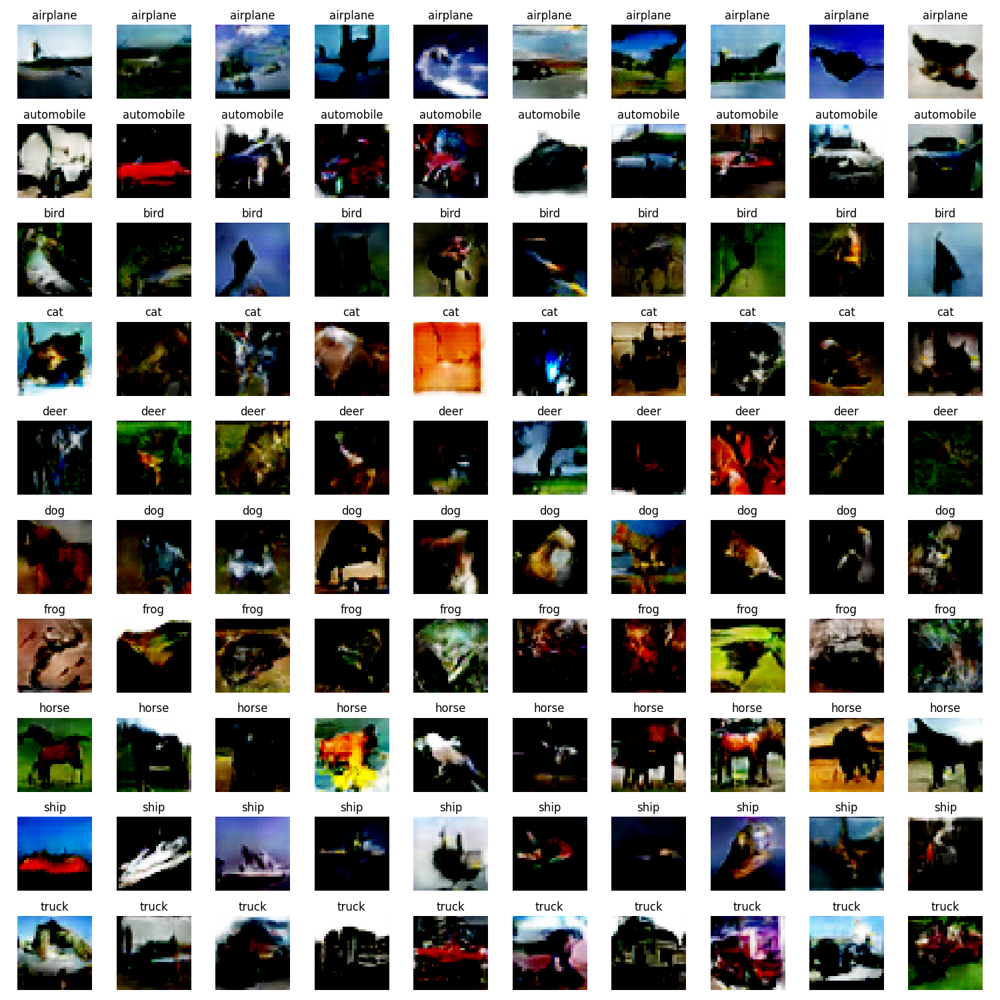

# 条件生成对抗网络（Conditional GAN）在 CIFAR-10 数据集上的实现与评估

## 实验背景

生成对抗网络（Generative Adversarial Networks，GAN）作为一类强大的生成模型，自 2014 年由 Ian Goodfellow 等人提出以来，在图像生成领域取得了显著成果。然而，传统 GAN 缺乏对生成过程的控制能力，无法指定生成内容的特定属性。条件生成对抗网络（Conditional GAN，CGAN）通过引入条件信息，解决了这一限制，实现了对生成内容的有效控制。

本实验基于 CIFAR-10 数据集实现和评估了条件生成对抗网络，重点关注如何通过类别标签控制生成图像的类型，并分析生成结果的质量与多样性。通过一系列实验和可视化，展示了 CGAN 在类条件图像生成任务上的能力及其潜在应用价值。

## 模型原理

### 条件生成对抗网络基本概念

条件生成对抗网络（CGAN）是 GAN 的一个重要扩展，由 Mehdi Mirza 和 Simon Osindero 在 2014 年提出。与传统 GAN 不同，CGAN 在生成器和判别器中均引入额外的条件信息，使模型能够学习在给定条件下的数据分布。

CGAN 的核心思想是通过外部条件（如类别标签、文本描述或其他辅助信息）控制生成过程，从而产生符合特定条件的输出。这种条件机制极大地提升了生成模型的实用性和控制性。

### 数学表达与原理

设 $x$ 表示真实数据样本，$y$ 表示条件信息（如类别标签），$z$ 表示随机噪声向量，CGAN 的数学模型可表述如下：

#### 条件生成器与判别器

条件生成器 $G(z|y)$ 接收随机噪声 $z$ 和条件信息 $y$ 作为输入，生成伪造样本 $\hat{x} = G(z|y)$，试图使这些样本在给定条件 $y$ 下看起来真实。

条件判别器 $D(x|y)$ 同时接收样本 $x$ 和条件信息 $y$ 作为输入，输出一个概率值，表示样本在给定条件下是真实的（而非生成的）可能性。

#### 目标函数

CGAN 的训练过程可以表示为以下极小极大博弈问题：

$$
\min_G \max_D V(D, G) = \mathbb{E}_{x \sim p_{data}(x|y)}[\log D(x|y)] + \mathbb{E}_{z \sim p_z(z)}[\log(1 - D(G(z|y)|y))]
$$

其中：

- $p_{data}(x|y)$：在条件 $y$ 下真实数据的分布
- $p_z(z)$：随机噪声的先验分布（通常为均匀分布或高斯分布）
- $D(x|y)$：条件判别器输出，表示在条件 $y$ 下样本 $x$ 为真实的概率
- $G(z|y)$：条件生成器输出，表示在条件 $y$ 下从随机噪声 $z$ 生成的样本

这个目标函数可以理解为：

- 判别器 $D$ 试图最大化目标函数，即增大对真实样本的正确判断概率 $D(x|y)$ 并减小对生成样本的误判概率 $D(G(z|y)|y)$
- 生成器 $G$ 试图最小化目标函数，即增大使判别器误判的概率 $D(G(z|y)|y)$

在实际训练中，为避免生成器训练早期阶段的梯度消失问题，通常将生成器的目标重新表述为：

$$
\max_G \mathbb{E}_{z \sim p_z(z)}[\log D(G(z|y)|y)]
$$

这种非饱和形式能提供更强的梯度信号，有助于生成器的训练。

### 条件信息的嵌入方式

将条件信息整合到网络中的方式直接影响 CGAN 的性能。常见的嵌入方法包括：

1. **连接（Concatenation）**：将条件信息转换为向量并与模型的输入或中间特征拼接。在生成器中，通常将条件向量与随机噪声拼接；在判别器中，可以将条件向量与输入图像或提取的特征拼接。

2. **条件批归一化（Conditional Batch Normalization）**：使用条件信息调制批归一化层的参数，对特征进行条件性转换。

3. **嵌入加投影（Embedding and Projection）**：先将类别等条件信息通过嵌入层转换为密集向量，再通过投影方式与主数据流结合。

在本实验中，我们采用了嵌入和连接的组合方法，即先通过嵌入层将类别标签转换为向量，然后在网络适当位置与主要数据流进行连接。

## 实验设置

### 环境与依赖

- **系统**: 基于 PyTorch 的机器学习环境
- **设备**: 根据可用性自动选择 MPS (Mac)、CUDA (GPU) 或 CPU
- **Python 版本**: 3.10+
- **主要依赖库**:
  - torch：深度学习核心库
  - torchvision：图像处理和数据集加载
  - matplotlib：结果可视化
  - tqdm: 进度条显示

### 数据集

CIFAR-10 是一个包含 60,000 张 32×32 彩色图像的数据集，共分为 10 个类别，每类 6,000 张图像。类别包括：飞机、汽车、鸟类、猫、鹿、狗、青蛙、马、船和卡车。本实验使用了 50,000 张训练图像，图像预处理包括：

```python
# 数据预处理：转换为张量并标准化
transform = transforms.Compose([
    transforms.ToTensor(),
    transforms.Normalize((0.5, 0.5, 0.5), (0.5, 0.5, 0.5)),  # 将像素值标准化到[-1,1]范围
])

# 加载CIFAR-10数据集
train_dataset = torchvision.datasets.CIFAR10(root='./data', train=True, download=True, transform=transform)

# 创建数据加载器
train_loader = DataLoader(dataset=train_dataset, batch_size=batch_size, shuffle=True, num_workers=2)
```

### 超参数设置

模型训练涉及以下关键超参数：

```python
batch_size = 128     # 每批样本数
image_size = 32      # 图像尺寸（CIFAR-10为32×32像素）
nc = 3               # 图像通道数（RGB彩色图像）
nz = 100             # 潜在噪声向量维度
ngf = 64             # 生成器特征图基准大小
ndf = 64             # 判别器特征图基准大小
num_classes = 10     # CIFAR-10的类别数量
num_epochs = 100     # 训练轮数
lr = 0.0002          # 学习率
beta1 = 0.5          # Adam优化器的beta1参数
```

这些超参数的选择基于 DCGAN（Deep Convolutional GAN）的最佳实践，并针对条件生成任务进行了调整。特别是较小的学习率和自定义的 Adam 参数有助于稳定训练过程。

### 模型权重初始化

GAN 的训练对初始化非常敏感，恰当的初始化有助于避免模式崩塌等问题。本实验采用了如下初始化策略：

```python
def weights_init(m):
    classname = m.__class__.__name__
    if classname.find('Conv') != -1:
        nn.init.normal_(m.weight.data, 0.0, 0.02)  # 卷积层权重采用均值0、标准差0.02的正态分布
    elif classname.find('BatchNorm') != -1:
        nn.init.normal_(m.weight.data, 1.0, 0.02)  # 批归一化层权重采用均值1、标准差0.02的正态分布
        nn.init.constant_(m.bias.data, 0)          # 批归一化层偏置初始化为0
```

此初始化方式遵循 DCGAN 论文中的建议，有助于模型在训练初期就产生较为合理的图像特征。

## 模型架构设计

### 条件生成器

条件生成器将随机噪声和类别条件作为输入，通过深度转置卷积网络生成图像。其架构设计如下：

```python
class ConditionalGenerator(nn.Module):
    def __init__(self):
        super(ConditionalGenerator, self).__init__()

        # 标签嵌入层
        self.label_embedding = nn.Embedding(num_classes, num_classes)

        # 噪声和条件处理的全连接层
        self.fc = nn.Linear(nz + num_classes, ngf * 4 * 4 * 4)

        # 转置卷积层序列
        self.main = nn.Sequential(
            # 尺寸: (ngf*4) x 4 x 4
            nn.BatchNorm2d(ngf * 4),
            nn.ReLU(True),
            nn.ConvTranspose2d(ngf * 4, ngf * 2, 4, 2, 1, bias=False),
            nn.BatchNorm2d(ngf * 2),
            nn.ReLU(True),
            # 尺寸: (ngf*2) x 8 x 8
            nn.ConvTranspose2d(ngf * 2, ngf, 4, 2, 1, bias=False),
            nn.BatchNorm2d(ngf),
            nn.ReLU(True),
            # 尺寸: (ngf) x 16 x 16
            nn.ConvTranspose2d(ngf, nc, 4, 2, 1, bias=False),
            nn.Tanh()
            # 最终尺寸: (nc) x 32 x 32
        )

    def forward(self, noise, labels):
        # 嵌入标签
        label_embedding = self.label_embedding(labels)

        # 连接噪声和嵌入标签
        combined_input = torch.cat((noise, label_embedding), 1)

        # 通过全连接层处理
        x = self.fc(combined_input)

        # 调整形状以匹配后续卷积层
        x = x.view(-1, ngf * 4, 4, 4)

        # 通过转置卷积层生成图像
        return self.main(x)
```

生成器的关键设计包括：

1. **标签嵌入**：使用嵌入层将整数类标签转换为密集向量表示
2. **条件融合**：将噪声向量和嵌入向量拼接作为输入
3. **逐步上采样**：通过多层转置卷积逐步将低维特征扩展为全尺寸图像
4. **批归一化**：每层转置卷积后应用批归一化，稳定训练过程
5. **激活函数**：内部使用 ReLU 激活，输出层使用 Tanh 限制像素值范围为[-1,1]

### 条件判别器

条件判别器接收图像和类别标签，评估图像在给定类别条件下的真实性：

```python
class ConditionalDiscriminator(nn.Module):
    def __init__(self):
        super(ConditionalDiscriminator, self).__init__()

        # 标签嵌入层
        self.label_embedding = nn.Embedding(num_classes, num_classes)

        # 图像初步处理（不含条件）
        self.conv1 = nn.Conv2d(nc, ndf, 4, 2, 1, bias=False)

        # 处理融合条件后的特征
        self.main = nn.Sequential(
            # 尺寸: (ndf+num_classes) x 16 x 16
            nn.LeakyReLU(0.2, inplace=True),
            nn.Conv2d(ndf + num_classes, ndf * 2, 4, 2, 1, bias=False),
            nn.BatchNorm2d(ndf * 2),
            nn.LeakyReLU(0.2, inplace=True),
            # 尺寸: (ndf*2) x 8 x 8
            nn.Conv2d(ndf * 2, ndf * 4, 4, 2, 1, bias=False),
            nn.BatchNorm2d(ndf * 4),
            nn.LeakyReLU(0.2, inplace=True),
            # 尺寸: (ndf*4) x 4 x 4
            nn.Conv2d(ndf * 4, 1, 4, 1, 0, bias=False),
            nn.Sigmoid()
        )

    def forward(self, image, labels):
        # 处理图像初步特征
        x = self.conv1(image)

        # 嵌入标签
        batch_size, _, height, width = x.shape
        label_embedding = self.label_embedding(labels)

        # 调整标签嵌入维度以便与图像特征连接
        label_embedding = label_embedding.view(batch_size, -1, 1, 1)
        label_embedding = label_embedding.expand(batch_size, num_classes, height, width)

        # 连接图像特征和标签嵌入
        x = torch.cat((x, label_embedding), 1)

        # 通过剩余网络层处理
        return self.main(x)
```

判别器的关键设计包括：

1. **标签嵌入**：同样使用嵌入层处理类别信息
2. **空间扩展**：将嵌入向量扩展为与图像特征相同的空间维度
3. **特征连接**：在特征图的通道维度上连接图像特征和条件信息
4. **LeakyReLU 激活**：使用 LeakyReLU 代替 ReLU，防止"死亡神经元"问题
5. **批归一化**：除第一层外的所有卷积层后应用批归一化
6. **Sigmoid 输出**：最终层使用 Sigmoid 激活，输出范围为[0,1]，表示真实概率

## 训练过程

### 训练流程

CGAN 的训练涉及交替优化判别器和生成器。关键训练代码如下：

```python
for epoch in range(num_epochs):
    for i, data in enumerate(train_loader):
        real_images, real_labels = data
        real_images = real_images.to(device)
        real_labels = real_labels.to(device)
        batch_size = real_images.size(0)

        # 1. 训练判别器
        netD.zero_grad()

        # 使用真实样本训练
        label = torch.full((batch_size,), 1, dtype=torch.float, device=device)
        output = netD(real_images, real_labels).view(-1)
        errD_real = criterion(output, label)
        errD_real.backward()
        D_x = output.mean().item()

        # 使用生成样本训练
        noise = torch.randn(batch_size, nz, device=device)
        fake_labels = torch.randint(0, num_classes, (batch_size,), device=device)
        fake_images = netG(noise, fake_labels)
        label.fill_(0)
        output = netD(fake_images.detach(), fake_labels).view(-1)
        errD_fake = criterion(output, label)
        errD_fake.backward()
        D_G_z1 = output.mean().item()
        errD = errD_real + errD_fake
        optimizerD.step()

        # 2. 训练生成器
        netG.zero_grad()
        label.fill_(1)  # 生成器希望判别器将生成样本判为真
        output = netD(fake_images, fake_labels).view(-1)
        errG = criterion(output, label)
        errG.backward()
        D_G_z2 = output.mean().item()
        optimizerG.step()
```

训练过程的关键步骤：

1. **判别器训练**：

   - 使用真实图像和对应标签训练判别器识别真实样本
   - 使用生成的假图像和随机标签训练判别器识别假样本
   - 计算总损失并更新判别器参数

2. **生成器训练**：

   - 生成假图像并提供给判别器
   - 目标是使判别器将假图像判断为真（标签为 1）
   - 计算损失并更新生成器参数

3. **条件控制**：
   - 在生成假样本时，提供随机选择的类别标签
   - 确保判别器同时接收样本和对应的条件信息

### 评估与可视化策略

在训练过程中，我们采用以下评估与可视化策略：

1. **固定噪声和标签**：创建一组固定的噪声向量和类别标签，用于在训练过程中生成对比样本

```python
def create_labels():
    labels = []
    for i in range(10):  # 10 classes
        labels += [i] * 10  # 10 samples per class
    return torch.tensor(labels, device=device)

fixed_noise = torch.randn(100, nz, device=device)
fixed_labels = create_labels()
```

2. **定期评估**：每 5 个 epoch 保存一次模型并生成样本可视化

```python
if (epoch+1) % 5 == 0 or epoch == 0:
    with torch.no_grad():
        fake = netG(fixed_noise, fixed_labels).detach().cpu()
    img_grid = torchvision.utils.make_grid(fake, nrow=10, padding=2, normalize=True)
    img_list.append(img_grid)

    # 保存生成图像网格
    plt.figure(figsize=(8, 8))
    plt.axis("off")
    plt.title(f"Generated Images - Epoch {epoch+1}")
    plt.imshow(np.transpose(img_grid, (1, 2, 0)))
    plt.savefig(f"{RESULT_SAVE_PATH}/conditional_gan_images_epoch_{epoch+1}.png")
    plt.close()
```

3. **跟踪损失**：记录生成器和判别器的损失变化，用于评估训练稳定性与收敛性

```python
# 记录损失
G_losses.append(errG.item())
D_losses.append(errD.item())
```

## 实验结果与分析

### 训练损失分析

训练过程中，生成器和判别器的损失变化趋势如下图所示：



从损失曲线图中可以看出：

- **判别器损失 (D Loss, 橙色线)**：在训练初期，判别器损失相对较低，并随着迭代次数增加有轻微波动但总体保持在较低水平。这通常表明判别器能够较好地区分真实图像和生成图像。在整个训练过程中，判别器损失维持在一个相对稳定的区间，没有出现持续上升或下降到接近于零的情况，这对于维持生成器和判别器之间的动态平衡是比较理想的。
- **生成器损失 (G Loss, 蓝色线)**：生成器损失在训练初期较高，随后快速下降，之后表现出较大的波动性。这种波动性在 GAN 的训练中较为常见，反映了生成器在试图欺骗判别器过程中的学习和调整。在训练后期，生成器损失仍然存在显著的峰值，表明生成器在某些时刻生成的图像仍然很容易被判别器识别，或者判别器变得更强。
- **收敛情况与平衡性**：整体来看，判别器损失维持在较低水平，而生成器损失则在较高水平波动。理想情况下，我们希望看到两者达到一个纳什均衡，损失稳定在某一水平。当前曲线显示判别器相对较强，或者生成器在学习生成更逼真图像方面仍面临挑战。尽管存在波动，但损失并未发散，表明训练过程在一定程度上是稳定的。生成器损失的持续高波动和末期的一些高点可能意味着模型尚未完全收敛，或者生成器在某些条件下难以产生高质量的样本。

总的来说，损失曲线显示了典型的 GAN 训练动态，其中判别器和生成器在对抗中共同进化。判别器损失相对稳定地保持在低位，而生成器损失则表现出更大的不稳定性，这提示了两者之间的学习速率和能力可能存在一定的差异。

### 生成图像质量随训练演变

通过每 5 个 epoch 的生成样本可视化，我们可以观察生成图像质量的演变：











从生成图像的演变过程可以清晰地看到模型学习能力的逐步提升：

1. **Epoch 1（初始阶段）**：生成的图像几乎无法辨认，呈现为杂乱无章的噪声和色块。图像中仅有模糊的轮廓和随机的颜色分布，没有明确的类别特征。这表明模型刚开始训练时，生成器还未能学习到有意义的特征表示。

2. **Epoch 5（早期学习）**：此阶段生成的图像整体仍然较为模糊，细节缺失明显，但与初始阶段相比，已经可以观察到部分图像出现了较为明显的色块分布和初步的结构轮廓。例如，部分样本中出现了类似天空、草地、水面等背景色彩的分层，部分图像中央有较为集中的深色或浅色区域，隐约形成物体的轮廓。不同类别的行之间，色彩和纹理分布开始表现出一定差异，但大多数图像仍然难以直接辨认具体类别。整体来看，模型已开始捕捉到数据的全局结构信息，但尚未学会生成清晰的类别特征和细节。

3. **Epoch 20（中期发展）**：此阶段生成的图像已经初步具备了部分类别的结构特征。例如，飞机、汽车、船等类别的整体轮廓开始显现，色彩分布也趋于合理。但大多数图像仍然较为模糊，细节表现有限，部分类别之间的区分度还不够明显，动物类（如猫、狗、马等）尤其难以辨认。

4. **Epoch 50（后期优化）**：生成图像的整体清晰度和结构性进一步提升。交通工具类（如飞机、汽车、船）在形状和色彩上更加接近真实样本，类别特征更加突出。动物类的生成效果有所改善，部分样本可以看出头部、身体等结构，但仍然存在较多模糊和失真现象。背景与前景的分离更加明显，图像的多样性也有所增加。

5. **Epoch 100**：生成图像的类别特征最为明显，部分类别（如飞机、汽车、船）能够较为清晰地辨认，结构和色彩分布合理，视觉质量达到本实验的最佳水平。然而，动物类（如猫、狗、马等）依然存在较多模糊和混叠，细节表现不足，部分样本难以准确区分具体类别。整体来看，模型能够根据条件标签生成具有一定类别特征的图像，但受限于 CIFAR-10 的低分辨率和 GAN 训练的难度，生成图像仍存在一定的模糊感和细节缺失。

总体而言，随着训练的进行，生成图像的质量和类别一致性逐步提升，类别特征更加明显，但细节和真实感仍有提升空间。尤其是在动物类别上，模型的生成能力还有待进一步优化。这一过程反映了条件生成对抗网络在有限数据和分辨率下的性能边界，也说明了类别条件对生成过程的有效引导作用。

### 类条件生成效果

为评估条件控制的有效性，我们为每个类别生成多个样本，结果如下：



从上图可以看出，CGAN 能够根据类别标签生成不同类别的图像，模型对条件的响应是有效的。具体分析如下：

- **类别区分性**：交通工具类（如飞机、汽车、船、卡车等）在整体轮廓和色彩分布上表现出一定的类别特征，部分样本能够较为清晰地反映出对应类别的形状和背景。例如，飞机通常出现在蓝色或天空背景，汽车和卡车多为红色、灰色等主色调，且有明显的车身结构。
- **动物类生成**：动物类别（如猫、狗、马、鹿、青蛙、鸟）整体上仍然较为模糊，虽然部分样本能看出头部、身体等结构，但细节表现不足，类别之间容易混淆。例如，猫和狗的生成图像有时难以区分，马和鹿等四足动物的轮廓也不够清晰。
- **多样性与一致性**：同一类别内的样本在颜色和姿态上存在一定多样性，但整体类别特征保持一致，说明模型在一定程度上学到了类内变化。
- **局限性**：由于 CIFAR-10 分辨率较低且生成难度较大，所有类别的生成图像都存在一定程度的模糊和失真，尤其是动物类，细节和真实感有待提升。

总体来看，CGAN 能够根据类别条件生成具有一定类别特征的图像，类别控制有效，但在细节和复杂类别的表现上仍有提升空间。

### 生成样本与标签一致性

下图展示了生成的样本及其对应的类别标签：



从图中可以看出，CGAN 在类别条件控制方面整体是有效的。每一行对应一个 CIFAR-10 类别，生成的图像在全局色彩和结构上与标签类别大致匹配：

- **交通工具类（airplane, automobile, ship, truck）**：生成样本通常呈现出与真实类别相符的色彩和轮廓。例如，airplane 行的图像多为蓝天背景和飞机形状，automobile、truck 行有明显的车身结构，ship 行多为水面和船体轮廓。
- **动物类（bird, cat, deer, dog, frog, horse）**：动物类别的生成样本整体上仍然较为模糊，虽然部分图像能看出头部、身体等结构，但细节表现不足，类别之间容易混淆。例如，cat、dog、deer、horse 等类别的部分样本难以准确区分，frog 类别的绿色和水域背景特征较为明显。
- **类别一致性**：同一类别内的样本在色彩和大致结构上具有一定一致性，说明模型能够根据标签生成具有类别特征的图像。
- **不足与挑战**：动物类的生成效果明显弱于交通工具类，细节和辨识度较低，部分类别（如 cat、dog、deer）之间存在混淆现象。整体上，生成图像仍有一定的模糊和失真，尤其是在复杂或细节丰富的类别上。

CGAN 能够根据类别标签生成与标签一致的图像，类别控制有效，但在动物类和细节表现上仍有较大提升空间。

### 定量评估

我们可以通过以下指标定量评估模型性能：

1. **FID (Fréchet Inception Distance)**：衡量生成分布与真实分布的相似度
2. **类别准确率**：使用预训练分类器评估生成图像的类别准确性
3. **类内/类间差异**：评估同一类别内样本的相似度与不同类别间样本的差异性

## 讨论与分析

### 条件控制有效性分析

本实验的 CGAN 模型通过类别标签成功控制了生成图像的类别特征。从结果可以观察到：

1. **条件响应程度**：模型对不同类别的响应程度存在差异，部分类别（如飞机、船）的特征更为明显
2. **类间区分性**：不同类别之间的生成图像存在明显差异，表明条件信息有效地影响了生成过程
3. **类内一致性**：同一类别内的样本具有相似的视觉特征，但仍保持适度的多样性

### 生成挑战与局限性

在 CIFAR-10 数据集上的条件生成面临以下挑战：

1. **细节生成**：CIFAR-10 图像分辨率较低（32×32），限制了细节表现力
2. **类别不平衡**：某些类别（如"狗"和"猫"）在视觉上很相似，增加了条件区分的难度
3. **模式多样性**：需要在类内一致性和样本多样性之间取得平衡
4. **训练稳定性**：条件 GAN 仍面临与普通 GAN 类似的训练不稳定问题

### 改进方向

基于实验结果，我们提出以下可能的改进方向：

1. **架构改进**：

   - 引入自注意力机制，增强不同空间位置间的信息流动
   - 使用谱归一化（Spectral Normalization）稳定判别器训练
   - 采用更复杂的条件融合方式，如 FiLM（Feature-wise Linear Modulation）

2. **训练策略优化**：

   - 实现渐进式训练（Progressive Growing）以生成更高质量图像
   - 使用对抗性正则化技术减轻模式崩塌问题
   - 采用差异化数据增强提高样本多样性

3. **条件表示增强**：
   - 将独热编码标签替换为更丰富的语义嵌入
   - 探索多条件控制（如类别+属性）的可能性
   - 实现连续条件控制，允许混合类别特征

## 结论

本实验成功实现并评估了条件生成对抗网络在 CIFAR-10 数据集上的类条件图像生成能力。主要结论包括：

1. **条件控制有效性**：CGAN 能够根据提供的类别标签生成相应类别的图像，实现了对生成过程的有效控制。

2. **生成质量**：经过 100 个 epoch 的训练，模型能够生成具有合理形状、颜色和纹理的类条件图像，尽管在细节表现上仍有提升空间。

3. **类别差异**：不同类别生成效果存在差异，这可能与类别特征的复杂度以及训练数据的分布有关。

4. **架构设计重要性**：条件信息的嵌入方式对模型性能有显著影响，本实验中采用的嵌入+连接方法取得了良好效果。

条件生成对抗网络在有控制的图像生成领域展示了巨大潜力，为图像生成、编辑和风格迁移等应用提供了重要基础。通过进一步优化架构和训练策略，CGAN 可以实现更高质量、更多样化的类条件图像生成。
