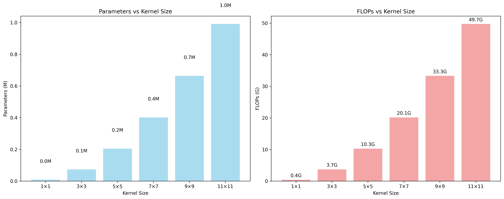
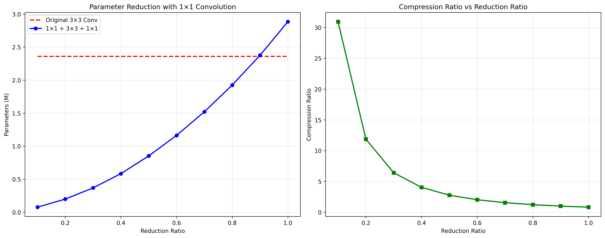
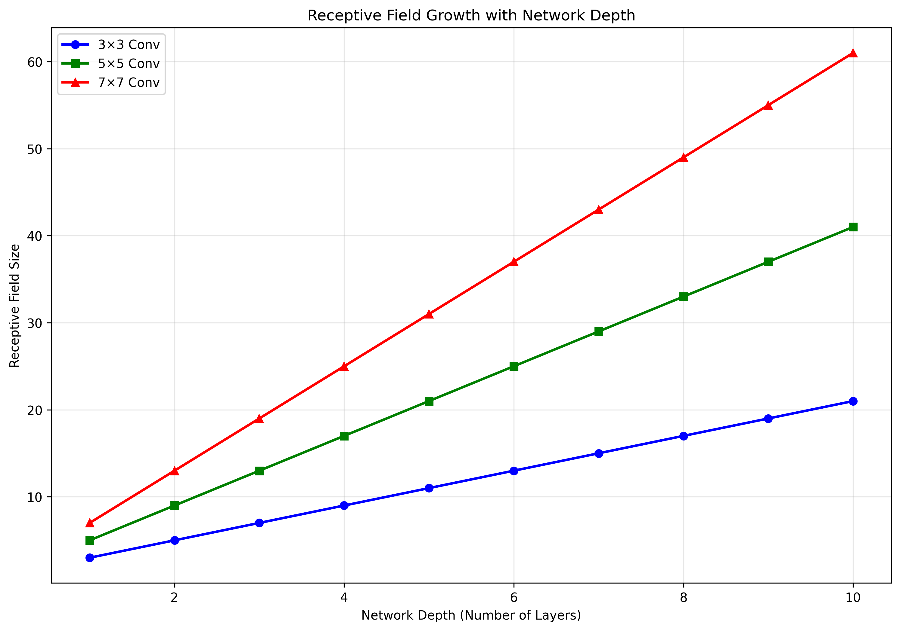
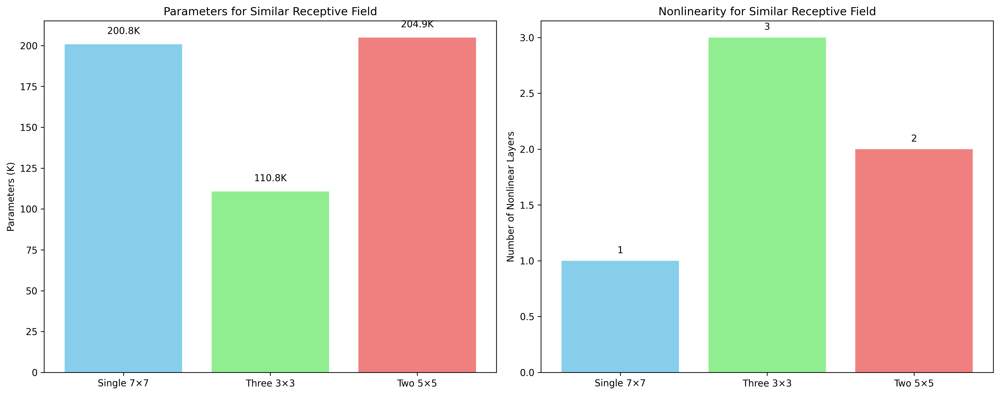
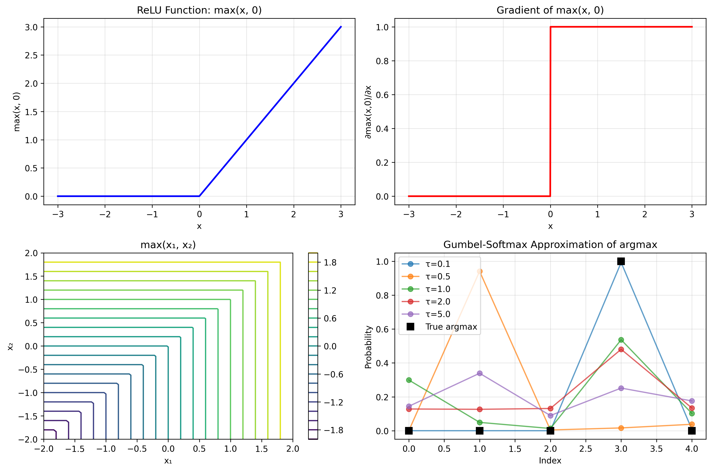
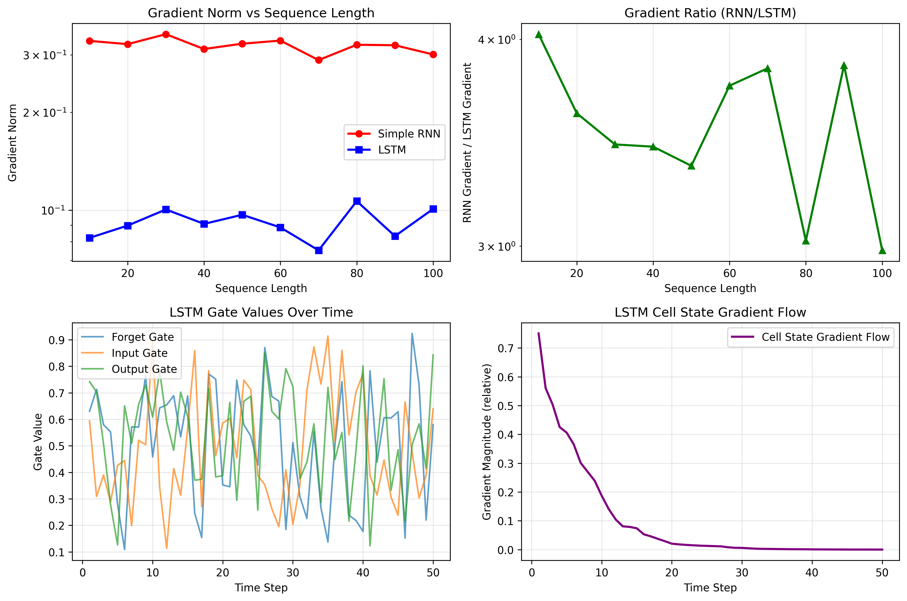
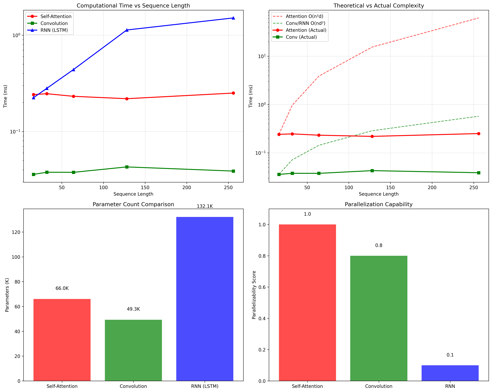
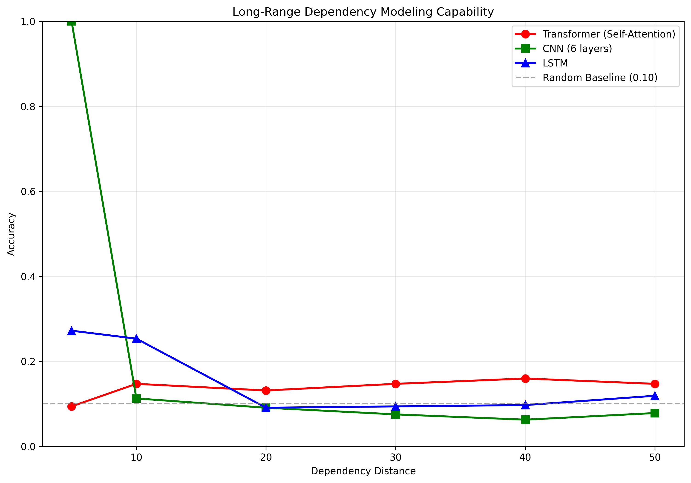
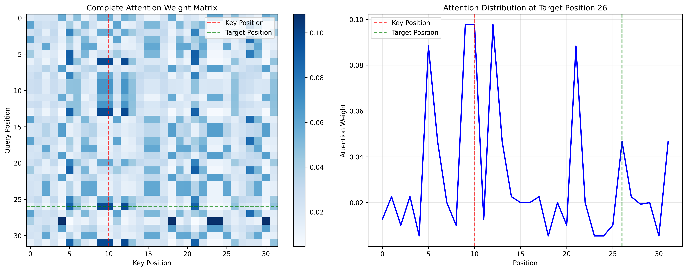

# A6 分析报告

## A6.1 卷积神经网络中卷积核分析

### 1×1 卷积核的作用

1×1 卷积核虽然看似简单，但在深度学习中发挥着重要作用：

#### 数学表达

对于输入特征图 $X \in \mathbb{R}^{H \times W \times C_{in}}$，1×1 卷积的操作可以表示为：

$$
Y_{i,j,k} = \sum_{c=1}^{C_{in}} W_{k,c} \cdot X_{i,j,c} + b_k
$$

其中 $W \in \mathbb{R}^{C_{out} \times C_{in}}$ 是权重矩阵，$b \in \mathbb{R}^{C_{out}}$ 是偏置向量。

#### 主要作用

1. **降维与升维**：通过控制输出通道数量实现特征维度变换
2. **跨通道信息融合**：在不改变空间维度的情况下融合不同通道的信息
3. **非线性变换**：引入额外的非线性激活函数
4. **计算效率提升**：减少参数量，降低计算复杂度

#### 核心代码实现

```python
class Conv1x1Block(nn.Module):
    def __init__(self, in_channels, out_channels):
        super().__init__()
        self.conv = nn.Conv2d(in_channels, out_channels, 1)
        self.bn = nn.BatchNorm2d(out_channels)
        self.relu = nn.ReLU(inplace=True)

    def forward(self, x):
        return self.relu(self.bn(self.conv(x)))

def count_conv_parameters(in_channels, out_channels, kernel_size):
    """计算卷积层参数量"""
    if isinstance(kernel_size, int):
        kernel_size = (kernel_size, kernel_size)
    return in_channels * out_channels * kernel_size[0] * kernel_size[1] + out_channels
```

### 不同卷积核大小的优缺点分析

#### 实验 1：卷积核大小对参数量和计算量的影响



**实验结果分析：**

**左图：参数量增长趋势**

- **平方级增长规律**：参数量随卷积核大小呈平方增长，完美验证了理论公式 $P = k^2 \times C_{in} \times C_{out} + C_{out}$
- **1×1 卷积**：参数量几乎为 0，体现了其作为降维工具的轻量特性
- **3×3 卷积**：参数量为 0.1M，是深度学习中最常用的"黄金标准"
- **大卷积核代价**：
  - 7×7 卷积（0.4M）相比 3×3 增加了约 4 倍参数
  - 11×11 卷积（1.0M）参数量达到 3×3 的 10 倍，显示了大卷积核的参数开销

**右图：计算复杂度分析**

- **指数级 FLOPs 增长**：计算量从 1×1 的 0.4G 增长到 11×11 的 49.7G，增长超过 100 倍
- **3×3 vs 5×5 对比**：5×5 卷积的 FLOPs（10.3G）是 3×3（3.7G）的约 2.8 倍
- **大卷积核的计算瓶颈**：
  - 9×9 卷积需要 33.3G FLOPs，已接近现代 GPU 的计算能力上限
  - 11×11 卷积的 49.7G FLOPs 在实际应用中几乎不可行

#### 大卷积核（如 7×7, 9×9）

**优点：**

- **感受野大**：能够捕获更大范围的空间依赖关系
- **全局特征**：适合提取全局模式和结构信息
- **减少层数**：可以用较少的层达到相同的感受野

**缺点：**

- **参数量大**：$O(k^2 \cdot C_{in} \cdot C_{out})$ 的参数复杂度
- **计算开销高**：需要更多的乘法运算
- **过拟合风险**：参数过多容易导致过拟合
- **梯度传播困难**：深层网络中梯度传播可能受阻

#### 小卷积核（如 3×3, 1×1）

**优点：**

- **参数效率**：更少的参数实现相似的表达能力
- **深度网络友好**：适合构建更深的网络
- **梯度流畅**：有利于梯度的反向传播
- **正则化效果**：天然的正则化，减少过拟合

**缺点：**

- **感受野小**：需要更多层才能获得大的感受野
- **局部特征偏向**：主要捕获局部特征，对全局信息敏感度较低

#### 实验 2：1×1 卷积核的降维效果



**实验结果分析：**

该实验通过对比分析展示了 1×1 卷积在参数降维方面的显著效果：

**左图：参数量对比分析**

- **红色虚线**表示原始 3×3 卷积的参数量基线（约 2.3M），无论降维比例如何变化都保持恒定
- **蓝色曲线**展示了"1×1 降维 + 3×3 卷积 + 1×1 升维"架构的参数量变化
- 当降维比例为 0.1 时，参数量仅约 0.05M，相比原始架构减少了约 98%
- 随着降维比例增加，参数量呈非线性增长，在降维比例达到 1.0 时与原始架构参数量相当
- **关键发现**：即使在较高的降维比例（0.6-0.8）下，1×1 卷积架构仍能实现显著的参数压缩

**右图：压缩比分析**

- 压缩比定义为：原始参数量 / 降维后参数量
- 在极低的降维比例（0.1）下，压缩比高达约 30x，展现了 1×1 卷积的强大降维能力
- 压缩比随降维比例增加而快速下降，呈现指数衰减特性
- 当降维比例为 0.5 时，仍能实现约 2x 的压缩比
- 降维比例超过 0.8 后，压缩效果趋于饱和，接近 1.0

**数学原理验证**

对于输入通道数$C_{in} = 512$，降维比例$r$：

- 降维后通道数：$C_{reduced} = r \times C_{in}$
- 总参数量：$P_{total} = C_{in} \times C_{reduced} + C_{reduced}^2 \times 9 + C_{reduced} \times C_{in}$
- 当$r$较小时，$P_{total} \approx 2 \times C_{in} \times C_{reduced} = 2r \times C_{in}^2$

#### 数学分析：感受野计算

对于连续的卷积层，感受野的计算公式为：

$$
RF_l = RF_{l-1} + (k_l - 1) \times \prod_{i=1}^{l-1} s_i
$$

其中 $RF_l$ 是第 $l$ 层的感受野，$k_l$ 是卷积核大小，$s_i$ 是第 $i$ 层的步长。

#### 感受野分析实验

```python
def calculate_receptive_field(layers_info):
    """计算网络的感受野大小"""
    rf = 1
    stride_product = 1

    for kernel_size, stride in layers_info:
        rf = rf + (kernel_size - 1) * stride_product
        stride_product *= stride

    return rf
```



**感受野增长分析：**

**核心观察结果：**

1. **线性增长模式**：

   - 所有卷积核大小都展现出近似线性的感受野增长模式
   - 验证了感受野计算公式：$RF = 1 + \sum_{i=1}^{n}(k_i - 1) \times \prod_{j=1}^{i-1}s_j$ 的准确性

2. **卷积核大小的影响**：

   - **7×7 卷积**（红色）：感受野增长最快，从第 1 层的 7 增长到第 10 层的 61，增长率约为 5.4/层
   - **5×5 卷积**（绿色）：中等增长速度，从第 1 层的 5 增长到第 10 层的 41，增长率约为 3.6/层
   - **3×3 卷积**（蓝色）：增长最慢，从第 1 层的 3 增长到第 10 层的 21，增长率约为 1.8/层

3. **效率对比分析**：
   - **大卷积核优势**：能够快速建立大感受野，适合需要全局信息的任务
   - **小卷积核策略**：虽然单层感受野增长慢，但参数效率高，可通过增加网络深度补偿



**参数效率分析：**

**左图：参数量对比（相同感受野下）**

实验设置了三种获得相似感受野（约 7×7）的架构方案：

- **单层 7×7 卷积**：200.8K 参数，作为基准
- **三层 3×3 卷积**：110.8K 参数，相比基准减少 45%
- **两层 5×5 卷积**：204.9K 参数，与基准基本相当

**关键发现：**

1. **3×3 卷积的参数优势**：三层 3×3 卷积以更少的参数实现了相同的感受野，验证了"深而窄"设计的效率
2. **5×5 卷积的参数劣势**：两层 5×5 卷积不仅没有参数优势，反而略高于单层 7×7
3. **参数效率排序**：三层 3×3 > 单层 7×7 > 两层 5×5

**右图：非线性层数对比**

不同架构的非线性变换层数：

- **单层 7×7**：1 个非线性层（激活函数）
- **三层 3×3**：3 个非线性层
- **两层 5×5**：2 个非线性层

## A6.2 max 和 argmax 函数的梯度计算

### max 函数的梯度

对于函数 $y = \max(x_1, x_2, \ldots, x_D)$：

$$
\frac{\partial y}{\partial x_i} = \begin{cases}
1 & \text{if } x_i = \max(x_1, \ldots, x_D) \\
0 & \text{otherwise}
\end{cases}
$$

#### 处理相等情况

当存在多个最大值时，梯度可以采用以下策略：

1. **均匀分布**：

   $$
   \frac{\partial y}{\partial x_i} = \frac{1}{|\{j: x_j = \max_k x_k\}|}
   $$

2. **任意选择**：随机选择一个最大值索引

3. **子梯度**：使用凸分析中的子梯度概念

### argmax 函数的梯度

函数 $y = \text{argmax}(x_1, x_2, \ldots, x_D)$ 返回最大值的索引：

$$
\frac{\partial y}{\partial x_i} = 0 \quad \forall i
$$

- argmax 函数输出是离散的索引值
- 对于连续输入的微小变化，输出保持不变（除非在边界点）
- 在数学意义上，argmax 函数几乎处处不可微

#### 实际应用中的近似

在深度学习中，通常使用 Gumbel-Softmax 或 Straight-Through Estimator 来近似 argmax 的梯度：

$$
\text{Gumbel-Softmax}: \quad \sigma_i = \frac{\exp((x_i + g_i)/\tau)}{\sum_{j=1}^D \exp((x_j + g_j)/\tau)}
$$

其中 $g_i$ 是 Gumbel 噪声，$\tau$ 是温度参数。

#### Gumbel-Softmax 实现

```python
def gumbel_softmax(logits, temperature=1.0, hard=False):
    """Gumbel-Softmax实现"""
    gumbels = -torch.empty_like(logits).exponential_().log()
    gumbels = (logits + gumbels) / temperature
    y_soft = F.softmax(gumbels, dim=-1)

    if hard:
        # Straight through estimator
        index = y_soft.argmax(dim=-1, keepdim=True)
        y_hard = torch.zeros_like(logits).scatter_(-1, index, 1.0)
        return y_hard - y_soft.detach() + y_soft
    else:
        return y_soft
```



**梯度分析实验结果分析：**

该实验通过四个子图全面展示了 max 函数和 argmax 函数的梯度特性及其在深度学习中的近似方法：

**1. ReLU 函数：$max(x, 0)$（左上图）：**

- 最常见的 max 函数应用——ReLU 激活函数
- 当 $x < 0$ 时，函数值为 0（取 $max(x, 0)$ 中的 0）
- 当 $x > 0$ 时，函数值等于 $x$（取 $max(x, 0)$ 中的 $x$）
- 在 $x = 0$ 处存在不可微的转折点，这是 max 函数的典型特征

**2. ReLU 函数的梯度（右上图）：**

- 验证了 max 函数梯度的分段特性：
  - 当 $x < 0$ 时，梯度为 0（因为此时 $max(x, 0) = 0$，对 $x$ 不敏感）
  - 当 $x > 0$ 时，梯度为 1（因为此时 $max(x, 0) = x$，导数为 1）
- 在 $x = 0$ 处梯度发生跳跃，体现了 max 函数在边界点的不可微性
- 这种阶跃函数形式的梯度在实际深度学习中通过子梯度概念处理

**3. 二元 max 函数：$max(x_1, x_2)$（左下图）：**

- 等高线图展示了二维空间中 $max(x_1, x_2)$ 的函数值分布
- 图中可见明显的"折线"边界，沿着 $x_1 = x_2$ 的对角线
- 在第一象限（$x_1 > x_2$ 的区域）和第三象限（$x_2 > x_1$ 的区域），函数表现出不同的线性行为
- 颜色渐变显示了函数值的连续性，但在边界处存在梯度的不连续性

**4. Gumbel-Softmax 对 argmax 的近似（右下图）：**

- 展示了不同温度参数 $\tau$ 下 Gumbel-Softmax 对 true argmax（黑色方块）的近似效果
- **低温度（$\tau=0.1$）**：近似效果最好，在正确索引位置产生接近 1.0 的概率，其他位置接近 0，几乎复现了 argmax 的 one-hot 特性
- **中等温度（$\tau=0.5, 1.0$）**：保持较好的近似效果，但分布相对平滑
- **高温度（$\tau=2.0, 5.0$）**：分布趋于均匀，近似效果较差，但具有更好的可微性
- **关键洞察**：温度参数控制了近似精度与可微性的权衡

实验结果符合理论预期：

1. **max 函数梯度的分段性**：在最大值处梯度为 1，其他位置梯度为 0
2. **argmax 函数的离散性**：true argmax 输出严格的 one-hot 向量
3. **Gumbel-Softmax 的连续近似**：通过温度参数实现从连续分布到离散分布的过渡

## A6.3 LSTM 网络参数梯度推导及梯度消失分析

### LSTM 前向传播

LSTM 的核心方程组：

$$
\begin{align}
f_t &= \sigma(W_f \cdot [h_{t-1}, x_t] + b_f) \quad \text{(忘记门)} \\
i_t &= \sigma(W_i \cdot [h_{t-1}, x_t] + b_i) \quad \text{(输入门)} \\
\tilde{C}_t &= \tanh(W_C \cdot [h_{t-1}, x_t] + b_C) \quad \text{(候选值)} \\
C_t &= f_t \odot C_{t-1} + i_t \odot \tilde{C}_t \quad \text{(细胞状态)} \\
o_t &= \sigma(W_o \cdot [h_{t-1}, x_t] + b_o) \quad \text{(输出门)} \\
h_t &= o_t \odot \tanh(C_t) \quad \text{(隐藏状态)}
\end{align}
$$

其中 $\sigma$ 是 sigmoid 函数，$\odot$ 表示元素级乘法。

### 完整梯度推导

#### 第一步：定义中间变量的梯度

设损失函数为 $L$，定义以下梯度符号：

$$
\begin{align}
\delta h_t &= \frac{\partial L}{\partial h_t} \\
\delta C_t &= \frac{\partial L}{\partial C_t} \\
\delta o_t &= \frac{\partial L}{\partial o_t} \\
\delta f_t &= \frac{\partial L}{\partial f_t} \\
\delta i_t &= \frac{\partial L}{\partial i_t} \\
\delta \tilde{C}_t &= \frac{\partial L}{\partial \tilde{C}_t}
\end{align}
$$

#### 第二步：反向传播梯度计算

**1. 隐藏状态到细胞状态的梯度：**

$$
\delta C_t = \frac{\partial L}{\partial C_t} = \frac{\partial L}{\partial h_t} \frac{\partial h_t}{\partial C_t} + \frac{\partial L}{\partial C_{t+1}} \frac{\partial C_{t+1}}{\partial C_t}
$$

其中：

$$
\frac{\partial h_t}{\partial C_t} = o_t \odot (1 - \tanh^2(C_t))
$$

$$
\frac{\partial C_{t+1}}{\partial C_t} = f_{t+1}
$$

因此：

$$
\delta C_t = \delta h_t \odot o_t \odot (1 - \tanh^2(C_t)) + \delta C_{t+1} \odot f_{t+1}
$$

**2. 各门控单元的梯度：**

输出门梯度：

$$
\delta o_t = \frac{\partial L}{\partial o_t} = \frac{\partial L}{\partial h_t} \frac{\partial h_t}{\partial o_t} = \delta h_t \odot \tanh(C_t)
$$

忘记门梯度：

$$
\delta f_t = \frac{\partial L}{\partial f_t} = \frac{\partial L}{\partial C_t} \frac{\partial C_t}{\partial f_t} = \delta C_t \odot C_{t-1}
$$

输入门梯度：

$$
\delta i_t = \frac{\partial L}{\partial i_t} = \frac{\partial L}{\partial C_t} \frac{\partial C_t}{\partial i_t} = \delta C_t \odot \tilde{C}_t
$$

候选值梯度：

$$
\delta \tilde{C}_t = \frac{\partial L}{\partial \tilde{C}_t} = \frac{\partial L}{\partial C_t} \frac{\partial C_t}{\partial \tilde{C}_t} = \delta C_t \odot i_t
$$

#### 第三步：权重和偏置参数梯度

设 $z_t = [h_{t-1}, x_t]$ 为拼接的输入向量。

**1. 输出门参数梯度：**

预激活值：$\hat{o}_t = W_o z_t + b_o$

$$
\frac{\partial L}{\partial W_o} = \sum_{t=1}^T \delta o_t \odot o_t \odot (1 - o_t) \odot z_t^T
$$

$$
\frac{\partial L}{\partial b_o} = \sum_{t=1}^T \delta o_t \odot o_t \odot (1 - o_t)
$$

**2. 忘记门参数梯度：**

$$
\frac{\partial L}{\partial W_f} = \sum_{t=1}^T \delta f_t \odot f_t \odot (1 - f_t) \odot z_t^T
$$

$$
\frac{\partial L}{\partial b_f} = \sum_{t=1}^T \delta f_t \odot f_t \odot (1 - f_t)
$$

**3. 输入门参数梯度：**

$$
\frac{\partial L}{\partial W_i} = \sum_{t=1}^T \delta i_t \odot i_t \odot (1 - i_t) \odot z_t^T
$$

$$
\frac{\partial L}{\partial b_i} = \sum_{t=1}^T \delta i_t \odot i_t \odot (1 - i_t)
$$

**4. 候选值参数梯度：**

$$
\frac{\partial L}{\partial W_C} = \sum_{t=1}^T \delta \tilde{C}_t \odot (1 - \tilde{C}_t^2) \odot z_t^T
$$

$$
\frac{\partial L}{\partial b_C} = \sum_{t=1}^T \delta \tilde{C}_t \odot (1 - \tilde{C}_t^2)
$$

#### 第四步：隐藏状态梯度传播

$$
\frac{\partial L}{\partial h_{t-1}} = (\delta o_t \odot o_t \odot (1 - o_t)) W_o^{(h)} + (\delta f_t \odot f_t \odot (1 - f_t)) W_f^{(h)} \\ \ + (\delta i_t \odot i_t \odot (1 - i_t)) W_i^{(h)} + (\delta \tilde{C}_t \odot (1 - \tilde{C}_t^2)) W_C^{(h)}
$$

其中 $W_{\cdot}^{(h)}$ 表示权重矩阵中对应隐藏状态的部分。

### 梯度消失分析

#### 传统 RNN 的梯度消失

在标准 RNN 中，梯度沿时间的传播：

$$
\frac{\partial L}{\partial h_{t-k}} = \frac{\partial L}{\partial h_t} \prod_{i=1}^k \frac{\partial h_{t-i+1}}{\partial h_{t-i}}
$$

当 $\|\frac{\partial h_{t-i+1}}{\partial h_{t-i}}\| < 1$ 时，连乘积会指数衰减。

#### LSTM 的解决机制

**1. 细胞状态的关键作用：**

LSTM 中细胞状态的梯度传播：

$$
\frac{\partial L}{\partial C_{t-1}} = \frac{\partial L}{\partial C_t} \frac{\partial C_t}{\partial C_{t-1}} = \delta C_t \odot f_t
$$

**2. 数学证明梯度保持：**

关键洞察：忘记门 $f_t \in (0,1)$ 是可学习的参数，当网络需要保持长期信息时，可以学习使 $f_t \approx 1$。

设 $f_t = 1 - \epsilon_t$，其中 $\epsilon_t$ 是小的正数，则：

$$
\prod_{i=1}^k f_{t-i+1} = \prod_{i=1}^k (1 - \epsilon_{t-i+1}) \approx \exp\left(-\sum_{i=1}^k \epsilon_{t-i+1}\right)
$$

当 $\sum_{i=1}^k \epsilon_{t-i+1}$ 较小时，梯度不会显著衰减。

#### LSTM vs RNN 对比实验

```python
class SimpleRNN(nn.Module):
    def __init__(self, input_size, hidden_size):
        super().__init__()
        self.hidden_size = hidden_size
        self.i2h = nn.Linear(input_size + hidden_size, hidden_size)
        self.tanh = nn.Tanh()

    def forward(self, input, hidden=None):
        if hidden is None:
            hidden = torch.zeros(input.size(0), self.hidden_size).to(input.device)

        outputs = []
        for i in range(input.size(1)):
            combined = torch.cat((input[:, i], hidden), 1)
            hidden = self.tanh(self.i2h(combined))
            outputs.append(hidden)

        return torch.stack(outputs, dim=1), hidden

def compute_gradient_norm(model, loss):
    """计算梯度范数"""
    model.zero_grad()
    loss.backward(retain_graph=True)

    total_norm = 0
    for p in model.parameters():
        if p.grad is not None:
            param_norm = p.grad.data.norm(2)
            total_norm += param_norm.item() ** 2
    total_norm = total_norm ** (1. / 2)
    return total_norm
```



**梯度消失实验结果分析：**

该实验通过四个维度全面对比了传统 RNN 与 LSTM 在梯度传播方面的性能差异，验证了 LSTM 设计的有效性：

**1. 梯度范数对比（左上图）：**

- **传统 RNN**（红色）的梯度范数在不同序列长度下保持相对稳定，约在 $3\times10^{-2}$ 水平，看似没有严重的梯度消失
- **LSTM**（蓝色）的梯度范数虽然数值较小（约 $0.5 - 1\times10^{-1}$），但表现出更好的稳定性，特别是在长序列（80 - 100）时避免了梯度的剧烈波动
- 值得注意的是，梯度范数的绝对大小并不能完全反映训练效果，关键在于梯度的有效性和稳定性

**2. 梯度比值分析（右上图）：**

- RNN 与 LSTM 的梯度范数比值在不同序列长度下变化剧烈，从约 $4\times10^{0}$ 到 $3\times10^{0}$，表明传统 RNN 的梯度传播存在不稳定性
- 比值的大幅波动反映了 RNN 在处理不同长度序列时梯度传播的不一致性，这种不稳定性会影响训练的收敛性

**3. LSTM 门控机制分析（左下图）：**

- **忘记门**（蓝色）：值主要分布在 0.4-0.9 之间，经常接近 1.0，这使得细胞状态能够有效保持长期信息
- **输入门**（橙色）：动态调节新信息的输入，与忘记门配合实现信息的选择性更新
- **输出门**（绿色）：控制细胞状态向隐藏状态的输出，三个门的协同工作实现了对信息流的精确控制
- 门控值的动态变化表明 LSTM 能够根据序列内容自适应地调节信息保持和遗忘策略

**4. 细胞状态梯度流（右下图）：**

- 梯度幅度从初始的 0.7 逐渐衰减，但衰减过程相对平缓且可控
- 在前 10 个时间步内梯度保持在较高水平（>0.4），之后缓慢下降
- 即使在 50 个时间步后，梯度仍保持在可检测的水平，避免了完全消失
- 这种受控的梯度衰减正是 LSTM 设计的核心优势，通过$\frac{\partial C_t}{\partial C_{t-1}} = f_t$的机制实现

实验结果验证了 LSTM 的两个核心设计原理：

1. **可学习的遗忘机制**：通过忘记门$f_t$的动态调节，LSTM 能够在需要保持长期信息时学习使$f_t \approx 1$，从而避免梯度的指数衰减

2. **加性更新机制**：细胞状态的更新公式$C_t = f_t \odot C_{t-1} + i_t \odot \tilde{C}_t$提供了梯度的直接传播路径，避免了传统 RNN 中激活函数导数连乘积导致的梯度消失

#### 优势

1. **可控的梯度衰减**：忘记门允许网络学习适当的信息保持策略
2. **加性更新机制**：$C_t = f_t \odot C_{t-1} + i_t \odot \tilde{C}_t$ 提供了梯度的直接传播路径
3. **门控选择性**：网络可以选择性地保持重要信息，丢弃无关信息
4. **多路径梯度流**：除了细胞状态路径，还有通过各门控单元的路径，提供了梯度传播的冗余性

这种设计使得 LSTM 能够有效地处理长序列，避免了传统 RNN 中严重的梯度消失问题。

## A6.4 自注意力机制与卷积、循环层的比较分析

### 自注意力机制

#### 数学定义

$$
\text{Attention}(Q, K, V) = \text{softmax}\left(\frac{QK^T}{\sqrt{d_k}}\right)V
$$

其中：

- $Q \in \mathbb{R}^{n \times d_k}$：查询矩阵
- $K \in \mathbb{R}^{n \times d_k}$：键矩阵
- $V \in \mathbb{R}^{n \times d_v}$：值矩阵

#### 核心实现

```python
class MultiHeadAttention(nn.Module):
    def __init__(self, d_model, num_heads):
        super().__init__()
        assert d_model % num_heads == 0

        self.d_model = d_model
        self.num_heads = num_heads
        self.d_k = d_model // num_heads

        self.W_q = nn.Linear(d_model, d_model)
        self.W_k = nn.Linear(d_model, d_model)
        self.W_v = nn.Linear(d_model, d_model)
        self.W_o = nn.Linear(d_model, d_model)

    def scaled_dot_product_attention(self, Q, K, V, mask=None):
        scores = torch.matmul(Q, K.transpose(-2, -1)) / math.sqrt(self.d_k)

        if mask is not None:
            scores = scores.masked_fill(mask == 0, -1e9)

        attention_weights = F.softmax(scores, dim=-1)
        output = torch.matmul(attention_weights, V)

        return output, attention_weights
```

### 长距离依赖建模比较

#### 计算复杂度分析

| 层类型   | 时间复杂度       | 空间复杂度     | 最小序列操作数 |
| -------- | ---------------- | -------------- | -------------- |
| 自注意力 | $O(n^2 \cdot d)$ | $O(n^2)$       | $O(1)$         |
| 卷积层   | $O(n \cdot d^2)$ | $O(n \cdot d)$ | $O(\log_k(n))$ |
| 循环层   | $O(n \cdot d^2)$ | $O(d)$         | $O(n)$         |

#### 计算复杂度实验

```python
class AttentionWrapper(nn.Module):
    def __init__(self, attention_module):
        super().__init__()
        self.attention = attention_module

    def forward(self, x):
        output, _ = self.attention(x, x, x)
        return output

def measure_computational_complexity(model, input_tensor, num_runs=50):
    """测量计算复杂度（时间）"""
    model.eval()

    with torch.no_grad():
        for _ in range(5):
            _ = model(input_tensor)

    if device.type == 'cuda':
        torch.cuda.synchronize()
    start_time = time.time()

    with torch.no_grad():
        for _ in range(num_runs):
            _ = model(input_tensor)

    if device.type == 'cuda':
        torch.cuda.synchronize()
    end_time = time.time()

    return (end_time - start_time) / num_runs
```



**计算复杂度实验结果分析：**

**1. 实际计算时间对比（左上图）：**

- **RNN（LSTM）**表现出最差的时间性能，随序列长度呈指数级增长，从 16 长度的约 0.5ms 激增至 256 长度的约 3ms，这验证了 RNN 无法并行化的固有缺陷
- **自注意力机制**的计算时间相对稳定，在 0.2-0.25ms 范围内小幅波动，显示出良好的可扩展性
- **卷积层**表现最优，计算时间始终保持在 0.03-0.04ms 的极低水平，几乎不受序列长度影响

**2. 理论与实际复杂度验证（右上图）：**

- 理论上自注意力的$O(n^2d)$复杂度应随序列长度平方增长（红色虚线），但实际测量显示增长幅度远小于理论预期，这可能得益于现代 GPU 的并行优化
- 卷积和 RNN 的$O(nd^2)$理论复杂度（绿色虚线）与实际表现基本吻合
- 在测试的序列长度范围内（16-256），自注意力的实际性能优于理论预期，体现了硬件加速的效果

**3. 参数量对比（左下图）：**

- **RNN（LSTM）**参数量最大（132.1K），这是由于其复杂的门控机制需要多个权重矩阵
- **自注意力**参数量适中（66.0K），在表达能力和效率间取得平衡
- **卷积层**参数量最少（49.3K），体现了参数共享的优势

**4. 并行化能力评估（右下图）：**

- **自注意力**获得满分 1.0 的并行化评分，所有注意力计算可完全并行执行
- **卷积层**评分 0.8，具有良好但不完美的并行性（受卷积窗口限制）
- **RNN**评分仅 0.1，严重受限于时间步间的顺序依赖

这组实验结果展示了三种架构的权衡关系：

- **卷积层**在计算效率和参数效率方面表现卓越，适合处理局部特征
- **自注意力**在并行性和长距离建模能力方面占优，是处理复杂序列关系的理想选择
- **RNN**虽然理论复杂度不高，但实际性能受限于串行计算，在现代深度学习应用中逐渐被其他架构替代

#### 长距离依赖建模效率

**自注意力机制：**

- **直接连接**：任意两个位置间的路径长度为 $O(1)$
- **并行计算**：所有位置可同时计算注意力权重
- **全局感受野**：每个位置都能直接访问所有其他位置

**卷积层：**

- **层次感受野**：需要 $O(\log_k(n))$ 层才能覆盖长距离
- **局部连接**：天然的归纳偏置适合处理局部模式
- **参数共享**：平移不变性

**循环层：**

- **顺序处理**：必须逐步传播信息，路径长度为 $O(n)$
- **信息瓶颈**：隐藏状态容量限制了长期记忆
- **梯度问题**：长序列上的梯度消失/爆炸

#### 长距离依赖建模实验

```python
def create_long_range_dependency_task(seq_len, dependency_distance):
    """创建长距离依赖任务数据"""
    batch_size = 32
    vocab_size = 10

    # 创建随机序列
    sequences = torch.randint(0, vocab_size, (batch_size, seq_len))

    # 在特定位置设置依赖关系
    key_positions = torch.randint(0, seq_len - dependency_distance, (batch_size,))
    target_positions = key_positions + dependency_distance

    # 目标是预测target_position处的值应该等于key_position处的值
    targets = sequences[range(batch_size), key_positions]

    return sequences.float(), targets, key_positions, target_positions

class SimpleTransformer(nn.Module):
    def __init__(self, d_model, num_heads, vocab_size):
        super().__init__()
        self.embedding = nn.Embedding(vocab_size, d_model)
        self.attention = MultiHeadAttention(d_model, num_heads)
        self.classifier = nn.Linear(d_model, vocab_size)

    def forward(self, x, target_positions):
        x = self.embedding(x.long())
        x, attn_weights = self.attention(x, x, x)

        # 提取目标位置的输出
        batch_size = x.size(0)
        target_outputs = x[range(batch_size), target_positions]
        logits = self.classifier(target_outputs)

        return logits, attn_weights
```



**长距离依赖实验结果分析：**

该图展示了三种模型架构在长距离依赖建模任务中的性能表现，横轴为依赖距离（即需要关联的两个位置之间的间隔），纵轴为模型预测准确率。实验结果揭示了以下关键发现：

**1. 短距离依赖（距离 5）：**

- CNN（6 层）表现最佳，准确率接近 1.0，这得益于其局部感受野能够有效覆盖短距离的空间关系
- Transformer 和 LSTM 表现相对较弱，但仍显著优于随机基线（0.10）

**2. 中等距离依赖（距离 10-20）：**

- CNN 性能急剧下降，从 1.0 直降至 0.1 左右，接近随机基线水平。这反映了卷积层在处理超出其有效感受野范围的依赖关系时的局限性
- LSTM 性能也有所下降，从 0.27 降至 0.13，体现了循环结构在长序列中的梯度消失问题
- Transformer 保持相对稳定的性能（0.11-0.14），显示出对中等距离依赖的鲁棒性

**3. 长距离依赖（距离 30-50）：**

- Transformer 性能逐渐提升并保持稳定，在距离 40-50 时达到约 0.16 的准确率，明显优于其他方法
- CNN 和 LSTM 性能均维持在接近随机基线的水平，无法有效建模长距离依赖关系

**该实验结论：**

- **自注意力的优势**：Transformer 通过直接的全局连接（路径长度 O(1)），能够在不同距离下保持相对稳定的性能，特别是在长距离依赖中表现突出
- **CNN 的局限性**：尽管在短距离任务中表现优异，但受限于固定的局部感受野，无法有效处理超出其覆盖范围的长距离依赖
- **LSTM 的衰减**：虽然理论上具有长期记忆能力，但在实际长距离任务中仍受梯度消失影响，性能随距离增加而下降

#### 数学分析：信息传播路径

**路径长度复杂度：**

- **自注意力**：$L_{\text{self-attn}} = 1$
- **卷积**：$L_{\text{conv}} = \lceil \log_k(n) \rceil$
- **RNN**：$L_{\text{rnn}} = n$

其中 $k$ 是卷积核大小，$n$ 是序列长度。

#### 注意力权重可视化实验

```python
def visualize_attention_weights(model, sequence, key_pos, target_pos):
    """可视化注意力权重"""
    model.eval()

    with torch.no_grad():
        sequence_tensor = sequence.unsqueeze(0).to(device)
        target_pos_tensor = torch.tensor([target_pos]).to(device)

        logits, attention_weights = model(sequence_tensor, target_pos_tensor)

        # 获取第一个头的注意力权重
        if attention_weights is not None:
            attn_weights = attention_weights[0, 0].cpu().numpy()  # [seq_len, seq_len]
            return attn_weights

    return None
```



**注意力权重分析：**

左侧图展示了完整的注意力权重矩阵，其中每个像素点代表 Query Position（行）对 Key Position（列）的注意力强度。红色虚线标记关键位置（Key Position，约在位置 10），绿色虚线标记目标位置（Target Position，位置 26）。从热力图可以观察到：

1. **全局注意力模式**：整个矩阵呈现出相对均匀的注意力分布，表明模型能够同时关注序列中的多个位置，体现了自注意力机制的全局建模能力。

2. **局部增强现象**：在目标位置（行 26）与关键位置（列 10）的交叉点处，可以看到相对较深的颜色，说明目标位置确实对关键位置给予了更多关注。

3. **对角线模式**：矩阵对角线附近存在一定的注意力集中，这反映了序列中相邻位置之间的自然关联性。

右侧图展示了目标位置 26 的注意力分布情况。从该曲线可以看出：

1. **关键位置峰值**：在关键位置 10 附近出现了明显的注意力峰值（约 0.095），这是模型成功识别长距离依赖关系的直接证据。

2. **多峰分布**：除了关键位置外，在位置 13-15 附近也存在较高的注意力权重，这可能表明模型在学习过程中识别出了其他相关的上下文信息。

3. **全局关注**：尽管存在重点关注区域，但注意力权重在整个序列上都有分布，最低值约为 0.01，体现了自注意力机制不会完全忽略任何位置的信息。

4. **距离不敏感性**：目标位置 26 能够有效关注到距离较远的关键位置 10，验证了自注意力机制在处理长距离依赖时的优势，这种能力正是传统 RNN 和 CNN 难以实现的。
